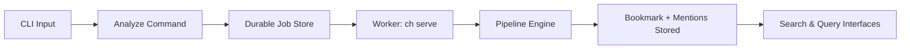
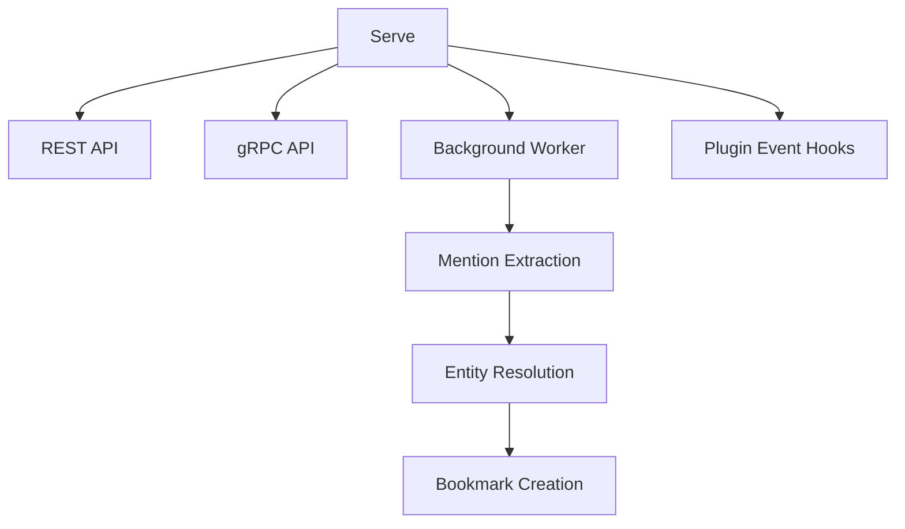

# CLI API (`ch`)

The `ch` command-line interface exposes all ContextHelp engine capabilities, including ingestion, job queue management, retrieval, registry interactions, entity/mention resolution, agent views, local server operations, and **plugin-defined commands** that extend the CLI at runtime.

The CLI is:

- Local-first
- Deterministic given config + input
- Scriptable
- Fully offline-capable
- Parallel to REST and gRPC APIs
- **Extensible by plugins without modifying core**

All ingestion operations follow the **Transactional Outbox Model**:
`ch analyze` enqueues a job → the worker (`ch serve`) processes pipelines → results are written to storage.



Plugins may inject additional behaviors before/after CLI execution (such as notifications) using documented extension hooks.

---

## Installation

```bash
brew install contexthelp
```

or:

```bash
curl -sL https://context.help/install.sh | bash
```

Development build:

```bash
go build -o ch cmd/ch/main.go
```

---

## Command Overview

| Command | Purpose |
|--------|---------|
| `ch analyze` | Enqueue an ingestion job |
| `ch jobs` | Inspect/manage ingestion jobs |
| `ch list` | Query bookmarks (local + registries) |
| `ch show` | Display bookmark details |
| `ch delete` | Remove bookmarks |
| `ch edit` | Modify bookmark metadata |
| `ch serve` | Start local servers + worker |
| `ch config` | Configuration operations |
| `ch registry` | Manage registries |
| `ch entities` | Query and inspect entities |
| `ch agent` | Manage agents |
| `ch version` | Show version info |
| **Plugin-defined commands** | Dynamically added at runtime (e.g. `ch feed`, `ch price`, `ch notify`) |

Plugins may register:

- new commands
- new flags on existing commands
- pre/post output injectors (e.g. pending notifications)

---

## `ch analyze`

Enqueue content into the ingestion queue.
This does **not** run pipelines directly; the worker handles execution.

### Usage

```bash
ch analyze [options]
```

### Options

| Flag | Description |
|------|-------------|
| `--type <text|url|image|audio|video|feed|auto>` | Input type override (plugins may add types) |
| `--hints "<#hint #hint>"` | Influence tagging |
| `--mentions "<@slug1 @slug2>"` | Explicit mentions to attach |
| `--file <path>` | Read input from file |
| `--agent <name>` | Use agent worldview |
| `--pipeline <name>` | Force pipeline |
| `--lang <code>` | Input language override |
| `--translate none` | Skip translations |
| `--raw` | Disable AI; store raw bookmark |
| `--wait` | Block until job completes |
| `--output <json|yaml|id>` | Output format |

### Refresh & Auto-Fetch Flags (Plugin-provided)

Plugins such as the Refresh Plugin and RSS Feed Plugin may add:

| Flag | Description |
|------|-------------|
| `--refresh <seconds|daily|auto>` | Attach refresh policy to bookmark |
| `--fetch-new` | For feed-like sources, auto-fetch new items |
| `--no-fetch-new` | Disable auto-fetch |

### Domain Plugin Flags (Example)

Plugins may attach additional ingestion options, for example:

| Flag | Description |
|------|-------------|
| `--price-monitor` | Enable price monitoring on this item |
| `--price-threshold <percent>` | Alert threshold |

These flags exist only if the respective plugin is installed.

### Notes

- Returns a **Job ID**.
- With `--wait`, returns the resulting **Bookmark ID**.
- Plugins may intercept or extend `ch analyze` behavior via lifecycle hooks.
- Bookmark type may be plugin-defined (e.g. `feed`, `feed_item`, `price_track`).

### Examples

```bash
echo "Fix signup flow" \
  | ch analyze --type text --hints "#ux #bad" --mentions "@ui.best-practice"

ch analyze --file screenshot.png --type image --mentions "@ui.layout @ux.onboarding"

ch analyze https://example.com --type url --agent growth

ch analyze https://example.com/feed.xml --type feed --fetch-new --refresh 3600

ch analyze https://amazon.com/product \
  --price-monitor --price-threshold 10
```

---

## `ch jobs`

Inspect and control ingestion jobs.

### Commands

```bash
ch jobs list
ch jobs status <id>
ch jobs logs <id>
ch jobs retry <id>
ch jobs cancel <id>
```

### States

- Pending
- Running
- Completed
- Failed
- Cancelled

Plugins may register custom job types (e.g. `refresh`, `fetch_new_items`).

---

## `ch list`

Query bookmarks across local storage and registries.
Supports tags, hints, mentions, entities, plugin-defined bookmark types, and AST query language.

### Usage

```bash
ch list [filters] [options]
```

### Filters

| Flag | Description |
|------|-------------|
| `--type <type>` | Filter by bookmark type (core or plugin-defined) |
| `--tag <t1,t2>` | Filter by tags |
| `--hint <#h1,#h2>` | Filter by hints |
| `--mention <@slug>` | Filter by mention |
| `--pipeline <name>` | Filter by pipeline |
| `--subtype <name>` | Filter by subtype |
| `--before <ISO>` | Created before |
| `--after <ISO>` | Created after |
| `--orig-lang <code>` | Original language |
| `--agent <name>` | Agent worldview |
| `--q "<query>"` | AST-based query |

Plugins may add custom filters (e.g. `--price-drop`, `--feed-new`).

### Options

| Flag | Description |
|------|-------------|
| `--limit <n>` | Max results |
| `--start <offset>` | Pagination |
| `--sort <view|match|recent|weight|score>` | Sorting |
| `--dir <asc|desc>` | Sort direction |
| `--no-track` | Skip match tracking |
| `--json` | JSON output |
| `--yaml` | YAML output |

---

## `ch show`

Display bookmark details including mentions, resolved entities, plugin metadata, feed metadata, and price tracking metadata.

```bash
ch show <id>
```

Options:

- `--raw`
- `--json`
- `--yaml`

Plugins may extend output sections (e.g. price history, feed item metadata).

---

## `ch delete`

Delete bookmarks using IDs or filters.

### Usage

```bash
ch delete [filters] [options]
```

### Filters

| Flag | Description |
|------|-------------|
| `--id <id>` | Delete specific bookmark |
| `--index <i1,i2>` | Delete by list index |
| `--tag <t>` | Delete by tag |
| `--hint <#h>` | Delete by hint |
| `--mention <@slug>` | Delete by mention |
| `--type <type>` | Delete by type |
| `--subtype <sub>` | Delete by subtype |
| `--all` | Delete all |

Plugins may register deletion helpers (e.g. delete all feed items).

---

## `ch edit`

Modify bookmark metadata.

```bash
ch edit --id <id> [fields]
```

Editable fields:

| Flag | Field |
|------|--------|
| `--title <text>` | Title |
| `--summary <text>` | Summary |
| `--tags <t1,t2>` | Replace tag list |
| `--hints "<#h1 #h2>"` | Replace hints |
| `--mentions "<@m1 @m2>"` | Replace mentions |
| `--decisions <json>` | Replace decisions |
| `--subtype <name>` | Update subtype |

Plugins may expose additional editable fields (e.g. refresh interval, price thresholds).

---

## `ch serve`

Start REST, gRPC, and the background job worker.

```bash
ch serve [options]
```

### Options

| Flag | Description |
|------|-------------|
| `--port <number>` | HTTP port |
| `--grpc-port <number>` | gRPC port |
| `--agent <name>` | Default agent |
| `--public` | Allow remote connections |
| `--config <path>` | Custom config file |

Plugins may attach:

- request interceptors
- response decorators
- CLI output injectors
- background tasks (e.g. queued notifications)



---

## `ch config`

### Commands

```bash
ch config show
ch config path
ch config validate
ch config edit
```

Plugins may define configuration namespaces under:

```
plugins.<pluginName>
```

---

## `ch registry`

Manage registry subscriptions and metadata.

### Commands

```bash
ch registry list
ch registry add <name> <url>
ch registry remove <name>
ch registry info <name>
ch registry sync <name>
```

Registries now expose entities, aliases, translations, and concept metadata.

---

## `ch entities`

Query and inspect entities (canonical concepts).

### Examples

```bash
ch entities list
ch entities show ui.best-practice
ch entities search "checkout"
```

### Features

- Show entity metadata
- Show aliases and translations
- Show backlinks

```bash
ch entities backlinks ui.best-practice
```

Plugins may augment output (e.g. entity-related plugin metadata).

---

## `ch agent`

Manage worldview profiles.

### Commands

```bash
ch agent list
ch agent show <name>
ch agent add <name> --config <path>
ch agent remove <name>
```

---

## `ch version`

Display engine and protocol version.

```bash
ch version
```

Example:

```
ContextHelp Engine v0.4.0
Registry Protocol v0.2.1
Build: 2025-01-18T14:41:55Z
```

---

## Plugin-Defined Commands

Plugins may register additional commands dynamically.

Examples:

```
ch feed list
ch feed items <feed-id>
ch feed refresh <feed-id>

ch price history <id>
ch price alerts

ch notify pending
ch notify clear
```

These commands follow the same flag/format conventions as core commands.

---

## Exit Codes

| Code | Meaning |
|------|---------|
| 0 | Success |
| 1 | General error |
| 2 | Invalid flags or input |
| 3 | Storage error |
| 4 | Registry error |
| 5 | Pipeline failure |
| 6 | Agent configuration error |
| 7 | Job execution error |

Plugins may define additional exit codes within their namespace.

---

## Scriptability Notes

- Every command supports JSON/YAML output.
- `ch analyze` is asynchronous.
- Deterministic given stable config + input.
- Offline by default unless registries are enabled.
- Plugins may extend CLI output (e.g. notification injection).

---

## Environment Variables

| Variable | Purpose |
|----------|---------|
| `CH_CONFIG` | Config path override |
| `CH_DATA_DIR` | Data directory override |
| `CH_REGISTRY_TOKEN_*` | Registry auth tokens |
| `CH_DISABLE_TELEMETRY` | Disable telemetry |

Plugins may define additional environment variables under:

```
CH_PLUGIN_<NAME>_*
```

---

## Completion Scripts

```bash
ch completion bash
ch completion zsh
ch completion fish
```

Plugins may extend completion rules for their custom commands and flags.