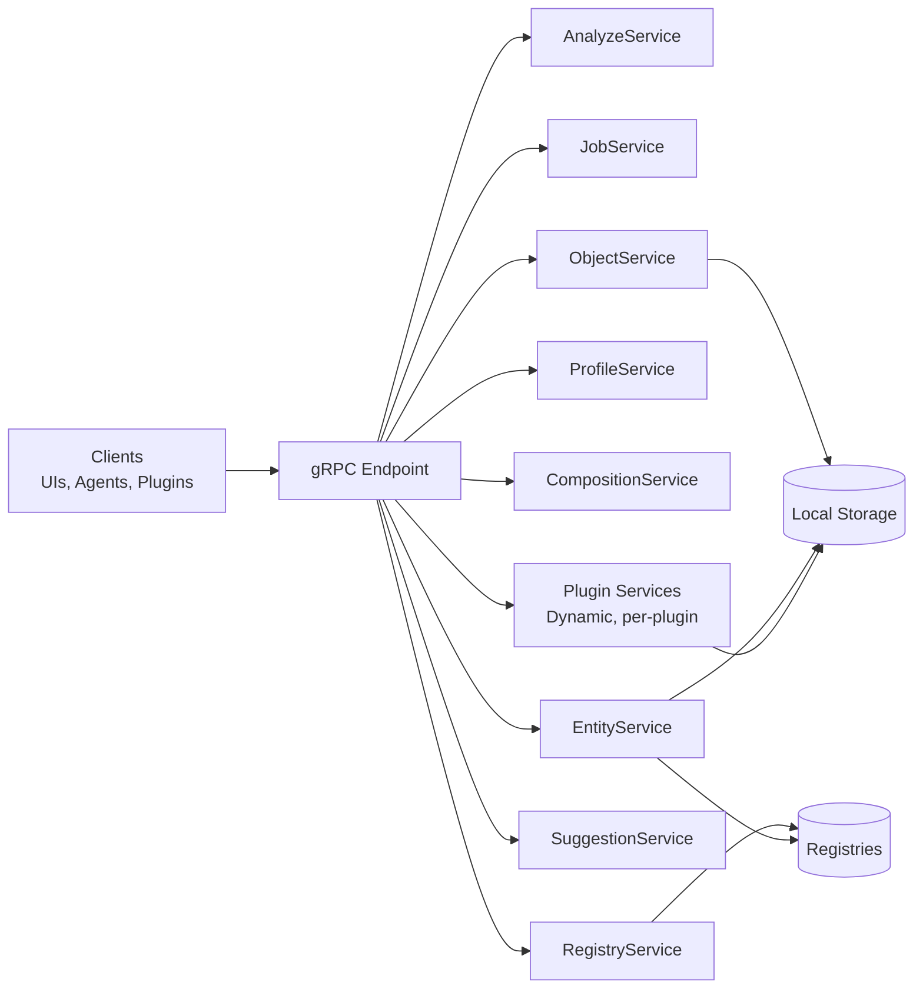

# gRPC API

This document specifies the **ContextHelp gRPC API**, the canonical typed interface for high-performance ingestion, retrieval, entity-aware mentions, and authorized plugin-driven extensions.

While the REST API is optimized for human and web use, the gRPC API is optimized for:

- UIs with real-time interactions
- local or remote agents
- plugins invoking the engine programmatically
- streaming pipelines
- bulk ingestion
- multi-step retrieval workflows
- structured, strongly typed integration

gRPC provides:

- high throughput
- low latency
- bi-directional streaming
- strong typing and schema evolution
- language bindings for all major ecosystems

Plugins MAY define additional RPC services under their own namespaces without modifying core.

---

## Overview

### Services

The gRPC surface area is divided into logical services:

| Service | Responsibility |
|--------|----------------|
| `AnalyzeService` | Ingestion via job-based pipelines |
| `JobService` | Query, retry, manage job lifecycle |
| `ObjectService` | Search, list, update, delete knowledge objects |
| `ProfileService` | Manage focus profiles |
| `CompositionService` | Generate briefs, plans, summaries, drafts |
| `RegistryService` | Discover registries and capabilities |
| `EntityService` | Resolve entities, list mentions, navigate backlinks |
| `SuggestionService` | Tag and hint suggestions (optional) |
| `NodeAdminService` (optional) | Node enrollment and admin operations (used by context.help cloud) |
| **`PluginService` (reserved)** | Plugin-defined RPCs mounted dynamically |

Plugins MAY register additional RPC services under the namespace:

```
contexthelp.plugins.<pluginName>.v1
```

These services do not require any modification to core API files.



### Protobuf Package

The recommended namespace:

```protobuf
package contexthelp.v1;
```

Future versions will increment the package (for example, `contexthelp.v2`).

Plugin-defined APIs MUST use:

```protobuf
package contexthelp.plugins.<pluginName>.v1;
```

---

## Common Messages

Shared across services.

### Timestamp

- Uses `google.protobuf.Timestamp`.

### KeyValue

```protobuf
message KeyValue {
  string key = 1;
  string value = 2;
}
```

### Error (For Streaming RPCs)

```protobuf
message Error {
  string code = 1;
  string message = 2;
  map<string, string> details = 3;
}
```

---

## Job-Related Messages

### AnalyzeRequest

```protobuf
message AnalyzeRequest {
  string type = 1;                     // text, url, image, audio, video, other
  string content = 2;                  // raw text, URL, base64 data, etc.
  repeated string hints = 3;           // user hints (#tags, freeform cues)
  string profile = 4;                  // focus profile (founder, engineer, research, etc.)
  string pipeline = 5;                 // optional explicit pipeline
  string language = 6;                 // optional declared input language
  bool skip_translation = 7;           // override i18n plugins for this call

  // Canonical entity IDs or slugs already known to the caller.
  repeated string mentions = 8;

  // Plugins may attach metadata to influence plugin-defined pipelines.
  map<string, string> plugin_metadata = 9;
}
```

### AnalyzeResponse

```protobuf
message AnalyzeResponse {
  string job_id = 1;
  string status = 2;                   // pending, running, completed, failed
}
```

### Job

```protobuf
message Job {
  string id = 1;
  string type = 2;                           // analyze, plugin:<pluginName>:*
  string status = 3;
  google.protobuf.Timestamp created_at = 4;
  google.protobuf.Timestamp updated_at = 5;

  AnalyzeRequest input = 6;

  string pipeline = 7;
  repeated JobStep steps = 8;

  string result_object_id = 9;
  string error = 10;

  // Plugins may attach additional state (e.g., price_monitor, rss_feed)
  map<string, string> plugin_metadata = 11;
}
```

### JobStep

```protobuf
message JobStep {
  string name = 1;
  string status = 2;
  google.protobuf.Timestamp started_at = 3;
  google.protobuf.Timestamp finished_at = 4;
  string error = 5;
}
```

---

## Knowledge Object and Mention Messages

### KnowledgeObject

```protobuf
message KnowledgeObject {
  string id = 1;

  google.protobuf.Timestamp created_at = 2;
  google.protobuf.Timestamp last_matched_at = 3;

  string type = 4;                           // text, url, feed, plugin-defined
  string subtype = 5;

  string title = 6;
  string summary = 7;

  string raw = 8;

  string language = 9;
  string profile = 10;                       // focus profile used during ingestion

  repeated Tag tags = 11;
  repeated string hints = 12;

  string pipeline = 13;
  string source = 14;

  uint32 views = 15;
  uint32 matches = 16;

  map<string, Translation> translations = 17;

  repeated Section sections = 18;
  repeated Decision decisions = 19;

  repeated RegistryReference registry_refs = 20;

  repeated string mentions = 21;
  repeated EntityRef entities = 22;

  // Namespaced plugin fields:
  // object.plugins.<pluginName>.* becomes:
  map<string, string> plugin_metadata = 23;
}
```

### Tag

```protobuf
message Tag {
  string label = 1;
  double weight = 2;
  string polarity = 3;
  repeated string influenced_by = 4;
}
```

### Section

```protobuf
message Section {
  string name = 1;
  string summary = 2;
}
```

### Decision

```protobuf
message Decision {
  string section = 1;
  string rating = 2;
  string reason = 3;
  string improvement = 4;
}
```

### Translation

```protobuf
message Translation {
  string summary = 1;
  map<string, string> fields = 2;
}
```

### RegistryReference

```protobuf
message RegistryReference {
  string registry_id = 1;
  string tag = 2;
}
```

### EntityRef

```protobuf
message EntityRef {
  string id = 1;
  string registry_id = 2;
  string source = 3;
}
```

---

## Entity Messages

```protobuf
message Entity {
  string id = 1;
  string title = 2;
  string description = 3;

  repeated string aliases = 4;

  map<string, string> translations = 5;

  string source = 6;
  map<string, string> metadata = 7;

  uint32 version = 8;
}
```

### EntityBacklink

```protobuf
message EntityBacklink {
  string entity_id = 1;
  string object_id = 2;
  string object_title = 3;
  string object_summary = 4;
}
```

---

## Focus Profile Messages

```protobuf
message Profile {
  string name = 1;
  string description = 2;
  bool enabled = 3;
  map<string, string> config = 4;
}
```

---

## Composition Messages

```protobuf
message ComposeRequest {
  string type = 1;                     // brief, plan, summary, draft
  string profile = 2;
  SearchRequest filters = 3;
  map<string, string> options = 4;
}

message ComposeResponse {
  string id = 1;
  string type = 2;
  string content = 3;
  map<string, string> metadata = 4;
}
```

---

## Query Messages (RSQL-Based)

### SearchRequest

```protobuf
message SearchRequest {
  string q = 1;

  repeated string tag = 2;
  string type = 3;
  string pipeline = 4;

  string after = 5;
  string before = 6;

  string registry = 7;

  string orig_lang = 8;
  string prefer_lang = 9;
  string translate = 10;

  uint32 limit = 11;
  uint32 offset = 12;

  repeated string sort = 13;
  string dir = 14;

  repeated string mention = 15;

  bool mentions_only = 16;

  string profile = 17;

  // Plugins may extend filtering via namespaced keys.
  map<string, string> plugin_filters = 18;
}
```

---

## Registry Messages

```protobuf
message Registry {
  string id = 1;
  string name = 2;
  string description = 3;

  repeated string type = 4;
  string url = 5;

  bool sync_supported = 6;
  string sync_mode = 7;

  string auth_type = 8;
  bool auth_configured = 9;

  map<string, string> capabilities = 10;
}
```

---

## Suggestion Messages (Optional)

### TagSuggestionRequest

```protobuf
message TagSuggestionRequest {
  string q = 1;
  uint32 limit = 2;
}
```

### TagSuggestion

```protobuf
message TagSuggestion {
  string label = 1;
  string source = 2;
  double confidence = 3;
}
```

### TagSuggestionResponse

```protobuf
message TagSuggestionResponse {
  repeated TagSuggestion suggestions = 1;
}
```

---

## Services

### AnalyzeService

```protobuf
service AnalyzeService {
  rpc Analyze(AnalyzeRequest) returns (AnalyzeResponse);
}
```

### JobService

```protobuf
service JobService {
  rpc ListJobs(ListJobsRequest) returns (ListJobsResponse);
  rpc GetJob(GetJobRequest) returns (Job);
  rpc RetryJob(RetryJobRequest) returns (Job);
}
```

### ObjectService

```protobuf
service ObjectService {
  rpc Search(SearchRequest) returns (SearchResponse);
  rpc Get(GetObjectRequest) returns (KnowledgeObject);
  rpc Update(UpdateObjectRequest) returns (KnowledgeObject);
  rpc Delete(DeleteObjectRequest) returns (DeleteObjectResponse);
}
```

### ProfileService

```protobuf
service ProfileService {
  rpc ListProfiles(ListProfilesRequest) returns (ListProfilesResponse);
  rpc GetProfile(GetProfileRequest) returns (Profile);
}
```

### CompositionService

```protobuf
service CompositionService {
  rpc Compose(ComposeRequest) returns (ComposeResponse);
}
```

### RegistryService

```protobuf
service RegistryService {
  rpc ListRegistries(ListRegistriesRequest) returns (ListRegistriesResponse);
  rpc GetRegistry(GetRegistryRequest) returns (Registry);
}
```

### EntityService

```protobuf
service EntityService {
  rpc ListEntities(ListEntitiesRequest) returns (ListEntitiesResponse);
  rpc GetEntity(GetEntityRequest) returns (Entity);
  rpc ResolveEntity(ResolveEntityRequest) returns (Entity);
  rpc ListEntityBacklinks(ListEntityBacklinksRequest) returns (ListEntityBacklinksResponse);
}
```

### SuggestionService (Optional)

```protobuf
service SuggestionService {
  rpc SuggestTags(TagSuggestionRequest) returns (TagSuggestionResponse);
}
```

### NodeAdminService (Optional)

The primary admin surface is the HTTP Node Admin API (`/admin/v1`).

This gRPC service is reserved for parity and high-throughput administration.
If implemented, it should mirror `docs/api/node-admin-api.md`.

Recommended namespace:

```protobuf
package contexthelp.admin.v1;
```

Service sketch:

```protobuf
service NodeAdminService {
  rpc GetCapabilities(GetCapabilitiesRequest) returns (GetCapabilitiesResponse);
  rpc GetStatus(GetStatusRequest) returns (GetStatusResponse);

  rpc Attach(AttachRequest) returns (AttachResponse);
  rpc Detach(DetachRequest) returns (DetachResponse);

  rpc ListAuditEvents(ListAuditEventsRequest) returns (ListAuditEventsResponse);
  rpc ListMeteringEvents(ListMeteringEventsRequest) returns (ListMeteringEventsResponse);
}
```

---

## Plugin Services

Plugins may expose their own gRPC services without modifying core.

### Naming Convention

```
package contexthelp.plugins.<pluginName>.v1;
```

### Example

A price monitoring plugin may define:

```protobuf
service PriceMonitorService {
  rpc GetPriceHistory(GetPriceHistoryRequest) returns (GetPriceHistoryResponse);
  rpc GetAlerts(GetPriceAlertsRequest) returns (GetPriceAlertsResponse);
}
```

A notification plugin may define:

```protobuf
service NotificationService {
  rpc GetPending(GetNotificationRequest) returns (NotificationResponse);
  rpc MarkRead(NotificationAckRequest) returns (NotificationAckResponse);
}
```

Core dynamically mounts these services based on plugin registration.

No core modification is required.

---

## Mention Semantics

(Hints vs tags vs mentions — unchanged logic)

---

## Streaming Extensions

Same as before; plugins may also define streaming endpoints.

---

## Summary

This gRPC API explicitly supports:

- **focus profiles** for contextualized behavior
- **composition endpoints** for generating briefs, plans, and summaries
- **plugin-defined RPC services**
- **plugin-defined knowledge object types**
- **plugin metadata on jobs and knowledge objects**
- **plugin-defined filters**
- **plugin-influenced ingestion through metadata**
- **non-core notification & alert surfacing**
- **safe coexistence of core and plugin pipelines**

The core API remains stable, minimal, and deterministic, while enabling powerful extensions via plugins—without requiring core changes.
