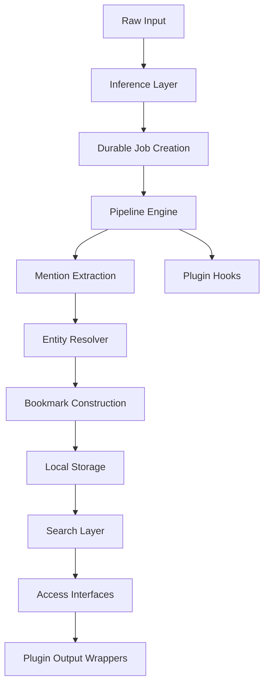
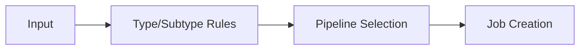
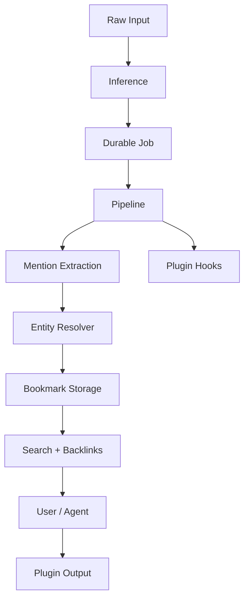

# Architecture

ContextHelp is a decentralized, local-first knowledge engine that ingests raw content, records ingestion operations into a durable job queue, enriches content using modular AI-driven pipelines, aligns outputs with user-selected registries, stores structured bookmarks locally, and retrieves knowledge through a multi-source search layer with deterministic merging and reranking.

With the introduction of **Mentions**, ContextHelp now supports canonical references to stable entities, enabling semantic graphs, backlinks, and richer cross-document reasoning.

With the introduction of **Plugin Hooks**, ContextHelp now supports powerful extensions—such as RSS ingestion, price monitoring, notifications, and custom pipelines—implemented entirely in plugin space without core modification.

---

## System Overview

ContextHelp consists of the following primary subsystems:

- Input Layer
- Inference Layer
- Ingestion & Job System (Transactional Outbox)
- Pipeline Engine
- **Plugin Layer (Extensibility Hooks & Plugin Runtime)**
- **Mentions Layer & Entity Resolver**
- Registry System (Decentralized, Multi-Source)
- Storage Layer (Local-First)
- Search Layer (AST-based, Scatter–Gather, Reranked)
- Access Interfaces (CLI, REST, gRPC)

Each subsystem is modular and replaceable. Plugins may extend, override, or wrap any part of the architecture through **stable, documented extension interfaces**, without touching the core.



---

## Core Principles

### Local-First
All ingestion, processing, and retrieval occur locally unless explicitly configured otherwise. Registries and remote services extend capabilities but never replace the local knowledge base.

### Transactional Safety
Every ingestion begins with a durable job record ensuring crash safety and deterministic pipeline execution.

### Deterministic Behavior
Given identical inputs, configurations, and registry states, ContextHelp must produce identical bookmarks, tags, mentions, and entity resolutions.

### Multi-Source Flexible Retrieval
ContextHelp retrieves knowledge from local storage, registries, synced snapshots, and plugin-defined sources, merging them deterministically.

### Modularity & Replaceability
Every subsystem can be replaced without touching core internals.

### Decentralization
Registries act as independent knowledge nodes capable of defining taxonomies, entities, aliases, translations, and semantic metadata.

### Agent-Scoped Context
Agents only see the registries, schemas, languages, and filters they are authorized to access.

### Plugin-Centric Customization (New)
Plugins can safely extend all functional layers:

- New bookmark types
- New pipelines
- New pipeline steps
- New search operators
- New job types
- New events and reactive behaviors
- Custom routing and notifications
- Custom enrichment logic

Plugins **must never modify core code** and instead use the documented plugin interfaces.

---

# Plugin Layer (Extensibility Model)

The Plugin Layer provides the stable interfaces through which plugins extend ContextHelp.
Plugins operate in **complete isolation**, owning their storage, configuration, and behavior.

## Plugin Capabilities

Plugins may:

- register new pipelines
- inject new pipeline steps
- define new bookmark types
- attach metadata to bookmarks under the `bookmark.plugins.<pluginName>` namespace
- enqueue ingestion jobs
- define refresh rules for bookmarks
- listen to plugin lifecycle events
- wrap CLI/REST/gRPC output
- provide internal APIs for other plugins (e.g. Notification Plugin)

Plugins may not:

- modify core tables
- override core schema
- modify registry definitions not owned by them
- modify entity resolution rules

## Plugin Hooks

Plugins use stable lifecycle hooks, including:

- `on_cli_start(ctx)`
- `post_ingest(ctx, bookmark)`
- `post_pipeline_step(ctx, step)`
- `on_refresh(ctx, bookmark)`
- `on_job_completed(job)`
- `plugin_event(type, payload)` (plugin-defined event bus)
- `wrap_cli_output(output)`
- `wrap_rest_response(response)`
- `wrap_grpc_response(response)`

These hooks allow rich behaviors such as:

- RSS auto-fetch
- price monitoring
- notification routing
- enrichment sidecars
- pipeline augmentation

## Plugin Storage

Plugins store all state inside:

```
~/.contexthelp/plugins/<pluginName>/
```

Common patterns:

- `state.json`
- `rules.json`
- plugin-level caches
- per-bookmark metadata stored under `bookmark.plugins.<pluginName>`

No core storage changes are required.

## Plugin-Defined Bookmark Types

Plugins may define new types. Examples:

- `feed`
- `feed_item`
- `price_item`
- `monitor_source`

The core simply treats them as opaque types, but search, pipelines, and UI surfaces may use the type field to guide behavior.

## Plugin Job Scheduling

Plugins may enqueue new jobs by using the standardized interface exposed through the plugin SDK:

- `jobs.Enqueue(pipeline, input, pluginMetadata)`

This enables:

- feed item ingestion
- refresh runs
- periodic evaluations
- scheduled checks

---

# Input Layer

Accepts typed or raw content from clipboard, files, URLs, images, audio, video, or API usage.

Responsibilities:

- URL normalization
- MIME sniffing
- Basic validation
- Passing typed input to the Inference Layer

Plugins may extend input detection or override subtype rules.

---

# Inference Layer

Determines:

- type
- subtype
- pipeline
- language

Plugins may extend:

- routing rules
- subtype detectors
- language inference models



---

# Ingestion & Job System (Transactional Outbox)

A durable, append-only job queue ensures that all ingestion steps are recoverable and deterministic.

Jobs include:

- ingestion
- refresh
- plugin-scheduled jobs

Plugins may create new job types safely.

### Job Lifecycle

- Pending
- Running
- Retrying
- Completed
- Failed

Plugins access job events via hooks.

---

# Pipeline Engine

Responsible for AI-driven enrichment:

- text analysis
- OCR
- URL fetch
- transcription
- hint and tag analysis
- mention extraction
- entity resolution
- summary generation
- bookmark construction

## Pipeline Structure

- Tasks
- Context object
- Hooks
- Plugin-registered steps
- Plugin pipeline overrides

Plugins can add new pipeline tasks or entire pipelines (e.g. `feed.fetch`, `feed.parse`).

---

# Mentions Layer

Supports explicit, canonical references to entities.

Responsibilities:

- Extract `@entity.slug`
- Validate entity syntax
- Resolve entities via registry or local definitions
- Record mention → entity relationships
- Update backlink index

Plugins may define additional mention extractors or entity fields.

---

# Entity Resolver

Maps mentions to canonical entities via:

- local registry
- remote registries
- alias chains
- versioning rules

Unresolved mentions become local placeholders.

Plugins may register:

- custom entity resolvers
- custom alias logic
- local entity definitions

But cannot modify core resolver behavior.

---

# Registry System (Decentralized Knowledge Nodes)

Registries may serve:

- taxonomies
- tags
- entities
- aliases
- translations

Plugins may:

- define custom registry providers
- interpret registry-provided semantics
- create plugin-level registries

---

# Storage Layer (Local-First)

Stores:

- bookmarks
- jobs
- job steps
- caches
- registry snapshots
- mention indexes
- local entity definitions

**Plugin Storage**

Plugins store their own state, not in core tables, using:

```
~/.contexthelp/plugins/<pluginName>/
```

---

# Search Layer

Responsible for:

- parsing queries into AST
- metadata filtering
- FTS text search
- vector similarity search
- mention/entity filtering
- plugin-extended operators

Plugins may register:

- custom search operators
- search result transformers
- scoring modifiers
- ranking rules

---

# Access Interfaces

## CLI (`ch`)

Includes:

- mention-based filters
- entity exploration
- plugin-defined commands
- plugin notification surfaces (via output wrappers)

## REST API

Plugins may extend the REST layer by:

- adding namespaced endpoints
- wrapping responses
- adding metadata

## gRPC API

Plugins may define:

- new service extensions
- response wrappers

---

# Agent Context Profiles

Agents limit access to:

- registries
- entities
- languages
- pipelines
- plugins

Plugins must declare:

- required permissions
- required data visibility

---

# Data Flow Overview



---

# Extensibility Model

Plugins may add:

- new mention extractors
- custom entity schemas
- registry resolvers
- embedding pipelines
- rerankers
- query operators
- custom bookmark types
- job scheduling rules
- notification handlers
- refresh configuration

Plugins never modify:

- core database schema
- core registry models
- core ingestion logic
- core semantic interpretation

---

# Security & Privacy

- Plugins are sandboxed and cannot access data beyond what users configure
- Notification or outbound network plugins require explicit user opt-in
- Registry access is permissioned
- Refresh behavior is controlled by configuration

---

# Summary

ContextHelp integrates:

- durable ingestion
- modular pipelines
- decentralized registries
- canonical entity mentions
- semantic graph construction
- plugin-driven extensibility
- local-first architecture

The Plugin Layer enables powerful extensions (RSS ingestion, price monitoring, notifications) without modifying the core, preserving both stability and developer freedom.