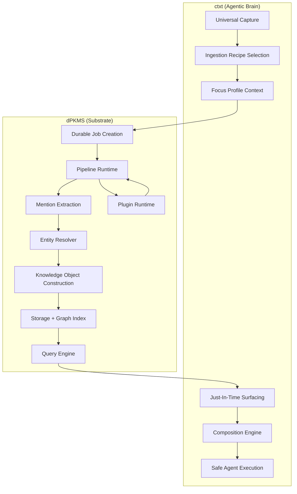
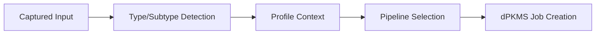
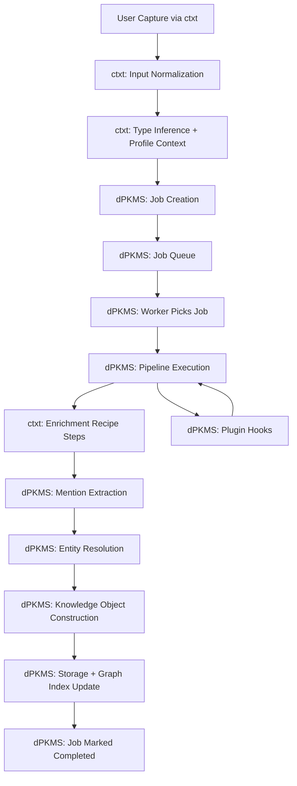
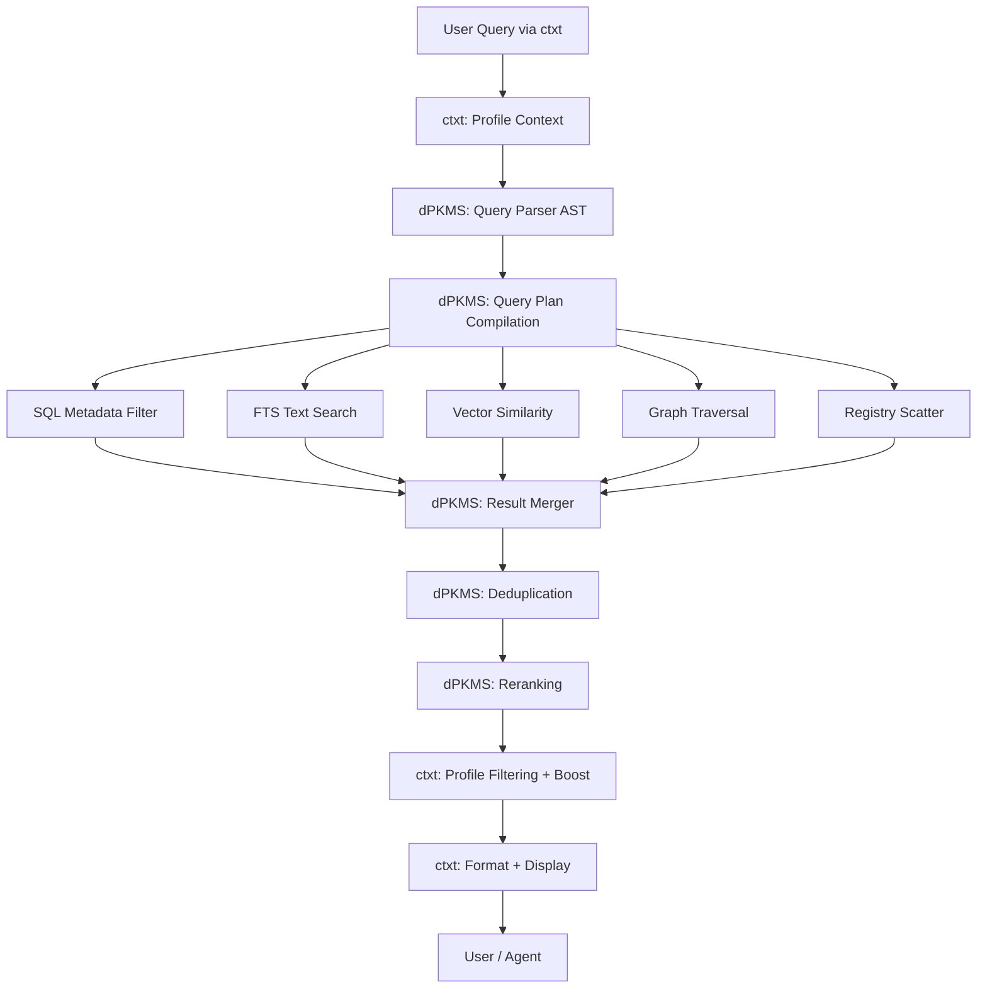
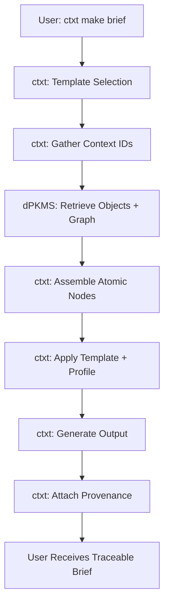

# Architecture

This document describes the architecture of a two-package system:

- **dPKMS** — a decentralized, local-first knowledge substrate for durable storage, encryption, identity, indexing, registries, federation, and safe execution.
- **`ctxt`** — an agentic context brain that uses dPKMS capabilities to ingest, enrich, compose, and surface knowledge just-in-time through human-friendly interfaces.

Together, they transform raw multimodal inputs into structured, contextualized knowledge that humans and AI agents can reliably use as **private, task-relevant context**.

This design explicitly separates:
- **mechanics** (dPKMS: safe execution + data guarantees)
from
- **meaning** (`ctxt`: intelligence + behavior + workflows)

With the introduction of **Mentions**, the system supports canonical references to stable entities, enabling semantic graphs, backlinks, and richer cross-document reasoning.

With the introduction of **Plugin Hooks**, the system supports powerful extensions—such as RSS ingestion, price monitoring, notifications, and custom pipelines—implemented entirely in plugin space without core modification.

---

## System Overview

The system consists of two primary packages, each with distinct subsystems:

### dPKMS (The Substrate)
- Storage Layer (Local-First, Pluggable Backends)
- Indexing Layer (FTS + Vectors + Graph Adjacency)
- Job System (Transactional Outbox)
- Pipeline Runtime (Deterministic + Capability-Scoped)
- **Mentions Layer & Entity Resolver**
- Knowledge Graph (Objects ↔ Entities ↔ Entities)
- Query Engine (AST-Based, Explainable)
- Registry System (Decentralized, Multi-Source, Federated)
- Encryption & Key Management
- Authentication & Authorization
- **Plugin Layer (Extensibility Hooks & Plugin Runtime)**
- Export/Import Contract (Portable Bundles)

### `ctxt` (The Agentic Brain)
- Universal Capture Layer (CLI, TUI, Browser, Mobile)
- Ingestion Recipes (Multimodal Enrichment Pipelines)
- Focus Profiles (Role/Project Lenses)
- Search & Retrieval UX
- Just-In-Time Surfacing Engine
- Composition Engine (Briefs, Plans, Drafts)
- Action Layer (Decisions, Tasks, Follow-Ups)
- Safe Agent Execution (Propose → Dry Run → Apply)
- Controlled Sharing Workflows
- CLI/REST/gRPC Interfaces

Each subsystem is modular and replaceable. Plugins may extend, override, or wrap any part of the architecture through **stable, documented extension interfaces**, without touching the core.

**Key Principle:** dPKMS runs work correctly. `ctxt` decides which work is valuable.



---

## Nodes + context.help cloud

ContextHelp runs as one or more **nodes**. A node may be self-hosted or managed via **context.help cloud**.

### Cloud scope (non-OSS)
- Org + user lifecycle, SSO/SCIM
- Multi-node access management (one org, many nodes)
- Billing/credits and marketplace for paid registries and extensions

### Node scope (OSS)
- Policy enforcement (permissions/RBAC, entitlements, quotas)
- Registry protocol client (thin sync + just-in-time pull)
- Audit + metering event emission

See `docs/cloud/README.md` and `docs/decisions/ADR-031-nodes-and-cloud-boundary.md`.

---

## Deployment: Web2/Web3 Hybrid Model

The system is **deployment-agnostic**. The same dPKMS + ctxt node runs on any infrastructure, with pluggable storage and networking.

### Storage Drivers (Pluggable)

The system is indifferent to where data persists:

- **SQLite** (local machine) — Default, zero-install, high performance for <1M objects
- **PostgreSQL** (cloud) — Multi-user, replication, high availability
- **IPFS** (P2P network) — Content-addressed, peer-pinned, DHT-discoverable
- **Arweave** (permanent) — Immutable archive, permanent storage
- **Blockchain** (Solana/Ethereum) — Metadata anchoring, proof-of-authorship, smart contracts

### Network Transports (Pluggable)

The system is indifferent to how nodes communicate:

- **HTTP** (cloud APIs) — REST/gRPC for centralized or cloud deployments
- **libp2p** (P2P networks) — Kademlia DHT for decentralized node discovery and sync
- **RPC** (blockchain) — Connection to settlement layers for on-chain settlement
- **Registry Protocol** (federated) — Works identically on any backend

### Five Deployment Models

#### 1. Web2: Managed Cloud (Recommended for Teams)
```
Users → SSO/SCIM (cloud identity) → Managed nodes (hosted) → PostgreSQL
```
- **Best for:** Teams wanting zero ops
- **Data location:** context.help cloud (encrypted)
- **Availability:** 99.99% uptime
- **Cost:** $15-50/user/month
- **Ops burden:** None (handled by cloud provider)

#### 2. Web2: Self-Hosted (Recommended for Privacy)
```
User machine → dPKMS node (OSS) → SQLite or self-managed Postgres
```
- **Best for:** Privacy-first individuals, data residency requirements
- **Data location:** User's control (local disk, cloud VM, on-prem)
- **Availability:** User's responsibility
- **Cost:** Free (your hardware)
- **Ops burden:** User's responsibility

#### 3. Web3: IPFS (Recommended for Communities)
```
P2P nodes → IPFS cluster → DHT discovery → Pinning service
```
- **Best for:** Decentralized communities, censorship-resistance
- **Data location:** IPFS cluster (replicated, peer-pinned)
- **Availability:** P2P resilience (no single point of failure)
- **Cost:** Pinning fees (~$0.01/GB/month)
- **Permanence:** Requires active community pinning

#### 4. Web3: Blockchain (Recommended for Verifiable)
```
Nodes → Blockchain anchor (Solana/Ethereum) → Arweave (archival) → Smart contracts
```
- **Best for:** Immutable proof, verifiable publishing, monetizable registries
- **Data location:** Off-chain (encrypted) + on-chain metadata
- **Availability:** Blockchain consensus
- **Cost:** Per-transaction fees (~$0.01-0.50/anchor)
- **Permanence:** Forever (immutable on-chain)

#### 5. Hybrid: Multi-Stack (Recommended for Enterprises)
```
Single node → Local (hot) + Cloud (compliance) + IPFS (redundancy) + Arweave (archive) + Blockchain (proof)
```
- **Best for:** Enterprises needing maximum resilience
- **Data location:** All targets simultaneously
- **Availability:** No single point of failure
- **Cost:** Sum of all targets
- **Resilience:** Can recover from any single target failure

### Hybrid Sync Guarantee

A single dPKMS + ctxt node can write once, asynchronously replicate to multiple targets, and serve reads from any target with automatic failover.

**Write Path:**
```
User adds content
    ↓
Write to local SQLite (immediate)
    ↓
Create async outbox jobs:
├─ Sync to PostgreSQL (if cloud enabled)
├─ Pin to IPFS cluster (if P2P enabled)
├─ Archive to Arweave (if archival enabled)
└─ Anchor to blockchain (if settlement enabled)
    ↓
Each job completes independently
    ↓
Content is now in all configured targets
```

**Read Path:**
```
User queries
    ↓
Query local SQLite (fast)
    ↓
In parallel (if configured):
├─ Query cloud PostgreSQL
├─ Query IPFS DHT
├─ Query blockchain events
└─ Query registered pinners
    ↓
Merge + deduplicate results
    ↓
Rerank by profile weight
    ↓
Return with provenance
```

If any target fails, reads continue using others. If all targets fail, local SQLite is your recovery point.

### Core Property: Deterministic Sync

All syncing is deterministic:
- Same data in local SQLite == cloud PostgreSQL == IPFS == Arweave == blockchain metadata
- Can migrate between models without data loss
- Can restore from any target with identical result
- Zero vendor lock-in by design

### Migration Paths

**Web2 Cloud → Web3 Hybrid:**
```
1. Export from cloud: ctxt export --format=bundle
2. Install local node + configure hybrid targets
3. Import: dpkms import bundle.tar.gz
4. Configure IPFS + blockchain targets
5. Jobs sync in background
```

**Web3 IPFS → Web2 Cloud:**
```
1. Export from IPFS: dpkms export --from=ipfs-driver
2. Set up cloud node
3. Import: dpkms import bundle.tar.gz
4. Sync complete, data intact
```

**Solo Local → Team Hybrid:**
```
1. Keep local SQLite (personal copy)
2. Add cloud node (team collaboration)
3. Configure hybrid sync (local ↔ cloud ↔ IPFS)
4. Team members join via cloud identity
5. Central registries for consistency
6. Local customization per member
```

### Implementation Phases

| Phase | Timeline | Components |
|-------|----------|-----------|
| **Phase 1** | MVP (exists) | SQLite storage, HTTP transport, Registry protocol |
| **Phase 2** | 3-6 months | PostgreSQL driver, managed cloud service, Docker packaging |
| **Phase 3** | 6-12 months | IPFS driver, libp2p transport, Solana integration |
| **Phase 4** | 12+ months | Arweave driver, Ethereum integration, smart contracts, marketplaces |

**Full specification:** See `docs/deployment/WEB2-WEB3-HYBRID.md`

---

## Core Principles

### dPKMS Principles (Substrate)

#### Sovereign
Full ownership is non-negotiable. Local-first, privacy-first, exportable forever. No vendor dependency.

#### Durable
Nothing breaks silently. Every operation is resumable, crash-safe, and recoverable by design.

#### Verifiable
Every conclusion has receipts and history. Provenance is preserved. Changes are reversible. Integrity is inspectable.

#### Self-Authenticating
Knowledge can prove origin and integrity. Entities, bundles, and revisions support signatures. Trust remains optional, but possible.

#### Interoperable
Knowledge must survive the ecosystem. It syncs, migrates, and composes across tools without breaking identity or meaning.

#### Federated
Knowledge can live anywhere. Query merges across sources cleanly. Ownership stays local. Replication is optional.

#### Language-Native
Multilingual knowledge is first-class. Entities, labels, and indexing support mixed languages without hacks or loss.

#### Extensible
The system must outlive assumptions. Pipelines, storage, providers, and operators plug in without rewrites.

#### Fast
It must feel instant. Performance stays predictable as the graph and storage grow.

### `ctxt` Principles (Agentic Brain)

#### Frictionless
Zero-resistance capture and retrieval. No rituals, no decisions, no "where does this go?" moments.

#### Accessible
Same brain, every interface. CLI, TUI, REPL, browser extension, web, mobile. Anywhere, instantly usable.

#### Formless
Accepts reality as-is. Any format, length, or mess. Nothing is rejected.

#### Polyglot
Speaks every language of knowledge and communication. Notes, tasks, code, media, research, and mixed Arabic/English/French stay usable and linkable.

#### Trusted
Sharing is explicit and reversible. Publish, subscribe, or collaborate. Trust is earned, not assumed.

#### Atomic
Notes are nodes, not essays. Small enough to link, reuse, remix, and reference. Built for composition.

#### Discoverable
Retrieval is effortless under uncertainty. Fuzzy search, semantic search, filters, and recall without perfect memory.

#### Evergreen
Knowledge compounds instead of rotting. Notes get revisited, re-linked, refined, and updated as understanding grows.

#### Actionable
Insight must create movement. Every capture becomes a decision, next step, draft, task, or deliberate archive.

### Shared Architectural Principles

#### Deterministic Behavior
Given identical inputs, configurations, and registry states, the system must produce identical knowledge objects, tags, mentions, and entity resolutions.

#### Plugin-Centric Customization
Plugins can safely extend all functional layers without modifying core code:

- New knowledge object types
- New pipelines and pipeline steps
- New search operators and query capabilities
- New job types and reactive behaviors
- Custom routing, notifications, and enrichment logic
- Storage backends and encryption providers
- Registry connectors and federation strategies

Plugins **must use documented plugin interfaces** and never touch core internals.

---

# Package Architecture: dPKMS vs `ctxt`

## 1) dPKMS (The Substrate)

dPKMS is the execution and data layer. It is designed to be **agent-ready**, not agent-opinionated.

### What dPKMS Provides

**Storage + Indexing**
- Local-first database with SQLite default (Postgres optional)
- Attachment store for blobs (images, audio, video, documents)
- FTS indexing (SQLite FTS5)
- Vector index hook (pluggable interface)
- Graph adjacency indexes (object ↔ entity, entity ↔ entity)
- Stable IDs and portable data model

**Knowledge Objects + Graph Model**
- Structured object schema (metadata, sections, tags, mentions, decisions, tasks, embeddings, provenance)
- Canonical entities with aliases, translations, and versioning
- Mention extraction and resolution (`@entity.slug`)
- Graph index for semantic navigation and retrieval

**Jobs + Pipelines Runtime**
- Transactional job queue (local outbox pattern)
- Pipeline execution runtime with step isolation
- Crash-safe recovery and resumability
- Deterministic replay for auditability
- Retry logic and idempotency guarantees
- Structured logs and step traces

**Encryption + Key Management**
- Encryption at rest and in transit
- Pluggable key strategies
- Privacy-preserving search mode (optional)

**Authentication + Authorization**
- Private-by-default workspaces
- Token-based access and scoped permissions
- Registry subscription controls
- Collaboration handshakes

**Registries + Federation**
- Decentralized registries for taxonomies, entities, workflows
- Subscription and synchronization primitives
- Federated query across multiple sources
- Trust policies and signature verification (optional)

**Self-Authenticating Capabilities**
- Optional signing and verification for bundles, registries, revisions
- Tamper-evident history
- Portable trust model

**Export/Import Contract**
- Portable bundles (Markdown + JSON + SQLite)
- Preserve IDs, provenance, edges, attachments
- Zero lock-in migration paths

### What dPKMS Does NOT Do
- Decide which enrichments matter
- Choose models or writing style
- Generate briefs or plans
- Decide what to surface or notify
- Enforce a worldview

**dPKMS runs work correctly. It does not decide what work is valuable.**

---

## 2) `ctxt` (The Context Brain)

`ctxt` is the agentic product layer. It builds human workflows on top of dPKMS capabilities.

### What `ctxt` Provides

**Universal Capture**
- CLI/TUI/REPL commands
- Browser extension entry points
- Mobile capture and share sheet support
- Offline-first dumping with local outbox
- Inbox mode (capture first, structure later)

**Multimodal Enrichment Pipelines**
- Recipes for text, URL, image, audio, video, documents, code
- Summarization, entity extraction, decision detection, task extraction
- Translation hooks and structured decomposition
- Progressive enrichment (raw → refined over time)

**Meaningful Defaults**
- "Capture first, structure later" behavior
- Background enrichment with graceful degradation
- Smart pipeline selection based on input type

**Focus Profiles (Role/Project Lenses)**
- Founder vs Engineer vs Research vs "Project X" profiles
- Profile-driven ranking, surfacing, templates, and outputs
- Context-aware pipeline selection

**Just-In-Time Surfacing**
- Relevant knowledge resurfacing based on active work
- Time windows, people, projects, and recent activity
- Proactive reminders without noise

**Composition Engine**
- One-command generation of briefs, plans, meeting packets
- Checklists, drafts, messages, and publish-ready artifacts
- Assembled from atomic nodes and graph context
- Traceable back to sources

**Safe Agent Behavior**
- Propose → dry-run → apply workflows
- Audits, scope controls, and reversibility
- Avoid silent automation and unintended writes

**Search That Forgives**
- Fast discovery under uncertainty
- Fuzzy search, semantic search, filters
- Entity-aware lookup and graph-informed exploration

**Personal Relevance Model**
- Learns what "useful" means through implicit feedback
- Adapts ranking, surfacing, and defaults over time

**Controlled Sharing Workflows**
- User-driven publishing and subscription management
- Collaboration flows with boundary controls
- Integration with dPKMS permissions

**`ctxt` decides which jobs and pipelines are worth running. dPKMS guarantees they run safely.**

---

# Plugin Layer (Extensibility Model)

The Plugin Layer provides stable interfaces through which plugins extend both dPKMS and `ctxt`.
Plugins operate in **complete isolation**, owning their storage, configuration, and behavior.

## Plugin Capabilities

Plugins may:

**dPKMS Plugin Capabilities:**
- Register new pipelines and inject pipeline steps
- Define new knowledge object types
- Add custom storage backends
- Provide encryption and key management strategies
- Implement custom registry connectors
- Extend query operators and search capabilities
- Add graph traversal algorithms
- Provide authentication methods

**`ctxt` Plugin Capabilities:**
- Define new capture interfaces
- Add enrichment recipes and ingestion workflows
- Create focus profiles and surfacing rules
- Implement composition templates
- Add action extraction logic
- Provide translation and localization
- Wrap CLI/REST/gRPC output
- Define notification and sharing behaviors

**Cross-Layer Capabilities:**
- Attach metadata to objects under `object.plugins.<pluginName>` namespace
- Enqueue jobs through dPKMS job system
- Define refresh rules and staleness policies
- Listen to plugin lifecycle events
- Provide internal APIs for other plugins

Plugins may NOT:
- Modify core tables or schema
- Override entity resolution rules
- Modify registry definitions not owned by them
- Access data beyond their permission scope
- Break determinism or idempotency guarantees

## Plugin Hooks

Plugins use stable lifecycle hooks, including:

- `on_cli_start(ctx)`
- `post_ingest(ctx, bookmark)`
- `post_pipeline_step(ctx, step)`
- `on_refresh(ctx, bookmark)`
- `on_job_completed(job)`
- `plugin_event(type, payload)` (plugin-defined event bus)
- `wrap_cli_output(output)`
- `wrap_rest_response(response)`
- `wrap_grpc_response(response)`

These hooks allow rich behaviors such as:

- RSS auto-fetch
- price monitoring
- notification routing
- enrichment sidecars
- pipeline augmentation

## Plugin Storage

Plugins store all state inside:

**dPKMS plugins:**
```
~/.dpkms/plugins/<pluginName>/
```

**`ctxt` plugins:**
```
~/.ctxt/plugins/<pluginName>/
```

Common patterns:
- `state.json` — plugin state
- `rules.json` — plugin configuration
- Plugin-level caches
- Per-object metadata stored under `object.plugins.<pluginName>`

No core storage changes are required.

## Plugin-Defined Knowledge Object Types

Plugins may define new object types. Examples:

**dPKMS-level types:**
- `entity` (canonical concepts)
- `registry_snapshot` (synced registry data)
- `signature` (cryptographic attestations)

**`ctxt`-level types:**
- `feed` (RSS/Atom sources)
- `feed_item` (individual feed entries)
- `price_item` (price monitoring snapshots)
- `monitor_source` (watchable resources)
- `decision` (extracted decisions)
- `task` (actionable items)

The core treats them as opaque types, but search, pipelines, and UI surfaces may use the type field to guide behavior.

## Plugin Job Scheduling

Plugins may enqueue new jobs by using the standardized interface exposed through the plugin SDK:

- `jobs.Enqueue(pipeline, input, pluginMetadata)`

This enables:

- feed item ingestion
- refresh runs
- periodic evaluations
- scheduled checks

---

# Input Layer (`ctxt`)

The Input Layer in `ctxt` provides universal capture across all interfaces.

**Capture Interfaces:**
- CLI: `ctxt add <content>`
- TUI: Interactive terminal UI
- REPL: Conversational capture mode
- Browser extension: Right-click, toolbar, keyboard shortcuts
- Web UI: Drag-and-drop, paste, forms
- Mobile: Share sheet integration
- API: REST/gRPC ingestion endpoints

**Responsibilities:**
- Accept any content type without rejection (formless principle)
- URL normalization and canonicalization
- MIME type detection
- Basic validation (size limits, format checks)
- Offline-first queuing (local outbox)
- Passing to dPKMS job system for enrichment

**Plugins may extend:**
- Input detection heuristics
- Subtype classification rules
- Custom capture interfaces
- Pre-processing transforms

---

# Inference Layer (`ctxt`)

The Inference Layer in `ctxt` determines how to process captured content.

**Determines:**
- Content type (text, URL, image, audio, video, document, code)
- Subtype (short text, long article, GitHub repo, PDF, etc.)
- Pipeline recipe to use
- Language(s) present
- Focus profile context

**Plugins may extend:**
- Type detection rules
- Subtype classifiers
- Pipeline routing logic
- Language inference models
- Profile-specific overrides



---

# Ingestion & Job System (dPKMS)

A durable, append-only job queue in dPKMS ensures that all ingestion and processing steps are recoverable and deterministic.

**Job Types:**
- Ingestion (content processing)
- Refresh (re-enrichment of stale objects)
- Sync (registry synchronization)
- Export/Import (bundle operations)
- Plugin-scheduled jobs

**Job Schema:**
```
jobs:
  - job_id (UUID)
  - type (ingestion, refresh, sync, etc.)
  - input_payload (raw content or reference)
  - pipeline (which pipeline to run)
  - state (pending, running, completed, failed)
  - retry_count
  - created_at, updated_at
  - error_message (optional)

job_steps:
  - step_id (UUID)
  - job_id (FK)
  - step_name
  - input, output
  - state
  - started_at, completed_at
  - error (optional)
```

**Job Lifecycle:**
1. **Pending** — Created, waiting for worker
2. **Running** — Being processed by worker
3. **Retrying** — Failed, will retry (up to max count)
4. **Completed** — Successfully finished
5. **Failed** — Exhausted retries or fatal error

**Resilience Mechanisms:**
- Stale `Running` jobs reset to `Pending` on worker restart
- Configurable retry count and backoff
- Failed jobs kept for inspection and manual retry
- Atomic state transitions
- Idempotent step execution

**Plugins may:**
- Create new job types
- Schedule periodic jobs
- Listen to job lifecycle events
- Access job traces and logs

---

# Pipeline Engine (dPKMS Runtime + `ctxt` Recipes)

The Pipeline Engine has two components:

## dPKMS Pipeline Runtime

Provides the **execution substrate** for pipelines:

**Capabilities:**
- Step isolation and typed inputs/outputs
- Caching hooks for expensive operations
- Idempotency guarantees
- Structured logging and traces
- Capability enforcement (network, filesystem, API access)
- Deterministic replay for debugging
- Error handling and retries

**Pipeline Step Interface:**
```go
type PipelineStep interface {
    Name() string
    Execute(ctx Context, input any) (output any, error)
    Retryable() bool
    RequiredCapabilities() []Capability
}
```

## `ctxt` Enrichment Recipes

Provides **opinionated pipelines** for content processing:

**Built-in Pipelines:**
- `text.short` — Quick summarization, entity extraction
- `text.long` — Deep analysis, section decomposition
- `url.generic` — Fetch, extract, clean, analyze
- `url.repo` — Clone, parse README, extract structure
- `image.ocr` — OCR, metadata extraction
- `image.landing` — Screenshot analysis, UI pattern detection
- `audio.transcript` — Transcription, speaker detection
- `video.analysis` — Frame sampling, scene detection, transcription
- `document.pdf` — Text extraction, structure parsing
- `code.snippet` — Language detection, syntax analysis

**Enrichment Steps:**
- Text analysis and summarization
- OCR and visual understanding
- URL fetching and cleaning
- Audio/video transcription
- Mention extraction (`@entity.slug`)
- Entity resolution via registries
- Tag assignment and classification
- Decision and task extraction
- Summary and section generation
- Knowledge object construction

**Plugins can:**
- Add new pipeline recipes
- Inject steps into existing pipelines
- Override default pipelines
- Define conditional branching logic
- Add custom enrichment steps

---

# Mentions Layer

Supports explicit, canonical references to entities.

Responsibilities:

- Extract `@entity.slug`
- Validate entity syntax
- Resolve entities via registry or local definitions
- Record mention → entity relationships
- Update backlink index

Plugins may define additional mention extractors or entity fields.

---

# Entity Resolver

Maps mentions to canonical entities via:

- local registry
- remote registries
- alias chains
- versioning rules

Unresolved mentions become local placeholders.

Plugins may register:

- custom entity resolvers
- custom alias logic
- local entity definitions

But cannot modify core resolver behavior.

---

# Registry System (Decentralized Knowledge Nodes)

Registries may serve:

- taxonomies
- tags
- entities
- aliases
- translations

Plugins may:

- define custom registry providers
- interpret registry-provided semantics
- create plugin-level registries

---

# Storage Layer (dPKMS)

The Storage Layer in dPKMS provides durable, queryable, local-first storage.

**Default Backend: SQLite**
- WAL mode enabled for concurrency
- Zero-install footprint
- Strong FTS support (FTS5)
- Adequate performance for local workloads
- Optional encryption at rest

**Optional Backends:**
- PostgreSQL (multi-user, server-grade)
- Remote stores (authenticated HTTP/gRPC)
- Vector databases (Qdrant, Weaviate, Pinecone)
- Custom backends via storage driver interface

**Core Tables:**

```sql
-- Knowledge Objects (formerly bookmarks)
objects:
  - id (UUID, stable)
  - type, subtype
  - raw_content
  - metadata (JSON)
  - summaries (JSON array)
  - sections (JSON array)
  - tags (JSON array with weights)
  - mentions (JSON array)
  - decisions, tasks (JSON arrays)
  - embeddings (vector)
  - pipeline, source
  - created_at, updated_at

-- Entities
entities:
  - id (canonical slug)
  - title, description
  - aliases (JSON array)
  - translations (JSON map)
  - metadata (JSON)
  - namespace, version
  - registry_source
  - created_at, updated_at

-- Graph Edges
edges:
  - id (UUID)
  - from_type, from_id
  - to_type, to_id
  - edge_type (mentions, related, derives_from)
  - weight
  - metadata (JSON)
  - created_at

-- Jobs (see Job System section)
-- Registry Snapshots
-- Revisions (version history)
```

**Indexes:**
- Metadata indexes on type, tag, created_at, pipeline, source
- FTS indexes on summaries, sections, raw_content
- Vector indexes on embeddings (optional)
- Graph adjacency indexes on edges

**Plugin Storage:**

Plugins store state separately:
```
~/.dpkms/plugins/<pluginName>/
~/.ctxt/plugins/<pluginName>/
```

**Migrations:**
- SQL migrations in `migrations/` directory
- Stable ID preservation across versions
- Reversible migration paths

---

# Search Layer (dPKMS Query + `ctxt` UX)

The Search Layer spans both packages:

## dPKMS Query Engine

Provides **deterministic, explainable query execution**:

**Query Language (RSQL-based AST):**
```
# Boolean operators
tag==ui AND type==article
(pipeline==text.short OR pipeline==text.long) AND lang==en

# Ranges and comparisons
created_at>=2024-01-01 AND weight>0.8

# IN/OUT operators
tag=in=(design,ux,patterns)
source=out=(twitter,reddit)

# Extended operators
mention:@ui.best-practice
entity:@stripe.api
similar=="authentication flow"
related:abc-123-uuid
```

**AST Nodes:**
- ComparisonNode (field, operator, value)
- LogicalAndNode, LogicalOrNode
- NotNode
- RangeNode
- MentionNode, EntityNode
- SimilarityNode

**Query Execution:**
1. Parse query → AST
2. Compile AST → Query Plan
3. Dispatch to backends:
   - Metadata filters → SQL WHERE clauses
   - Text search → FTS queries
   - Semantic search → vector similarity
   - Entity filters → graph traversal
   - Registry queries → remote scatter
4. Merge results
5. Rerank and deduplicate
6. Return with explain metadata

**Deduplication:**
- Exact ID match
- URL normalization and canonicalization
- Semantic fingerprint (embedding cosine similarity)

**Plugins may register:**
- Custom query operators
- Search result transformers
- Scoring modifiers
- Reranking algorithms

## `ctxt` Search UX

Provides **forgiving, accessible search interfaces**:

**Commands:**
```bash
# Simple text search
ctxt find "authentication flow"

# Filtered search
ctxt find --type article --tag design --after 2024-01-01

# Entity-aware search
ctxt find mention:@ui.best-practice

# Semantic search
ctxt find similar:"how to handle errors in forms"

# Graph navigation
ctxt find related:<object-id>

# Combined
ctxt find "signup flow" --tag ux --mention:@stripe.api
```

**Search Features:**
- Fuzzy matching for typos
- Autocomplete for tags, entities, fields
- Search history and saved queries
- Result preview and open
- Export results to various formats

**Just-In-Time Surfacing:**
- Proactive knowledge resurfacing based on:
  - Active projects (focus profiles)
  - Recent work and context
  - Time windows and recency
  - People and collaborators
  - Related entities and topics

---

# Access Interfaces

## dPKMS Interfaces

**Library API:**
- Core capability-based contracts
- Storage driver interface
- Job system API
- Query engine API
- Graph traversal API
- Registry connector API
- Plugin registration API

**Daemon API (Optional):**
- HTTP/gRPC server mode for local clients
- Streaming support for large results
- Authentication and authorization
- Multi-user mode (with Postgres backend)

## `ctxt` Interfaces

**CLI (`ctxt`)**

Primary interface for daily usage:

```bash
# Capture
ctxt add "some text"
ctxt add --file document.pdf
ctxt add https://example.com/article

# Retrieve
ctxt find "keyword"
ctxt open <id>
ctxt graph <id>

# Compose
ctxt make brief --from <id>
ctxt make plan --topic "project X"

# Manage
ctxt status
ctxt jobs list
ctxt sync <registry>

# Focus
ctxt profile use engineer
ctxt profile list
```

**TUI (Optional):**
- Interactive terminal UI
- Keyboard-driven navigation
- Split-pane views (search, preview, graph)
- Visual graph exploration

**REPL (Optional):**
- Conversational capture mode
- Multi-turn enrichment dialogs
- Agent-assisted composition

**Browser Extension:**
- Right-click capture
- Toolbar quick-add
- Keyboard shortcuts
- Annotation mode

**Web UI (Optional):**
- Drag-and-drop capture
- Rich text editing
- Graph visualization
- Collaborative features

**Mobile (Optional):**
- Share sheet integration
- Quick capture widget
- Voice input
- Camera capture

**REST API:**

For automation and integrations:

```
POST   /api/v1/objects           # Create object
GET    /api/v1/objects           # List objects
GET    /api/v1/objects/:id       # Get object
PUT    /api/v1/objects/:id       # Update object
DELETE /api/v1/objects/:id       # Delete object

GET    /api/v1/search            # Search with query
POST   /api/v1/search            # Complex search

GET    /api/v1/entities          # List entities
GET    /api/v1/entities/:id      # Get entity

GET    /api/v1/graph/:id         # Get related items

POST   /api/v1/compose           # Generate compositions

GET    /api/v1/jobs              # List jobs
GET    /api/v1/jobs/:id          # Get job status

POST   /api/v1/sync/:registry    # Trigger registry sync
```

**gRPC API:**

For high-performance agent runtimes:

```protobuf
service ContextService {
  rpc Ingest(IngestRequest) returns (IngestResponse);
  rpc Search(SearchRequest) returns (stream SearchResult);
  rpc GetObject(GetRequest) returns (Object);
  rpc GetGraph(GraphRequest) returns (stream GraphNode);
  rpc Compose(ComposeRequest) returns (ComposeResponse);
}
```

**Plugin Extensions:**

Plugins may:
- Add namespaced CLI commands (`ctxt plugin:command`)
- Add REST endpoints under `/api/v1/plugins/:name/`
- Wrap output formatters
- Add gRPC service extensions
- Provide notification handlers

---

# Agent Context Profiles (`ctxt`)

Agent profiles in `ctxt` provide **role-based and project-based scoping** of knowledge and behavior.

**Profile Types:**

**Role Profiles:**
- Founder (high-level, strategic)
- Engineer (technical, implementation-focused)
- Research (deep-dive, academic)
- Writer (narrative, composition-focused)
- Family (personal, non-work)

**Project Profiles:**
- "Project X" (scoped to specific initiative)
- "Q1 Planning" (time-bounded)
- "Client Acme" (organization-scoped)

**Profile Configuration:**

```yaml
profile:
  name: engineer
  description: "Technical implementation focus"

  scopes:
    registries:
      - technical-patterns
      - api-references
      - code-snippets

    entities:
      include:
        - @api.*
        - @component.*
        - @architecture.*
      exclude:
        - @marketing.*

    tags:
      boost:
        - technical
        - implementation
        - debugging
      suppress:
        - marketing
        - sales

  pipelines:
    preferred:
      - url.repo
      - code.snippet

  ranking:
    recency_weight: 0.7
    entity_match_boost: 2.0

  surfacing:
    max_results: 10
    time_window: 30d

  composition:
    templates:
      - technical-brief
      - implementation-plan
      - architecture-doc
```

**Profile Effects:**

**Retrieval:**
- Filters results by profile scope
- Boosts relevant entities and tags
- Suppresses out-of-scope content
- Adjusts ranking weights

**Surfacing:**
- Shows profile-relevant resurfacing
- Time window and recency preferences
- Entity-based notifications

**Composition:**
- Profile-specific templates
- Tone and style preferences
- Language and terminology

**Pipeline Selection:**
- Preferred enrichment recipes
- Skip unnecessary steps
- Focus on relevant extractions

**Permissions:**
Plugins and agents must declare:
- Required profile access
- Data visibility scope
- Allowed operations
- Registry subscriptions

---

# Data Flow Overview

## Write Path (Ingestion)



## Read Path (Retrieval)



## Composition Path



---

# Extensibility Model

## dPKMS Extensibility

Plugins may add:

**Storage Layer:**
- Custom storage backends
- Encryption providers
- Key management strategies
- Migration handlers

**Query Layer:**
- Custom query operators
- Search result transformers
- Reranking algorithms
- Scoring modifiers

**Graph Layer:**
- Entity resolvers
- Graph traversal algorithms
- Relationship inference rules

**Registry Layer:**
- Registry connectors
- Sync strategies
- Trust policies
- Conflict resolution rules

**Job System:**
- New job types
- Job scheduling rules
- Retry strategies
- Monitoring hooks

**Pipeline Runtime:**
- Capability providers
- Caching strategies
- Logging formatters

## `ctxt` Extensibility

Plugins may add:

**Capture Layer:**
- Custom input interfaces
- Pre-processing transforms
- Type detection rules

**Enrichment Layer:**
- New pipeline recipes
- Pipeline steps
- Mention extractors
- Entity extraction logic
- Tag classifiers
- Decision/task extractors

**Surfacing Layer:**
- Resurfacing rules
- Notification handlers
- Refresh policies
- Staleness detectors

**Composition Layer:**
- Templates and generators
- Output formatters
- Style guides
- Language models

**Profile Layer:**
- Custom profile types
- Ranking adjustments
- Filter rules

**UI Layer:**
- CLI commands
- Output wrappers
- Interactive modes

## What Plugins CANNOT Modify

**dPKMS Core:**
- Core database schema
- Job state machine
- Pipeline execution guarantees
- Storage contracts
- Graph semantics

**`ctxt` Core:**
- Profile scoping logic
- Capture frictionlessness
- Atomic note principles
- Composition traceability

**Shared:**
- Entity resolution core logic
- Registry protocol semantics
- Authentication mechanisms
- Encryption primitives

---

# Security & Privacy

## dPKMS Security Model

**Encryption:**
- Encryption at rest (optional, pluggable)
- Encryption in transit (TLS for remote registries)
- Key derivation from user passphrase or keychain
- Per-object encryption (selective privacy)
- Privacy-preserving search mode (encrypted indexes)

**Authentication:**
- Local-only mode (no auth required)
- Token-based auth for API access
- OAuth/OIDC for registry connections
- Device authentication for multi-device sync

**Authorization:**
- Capability-based permissions
- Profile-scoped access control
- Registry subscription controls
- Plugin permission declarations

**Data Integrity:**
- Optional cryptographic signatures
- Tamper-evident revision history
- Provenance preservation
- Audit trails for all writes

**Privacy Guarantees:**
- Local-first by default
- No telemetry without opt-in
- Explicit consent for outbound network calls
- Portable exports with full data ownership

## `ctxt` Security Model

**Sharing Controls:**
- Private by default
- Explicit publish/subscribe model
- Granular sharing (collections, objects, entities)
- Revocable access
- Time-bounded sharing (optional)

**Agent Safety:**
- Propose → dry-run → apply workflow
- Explicit scopes for agent operations
- Audit logs for agent actions
- Reversible writes
- User confirmation for destructive ops

**Plugin Sandboxing:**
- Declared capabilities only
- No filesystem access without permission
- No network access without permission
- No storage writes without permission
- Isolated plugin storage directories

**Input Validation:**
- Sanitization of HTML/Markdown
- MIME type verification
- Size limits on uploads
- URL validation and normalization
- Prevention of path traversal

**Registry Security:**
- Trust policies (allowlist/denylist)
- Signature verification (optional)
- Rate limiting
- Malicious entity detection
- Conflict resolution with local override

## Threat Model

**Threats Addressed:**
- Malicious plugins
- Untrusted registries
- Network interception
- Local data theft
- Agent hallucination attacks
- Injection vulnerabilities
- Unauthorized data access

**User Responsibilities:**
- Choose trusted registries
- Approve plugin permissions
- Secure encryption passphrases
- Review agent proposals before applying
- Keep software updated

---

# Summary

This architecture defines a **two-package system** that separates concerns:

## dPKMS (The Substrate)

Provides the **mechanical guarantees**:
- Sovereign, durable, local-first storage
- Crash-safe job system and pipeline runtime
- Deterministic, verifiable operations
- Federated registries and scatter–gather retrieval
- Encryption, authentication, authorization
- Self-authenticating knowledge with optional signatures
- Portable exports with zero lock-in
- Plugin extensibility without core modification
- Performance at scale

**dPKMS runs work correctly.**

## `ctxt` (The Context Brain)

Provides the **meaningful behaviors**:
- Frictionless, formless capture across all interfaces
- Progressive enrichment from raw → refined
- Focus profiles for role and project lenses
- Just-in-time surfacing and contextual memory
- Composition engine for briefs, plans, drafts
- Safe agent execution with propose → dry-run → apply
- Search that forgives uncertainty
- Controlled sharing with trust-aware workflows
- Atomic, evergreen, actionable knowledge

**`ctxt` decides which work is valuable.**

## Together

They provide:
- **Context-as-a-Service** for humans and agents
- **Semantic identity** through entities and mentions
- **Knowledge graphs** that enable navigation and reasoning
- **Decentralized ecosystems** of registries and plugins
- **Privacy and sovereignty** with optional federation
- **Verifiable provenance** with reversible history

This is not just a tool.
It is a **substrate + brain for contextual cognition**.
