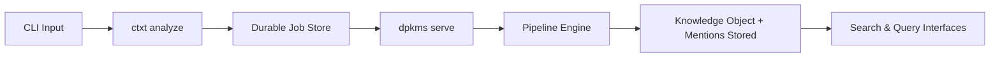
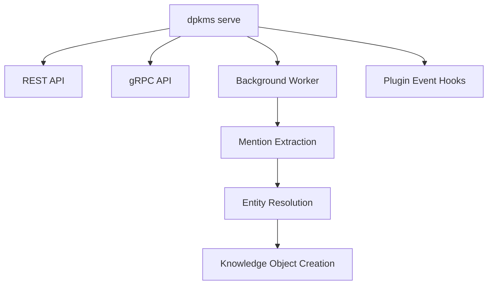

# CLI API (`ctxt` and `dpkms`)

ContextHelp provides two command-line interfaces that together expose all engine capabilities:

- **`ctxt`** — User-facing commands for capture, search, composition, and profiles
- **`dpkms`** — Infrastructure commands for server operations and maintenance

Both CLIs support ingestion, job queue management, retrieval, registry interactions, entity/mention resolution, focus profiles, local server operations, and **plugin-defined commands** that extend the CLI at runtime.

Both CLIs are:

- Local-first
- Deterministic given config + input
- Scriptable
- Fully offline-capable
- Parallel to REST and gRPC APIs
- **Extensible by plugins without modifying core**

All ingestion operations follow the **Transactional Outbox Model**:
`ctxt analyze` enqueues a job → the worker (`dpkms serve`) processes pipelines → results are written to storage.



Plugins may inject additional behaviors before/after CLI execution (such as notifications) using documented extension hooks.

---

## Installation

```bash
brew install contexthelp
```

or:

```bash
curl -sL https://context.help/install.sh | bash
```

This installs both `ctxt` and `dpkms` binaries.

Development build:

```bash
go build -o ctxt cmd/ctxt/main.go
go build -o dpkms cmd/dpkms/main.go
```

---

## Command Overview

### `ctxt` Commands (User-Facing)

| Command | Purpose |
|--------|---------|
| `ctxt analyze` | Enqueue an ingestion job |
| `ctxt job` | Inspect/manage ingestion jobs |
| `ctxt list` | Query knowledge objects (local + registries) |
| `ctxt find` | Semantic search across knowledge |
| `ctxt open` | Display knowledge object details |
| `ctxt delete` | Remove knowledge objects |
| `ctxt edit` | Modify knowledge object metadata |
| `ctxt profile` | Manage focus profiles |
| `ctxt make` | Generate compositions (briefs, plans) |
| `ctxt config` | Configuration operations |
| `ctxt registry` | Manage registries |
| `ctxt entity` | Query and inspect entities |
| `ctxt version` | Show version info |

### `dpkms` Commands (Infrastructure)

| Command | Purpose |
|--------|---------|
| `dpkms serve` | Start background worker + REST/gRPC APIs |
| `dpkms housekeeping` | Database maintenance and optimization |
| `dpkms version` | Show version info |

### Plugin-Defined Commands

Plugins may register:

- New commands (e.g. `ctxt feed`, `ctxt price`, `ctxt notify`)
- New flags on existing commands
- Pre/post output injectors (e.g. pending notifications)

---

## `ctxt analyze`

Enqueue content into the ingestion queue.
This does **not** run pipelines directly; the worker handles execution.

### Usage

```bash
ctxt analyze [options]
```

### Options

| Flag | Description |
|------|-------------|
| `--type <text|url|image|audio|video|feed|auto>` | Input type override (plugins may add types) |
| `--hints "<#hint #hint>"` | Influence tagging |
| `--mentions "<@slug1 @slug2>"` | Explicit mentions to attach |
| `--file <path>` | Read input from file |
| `--profile <name>` | Use focus profile (e.g., Founder, Engineer, Research) |
| `--pipeline <name>` | Force pipeline |
| `--lang <code>` | Input language override |
| `--translate none` | Skip translations |
| `--raw` | Disable AI; store raw knowledge object |
| `--wait` | Block until job completes |
| `--output <json|yaml|id>` | Output format |

### Refresh & Auto-Fetch Flags (Plugin-provided)

Plugins such as the Refresh Plugin and RSS Feed Plugin may add:

| Flag | Description |
|------|-------------|
| `--refresh <seconds|daily|auto>` | Attach refresh policy to knowledge object |
| `--fetch-new` | For feed-like sources, auto-fetch new items |
| `--no-fetch-new` | Disable auto-fetch |

### Domain Plugin Flags (Example)

Plugins may attach additional ingestion options, for example:

| Flag | Description |
|------|-------------|
| `--price-monitor` | Enable price monitoring on this item |
| `--price-threshold <percent>` | Alert threshold |

These flags exist only if the respective plugin is installed.

### Notes

- Returns a **Job ID**.
- With `--wait`, returns the resulting **Knowledge Object ID**.
- Plugins may intercept or extend `ctxt analyze` behavior via lifecycle hooks.
- Knowledge object type may be plugin-defined (e.g. `feed`, `feed_item`, `price_track`).

### Examples

```bash
echo "Fix signup flow" \
  | ctxt analyze --type text --hints "#ux #bad" --mentions "@ui.best-practice"

ctxt analyze --file screenshot.png --type image --mentions "@ui.layout @ux.onboarding"

ctxt analyze https://example.com --type url --profile growth

ctxt analyze https://example.com/feed.xml --type feed --fetch-new --refresh 3600

ctxt analyze https://amazon.com/product \
  --price-monitor --price-threshold 10
```

---

## `ctxt job`

Inspect and control ingestion jobs.

### Commands

```bash
ctxt job list
ctxt job status <id>
ctxt job log <id>
ctxt job retry <id>
ctxt job cancel <id>
```

### States

- Pending
- Running
- Completed
- Failed
- Cancelled

Plugins may register custom job types (e.g. `refresh`, `fetch_new_items`).

---

## `ctxt list`

Query knowledge objects across local storage and registries.
Supports tags, hints, mentions, entities, plugin-defined object types, and AST query language.

### Usage

```bash
ctxt list [filters] [options]
```

### Filters

| Flag | Description |
|------|-------------|
| `--type <type>` | Filter by knowledge object type (core or plugin-defined) |
| `--tag <t1,t2>` | Filter by tags |
| `--hint <#h1,#h2>` | Filter by hints |
| `--mention <@slug>` | Filter by mention |
| `--pipeline <name>` | Filter by pipeline |
| `--subtype <name>` | Filter by subtype |
| `--before <ISO>` | Created before |
| `--after <ISO>` | Created after |
| `--orig-lang <code>` | Original language |
| `--profile <name>` | Focus profile filter |
| `--q "<query>"` | AST-based query |

Plugins may add custom filters (e.g. `--price-drop`, `--feed-new`).

### Options

| Flag | Description |
|------|-------------|
| `--limit <n>` | Max results |
| `--start <offset>` | Pagination |
| `--sort <view|match|recent|weight|score>` | Sorting |
| `--dir <asc|desc>` | Sort direction |
| `--no-track` | Skip match tracking |
| `--json` | JSON output |
| `--yaml` | YAML output |

---

## `ctxt find`

Semantic search across local and federated knowledge.

### Usage

```bash
ctxt find <query> [options]
```

### Options

| Flag | Description |
|------|-------------|
| `--profile <name>` | Use focus profile for reranking |
| `--limit <n>` | Max results |
| `--json` | JSON output |
| `--yaml` | YAML output |

---

## `ctxt open`

Display knowledge object details including mentions, resolved entities, plugin metadata, feed metadata, and price tracking metadata.

```bash
ctxt open <id>
```

Options:

- `--raw`
- `--json`
- `--yaml`

Plugins may extend output sections (e.g. price history, feed item metadata).

---

## `ctxt delete`

Delete knowledge objects using IDs or filters.

### Usage

```bash
ctxt delete [filters] [options]
```

### Filters

| Flag | Description |
|------|-------------|
| `--id <id>` | Delete specific knowledge object |
| `--index <i1,i2>` | Delete by list index |
| `--tag <t>` | Delete by tag |
| `--hint <#h>` | Delete by hint |
| `--mention <@slug>` | Delete by mention |
| `--type <type>` | Delete by type |
| `--subtype <sub>` | Delete by subtype |
| `--all` | Delete all |

Plugins may register deletion helpers (e.g. delete all feed items).

---

## `ctxt edit`

Modify knowledge object metadata.

```bash
ctxt edit --id <id> [fields]
```

Editable fields:

| Flag | Field |
|------|--------|
| `--title <text>` | Title |
| `--summary <text>` | Summary |
| `--tags <t1,t2>` | Replace tag list |
| `--hints "<#h1 #h2>"` | Replace hints |
| `--mentions "<@m1 @m2>"` | Replace mentions |
| `--decisions <json>` | Replace decisions |
| `--subtype <name>` | Update subtype |

Plugins may expose additional editable fields (e.g. refresh interval, price thresholds).

---

## `ctxt profile`

Manage focus profiles (Founder, Engineer, Research, custom).

### Commands

```bash
ctxt profile list
ctxt profile show <name>
ctxt profile create <name> --config <path>
ctxt profile delete <name>
ctxt profile set-default <name>
```

---

## `ctxt make`

Generate compositions from knowledge objects.

### Usage

```bash
ctxt make <type> [options]
```

### Types

| Type | Description |
|------|-------------|
| `brief` | Generate executive brief |
| `plan` | Generate action plan |
| `summary` | Generate summary |
| `draft` | Generate publish-ready draft |

### Options

| Flag | Description |
|------|-------------|
| `--profile <name>` | Use focus profile |
| `--mention <@slug>` | Focus on specific mentions |
| `--tag <t1,t2>` | Focus on specific tags |
| `--since <ISO>` | Include knowledge since date |
| `--output <path>` | Write to file |

---

## `dpkms serve`

Start REST API, gRPC API, and the background job worker.

```bash
dpkms serve [options]
```

### Options

| Flag | Description |
|------|-------------|
| `--port <number>` | HTTP port (default: 8080) |
| `--grpc-port <number>` | gRPC port (default: 9090) |
| `--profile <name>` | Default focus profile |
| `--public` | Allow remote connections |
| `--config <path>` | Custom config file |
| `--workers <n>` | Number of worker threads |

Plugins may attach:

- request interceptors
- response decorators
- CLI output injectors
- background tasks (e.g. queued notifications)



---

## `dpkms housekeeping`

Database maintenance, compaction, and optimization.

### Commands

```bash
dpkms housekeeping vacuum
dpkms housekeeping reindex
dpkms housekeeping compact
dpkms housekeeping prune --before <ISO>
```

---

## `ctxt config`

### Commands

```bash
ctxt config show
ctxt config path
ctxt config validate
ctxt config edit
```

Plugins may define configuration namespaces under:

```
plugins.<pluginName>
```

---

## `ctxt registry`

Manage registry subscriptions and metadata.

### Commands

```bash
ctxt registry list
ctxt registry add <name> <url>
ctxt registry remove <name>
ctxt registry info <name>
ctxt registry sync <name>
```

Registries now expose entities, aliases, translations, and concept metadata.

---

## `ctxt entity`

Query and inspect entities (canonical concepts).

### Examples

```bash
ctxt entity list
ctxt entity show ui.best-practice
ctxt entity search "checkout"
```

### Features

- Show entity metadata
- Show aliases and translations
- Show backlinks

```bash
ctxt entity backlink ui.best-practice
```

Plugins may augment output (e.g. entity-related plugin metadata).

---

## `ctxt version` / `dpkms version`

Display engine and protocol version.

```bash
ctxt version
dpkms version
```

Example output:

```
ContextHelp v0.4.0
ctxt v0.4.0 (brain)
dPKMS v0.4.0 (substrate)
Registry Protocol v0.2.1
Build: 2025-01-18T14:41:55Z
```

---

## Plugin-Defined Commands

Plugins may register additional commands dynamically.

Examples:

```
ctxt feed list
ctxt feed items <feed-id>
ctxt feed refresh <feed-id>

ctxt price history <id>
ctxt price alerts

ctxt notify pending
ctxt notify clear
```

These commands follow the same flag/format conventions as core commands.

---

## Exit Codes

| Code | Meaning |
|------|---------|
| 0 | Success |
| 1 | General error |
| 2 | Invalid flags or input |
| 3 | Storage error |
| 4 | Registry error |
| 5 | Pipeline failure |
| 6 | Agent configuration error |
| 7 | Job execution error |

Plugins may define additional exit codes within their namespace.

---

## Scriptability Notes

- Every command supports JSON/YAML output.
- `ctxt analyze` is asynchronous by default (use `--wait` for synchronous).
- `dpkms serve` runs in the foreground (use systemd/supervisor for daemon).
- Deterministic given stable config + input.
- Offline by default unless registries are enabled.
- Plugins may extend CLI output (e.g. notification injection).

---

## Environment Variables

| Variable | Purpose |
|----------|---------|
| `CTXT_CONFIG` | Config path override |
| `CTXT_DATA_DIR` | Data directory override |
| `CTXT_PROFILE` | Default focus profile |
| `DPKMS_DATA_DIR` | dPKMS data directory override |
| `DPKMS_WORKERS` | Number of worker threads |
| `CH_REGISTRY_TOKEN_*` | Registry auth tokens |
| `CH_DISABLE_TELEMETRY` | Disable telemetry |

Plugins may define additional environment variables under:

```
CH_PLUGIN_<NAME>_*
```

---

## Completion Scripts

```bash
ctxt completion bash
ctxt completion zsh
ctxt completion fish

dpkms completion bash
dpkms completion zsh
dpkms completion fish
```

Plugins may extend completion rules for their custom commands and flags.