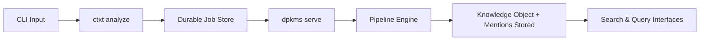

# CLI API (`ctxt` and `dpkms`)

ContextHelp provides two command-line interfaces that together expose all engine capabilities:

- **`ctxt`** — User-facing commands for capture, search, composition, and profiles
- **`dpkms`** — Infrastructure commands for server operations and maintenance

Both CLIs support ingestion, job queue management, retrieval, registry interactions, entity/mention resolution, focus profiles, local server operations, and **plugin-defined commands** that extend the CLI at runtime.

Both CLIs are:

- Local-first
- Deterministic given config + input
- Scriptable
- Fully offline-capable
- Parallel to REST and gRPC APIs
- **Extensible by plugins without modifying core**

All ingestion operations follow the **Transactional Outbox Model**:
`ctxt analyze` enqueues a job → the worker (`dpkms serve`) processes pipelines → results are written to storage.



---

## Installation

```bash
brew install contexthelp
```

or:

```bash
curl -sL https://context.help/install.sh | bash
```

This installs both `ctxt` and `dpkms` binaries.

Development build:

```bash
go build -o ctxt cmd/ctxt/main.go
go build -o dpkms cmd/dpkms/main.go
```

---

## Command Overview

### `ctxt` Commands (User-Facing)

| Command | Purpose |
|--------|---------|
| `ctxt <content>` | (Default) Enqueue content for ingestion (args, stdin, or clipboard) |
| `ctxt analyze` | Enqueue an ingestion job (supports clipboard fallback) |
| `ctxt inbox` | Manage inbox items (list, triage, discard, clear) |
| `ctxt job` | Inspect/manage ingestion jobs |
| `ctxt list` | Query knowledge objects (local + registries) |
| `ctxt find <query>` | Semantic search (supports clipboard fallback) |
| `ctxt open <id>` | Display knowledge object details (supports clipboard fallback) |
| `ctxt delete` | Remove knowledge objects |
| `ctxt edit` | Modify knowledge object metadata |
| `ctxt profile` | Manage focus profiles |
| `ctxt make` | Generate compositions (briefs, plans) |
| `ctxt stats` | Live at-a-glance system summary |
| `ctxt instance` | Multi-instance targeting (use, list, current) |
| `ctxt config` | Configuration operations |
| `ctxt registry` | Manage registries |
| `ctxt entity` | Query and inspect entities |
| `ctxt secret` | Manage secrets (get, set, list backend) |
| `ctxt uri` | Manage ctxt:// URI scheme OS registration |

### `dpkms` Commands (Infrastructure)

| Command | Purpose |
|--------|---------|
| `dpkms serve` | Start background worker + REST/gRPC APIs |
| `dpkms ps` | List all running dpkms instances |
| `dpkms shutdown` | Gracefully stop a running instance (alias: `stop`) |
| `dpkms reboot` | Gracefully restart a running instance (SIGHUP) |
| `dpkms housekeeping` | Database maintenance and optimization |

### Version and Verbose Flags

Both CLIs expose `--version` (`-v`) as a root flag and `--verbose` (`-V`) as a persistent flag:

```bash
ctxt --version   # or: ctxt -v
dpkms --version  # or: dpkms -v

ctxt --verbose search "foo"   # or: ctxt -V search "foo"
```

Output format: `<binary> version <semver> (<YYYY-MM-DD>)`. See [docs/conventions/version-output.md](../conventions/version-output.md).

---

## `ctxt analyze`

Enqueue content into the ingestion queue.
This does **not** run pipelines directly; the worker handles execution.

**If no content is provided as an argument or via piped stdin, `ctxt` (and `ctxt analyze`) will check the system clipboard.**

### Usage

```bash
ctxt <content> <options>
# or explicitly:
ctxt analyze <content> <options>
```

### Options

| Flag | Description |
|------|-------------|
| `--type <text|url|image|audio|video|feed|auto>` | Input type override |
| `--hints "<#hint #hint>"` | Influence tagging |
| `--mentions "<@slug1 @slug2>"` | Explicit mentions to attach |
| `--file <path>` | Read input from file |
| `--profile <name>` | Use focus profile |
| `--pipeline <name>` | Force pipeline |
| `--lang <code>` | Input language override |
| `--translate none` | Skip translations |
| `--raw` | Disable AI; store raw knowledge object |
| `--wait` | Block until job completes |
| `--output <json|yaml|id>` | Output format |

### Refresh & Auto-Fetch Flags (Plugin-provided)

Plugins such as the Refresh Plugin and RSS Feed Plugin may add:

| Flag | Description |
|------|-------------|
| `--refresh <seconds|daily|auto>` | Attach refresh policy to knowledge object |
| `--fetch-new` | For feed-like sources, auto-fetch new items |
| `--no-fetch-new` | Disable auto-fetch |

### Notes

- Returns a **Job ID**.
- With `--wait`, returns the resulting **Knowledge Object ID**.
- Plugins may intercept or extend `ctxt analyze` behavior via lifecycle hooks.

### Examples

```bash
# Default behavior: capture clipboard
ctxt

# Direct argument
ctxt "Fix signup flow" --hints "#ux"

# Piped stdin
echo "UX improvements needed" | ctxt --mentions "@ui.best-practice"

# Explicit command with file
ctxt analyze --file screenshot.png --type image
```

---

## `ctxt inbox`

Manage inbox items — captured content parked for a triage decision before entering the pipeline.

Inbox items are created when content is captured via `ctxt analyze` with the `--inbox` flag, the
PWA Web Share Target, or any other capture path that defers pipeline scheduling.

### Commands

```bash
ctxt inbox list                      # list pending inbox items
ctxt inbox triage <id>               # promote to active and enqueue for processing
ctxt inbox triage <id> --pipeline <name>  # triage with a specific pipeline
ctxt inbox discard <id>              # mark item as discarded
ctxt inbox clear                     # discard all inbox items
```

### `inbox list` Options

| Flag | Description |
|------|-------------|
| `--limit <n>` | Max results (default: 50) |
| `--offset <n>` | Pagination offset |
| `--before <RFC3339>` | Created before |
| `--after <RFC3339>` | Created after |
| `--output json` | JSON output |

### `inbox triage` Options

| Flag | Description |
|------|-------------|
| `--pipeline <name>` | Pipeline to use (default: auto-detect from content) |

### Notes

- `triage` promotes the item to `active` status, then enqueues a job. Returns the **Job ID**.
- `discard` marks the item as `discarded`; it is excluded from all future queries.
- `clear` discards all current inbox items in one shot and prints the count cleared.

### Examples

```bash
# See what's waiting
ctxt inbox list

# Triage a specific item
ctxt inbox triage 4a3b1c2d --pipeline text.long

# Discard noise
ctxt inbox discard 9f8e7d6c

# Nuke everything
ctxt inbox clear
```

---

## `ctxt job`

Inspect and control ingestion jobs.

### Commands

```bash
ctxt job list
ctxt job status <id>
ctxt job log <id>
ctxt job retry <id>
ctxt job cancel <id>
```

---

## `ctxt list`

Query knowledge objects across local storage and registries.
Supports tags, hints, mentions, entities, and AST query language.

### Usage

```bash
ctxt list <filters> <options>
```

### Filters

| Flag | Description |
|------|-------------|
| `--type <type>` | Filter by knowledge object type |
| `--tagged <t1,t2>` | Filter by tags |
| `--hint <#h1,#h2>` | Filter by hints |
| `--mention <@slug>` | Filter by mention |
| `--pipeline <name>` | Filter by pipeline |
| `--subtype <name>` | Filter by subtype |
| `--before <ISO>` | Created before |
| `--after <ISO>` | Created after |
| `--orig-lang <code>` | Original language |
| `--profile <name>` | Focus profile filter |
| `--q "<query>"` | AST-based query |

### Options

| Flag | Description |
|------|-------------|
| `--limit <n>` | Max results |
| `--start <offset>` | Pagination |
| `--sort <view|match|recent|weight|score>` | Sorting |
| `--dir <asc|desc>` | Sort direction |
| `--json` | JSON output |
| `--yaml` | YAML output |

---

## `ctxt find`

Semantic search across local and federated knowledge.

**If no query is provided, `ctxt find` will check the system clipboard.**

### Usage

```bash
ctxt find <query> <options>
```

### Options

| Flag | Description |
|------|-------------|
| `--profile <name>` | Use focus profile for reranking |
| `--limit <n>` | Max results |
| `--json` | JSON output |
| `--yaml` | YAML output |

---

## `ctxt open`

Display knowledge object details including mentions, resolved entities, and metadata.

**If no ID is provided, `ctxt open` will check the system clipboard for an object ID.**

```bash
ctxt open <id>
```

Options:

- `--raw`
- `--json`
- `--yaml`

---

## `ctxt delete`

Delete knowledge objects using IDs or filters.

### Usage

```bash
ctxt delete <filters> <options>
```

### Filters

| Flag | Description |
|------|-------------|
| `--id <id>` | Delete specific knowledge object |
| `--index <i1,i2>` | Delete by list index |
| `--tagged <t>` | Delete by tag |
| `--hint <#h>` | Delete by hint |
| `--mention <@slug>` | Delete by mention |
| `--type <type>` | Delete by type |
| `--subtype <subtype>` | Delete by subtype |
| `--all` | Delete all |

---

## `ctxt edit`

Modify knowledge object metadata.

```bash
ctxt edit --id <id> <fields>
```

Editable fields:

| Flag | Field |
|------|--------|
| `--title <text>` | Title |
| `--summary <text>` | Summary |
| `--tags <t1,t2>` | Replace tag list |
| `--hints "<#h1 #h2>"` | Replace hints |
| `--mentions "<@m1 @m2>"` | Replace mentions |
| `--subtype <name>` | Update subtype |

---

## `ctxt profile`

Manage focus profiles.

### Commands

```bash
ctxt profile list
ctxt profile view <name>
ctxt profile create <name> --config <path>
ctxt profile rm <name> --confirm=yes
ctxt profile set <name>
ctxt profile unset <name>
```

---

## `ctxt make`

Generate compositions from knowledge objects.

### Usage

```bash
ctxt make <type> <options>
```

### Types

| Type | Description |
|------|-------------|
| `brief` | Generate executive brief |
| `plan` | Generate action plan |
| `summary` | Generate summary |
| `draft` | Generate publish-ready draft |

### Options

| Flag | Description |
|------|-------------|
| `--profile <name>` | Use focus profile |
| `--mention <@slug>` | Focus on specific mentions |
| `--tagged <t1,t2>` | Focus on specific tags |
| `--since <ISO>` | Include knowledge since date |
| `--output <path>` | Write to file |

---

## `dpkms serve`

Start REST API, gRPC API, and the background job worker.

```bash
dpkms serve <options>
# aliases: dpkms start
```

### Options

| Flag | Description |
|------|-------------|
| `--name <slug>` | Instance name (URI-safe, e.g. `work`); derived from DB basename if omitted. Must be unique across running instances |
| `--port <number>` | HTTP port (default: 8080; auto-assigns if busy) |
| `--grpc-port <number>` | gRPC port (default: 9090; auto-assigned if busy) |
| `--daemon` | Detach from terminal (background daemon) |
| `--profile <name>` | Default focus profile (interactive picker if unset and multiple exist) |
| `--public` | Allow remote connections |
| `--config <path>` | Custom config file |
| `--workers <n>` | Number of worker threads |
| `--dev` | Enable CORS for Vite dev server (localhost:5173) |
| `--reminder-interval <duration>` | How often to check for due reminders (default: 1m) |

### Notes

- gRPC and cookie-bridge ports are auto-assigned if the preferred port is busy.
- `--daemon` re-execs the process detached from the terminal; stdio is redirected to `/dev/null`.
- A pidfile is written to `$XDG_DATA_HOME/contexthelp/run/<port>.pid` on start and removed on clean shutdown.
- Stale pidfiles (from crashes) are cleaned up automatically by `dpkms ps`.
- On startup, stale/interrupted jobs are reset to `pending` for retry.
- SIGHUP triggers graceful drain + exit (for use with process supervisors or `dpkms reboot`).
- Starting a second instance with the same `--name` is a fatal error.

### Multiple instances

```bash
dpkms serve --name work     --config ~/.config/contexthelp/work.yaml
dpkms serve --name personal --config ~/.config/contexthelp/personal.yaml --port 8081
```

---

## `dpkms ps`

List all running dpkms instances on this machine.

```bash
dpkms ps [--output json]
```

Scans `$XDG_DATA_HOME/contexthelp/run/` for pidfiles, validates each process is alive, and removes stale entries automatically.

Output columns: `NAME  PID  PORT  GRPC  DB  UPTIME` (BROWSER column added when any instance has browser enabled).

---

## `dpkms shutdown`

Gracefully stop a running dpkms instance (alias: `dpkms stop`).

```bash
dpkms shutdown [--port <number>]
dpkms stop     [--port <number>]
```

Sends SIGTERM to the target instance. The instance drains in-flight jobs, closes all servers, and exits.

| Flag | Description |
|------|-------------|
| `--port <number>` | Port of the instance to stop (default: server-url port) |

---

## `dpkms reboot`

Gracefully restart a running dpkms instance.

```bash
dpkms reboot [--port <number>]
```

Sends SIGHUP. The instance drains in-flight jobs and exits. The caller (or process supervisor) is responsible for re-launching `dpkms serve`.

| Flag | Description |
|------|-------------|
| `--port <number>` | Port of the instance to restart (default: server-url port) |

---

## `dpkms housekeeping`

Database maintenance, compaction, and optimization.

### Commands

```bash
dpkms housekeeping vacuum
dpkms housekeeping reindex
dpkms housekeeping compact
dpkms housekeeping prune --before <ISO>
```

---

## `ctxt stats`

Live at-a-glance system summary: knowledge objects (by type), jobs (by status), entities, feeds, profiles, pending reminders, and resurfacing candidates.

```bash
ctxt stats
ctxt stats --output json
ctxt stats --watch               # re-print every 3s; Ctrl-C to exit
```

| Flag | Description |
|------|-------------|
| `--watch` | Continuous refresh every 3 seconds |
| `--output json` | JSON snapshot (suitable for monitoring scripts) |

### JSON fields

| Field | Description |
|-------|-------------|
| `knowledge_objects` | Total object count |
| `objects_by_type` | Map of type → count |
| `jobs.total/pending/running/completed/failed` | Job counts by state |
| `entities` | Total entity count |
| `feeds` / `feeds_active` | Total and active feed count |
| `profiles` / `default_profile` | Profile count and active default |
| `reminders_pending` | Due or upcoming reminder count |
| `resurfacing_candidates` | Objects queued for resurfacing |

---

## `ctxt config`

### Commands

```bash
ctxt config show
ctxt config path
ctxt config validate
ctxt config edit
```

---

## `ctxt instance`

Select which dpkms instance `ctxt` commands target when multiple instances
are running. The selection is persisted to
`$XDG_DATA_HOME/contexthelp/run/current-instance`.

### Commands

```bash
ctxt instance list              # table of running instances; * marks current
ctxt instance use <name>        # set current instance by name
ctxt instance use <port>        # set by port number
ctxt instance use -             # clear — revert to config storage.path
ctxt instance current           # print active instance
```

### Per-call override (not persisted)

```bash
ctxt --instance work stats
ctxt --instance personal find "auth patterns"
CTXT_INSTANCE=work ctxt stats   # env var; same precedence as flag
```

### Resolution order

1. `--instance` flag / `CTXT_INSTANCE` env var
2. State file set by `ctxt instance use`
3. `storage.path` in config (original behaviour)

---

## `ctxt registry`

Manage registry subscriptions and metadata.

### Commands

```bash
ctxt registry list
ctxt registry add <name> <url>
ctxt registry remove <name>
ctxt registry info <name>
ctxt registry sync <name>
```

---

## `ctxt entity`

Query and inspect entities (canonical concepts).

### Examples

```bash
ctxt entity list
ctxt entity show <slug>
ctxt entity search "<query>"
ctxt entity backlink <slug>
```

---

## `ctxt secret`

Read and write secrets from the configured backend.

The active backend is set via `secrets.backend` in the config file. Supported backends: `env`, `keychain`, `age-file`, `1password`, `gh-secrets`. See [secrets-backends](../security/secrets-backends.md) for setup.

### Commands

```bash
ctxt secret get <key>        # Print secret value to stdout
ctxt secret set <key> <val>  # Store secret in the active backend
ctxt secret list             # Show active backend and its config
```

### Notes

- `secret get` exits non-zero if the key is not found.
- `secret set` with the `env` or `age-file` backend fails with a clear error — these backends are read-only.
- `--output json` is supported for `get` (`{"key":"...","value":"..."}`) and `list`.
- Passing a secret value on the command line exposes it in shell history. For sensitive values, prefer the backend's native tooling (e.g. `security add-generic-password` for keychain).

### Examples

```bash
# Get a secret from the active backend
ctxt secret get OPENAI_API_KEY

# Store a secret (keychain backend required)
ctxt secret set OPENAI_API_KEY sk-...

# Show which backend is active and its config
ctxt secret list

# Machine-readable output
ctxt --output json secret get OPENAI_API_KEY
```

---

## `ctxt uri`

Register the `ctxt://` URI scheme with the OS so clickable links open ctxt.

### Subcommands

```bash
ctxt uri register                         # Register ctxt:// with OS (runtime)
ctxt uri snippet --platform <platform>    # Print static config snippet
```

Supported platforms for `snippet`: `macos`, `ios`, `linux`, `windows`.

### OS dispatch

After `ctxt uri register`, clicking a `ctxt://` link invokes:

```
ctxt ctxt://<objectID>          → ctxt open <objectID>
ctxt ctxt://search/<query>      → ctxt find <query>
```

### Platform notes

| Platform | Mechanism |
|----------|-----------|
| macOS | `LSSetDefaultHandlerForURLScheme` via bundle ID `com.ideacrafterslabs.ctxt` |
| Linux | `xdg-mime` + `.desktop` file |
| Windows | HKCU registry entry |
| iOS / bundles | Use `ctxt uri snippet --platform ios` — must be in `Info.plist` |

### Examples

```bash
# Register on current machine (requires ctxt installed)
ctxt uri register

# Print macOS plist snippet for app bundle packaging
ctxt uri snippet --platform macos

# Print Linux .desktop file
ctxt uri snippet --platform linux
```

---

## Exit Codes

| Code | Meaning |
|------|---------|
| 0 | Success |
| 1 | General error |
| 2 | Invalid flags or input |
| 3 | Storage error |
| 4 | Registry error |
| 5 | Pipeline failure |
| 6 | Agent configuration error |
| 7 | Job execution error |

---

## Environment Variables

| Variable | Purpose |
|----------|---------|
| `CTXT_CONFIG` | Config path override |
| `CTXT_DATA_DIR` | Data directory override |
| `CTXT_PROFILE` | Default focus profile |
| `DPKMS_DATA_DIR` | dPKMS data directory override |
| `DPKMS_WORKERS` | Number of worker threads |
