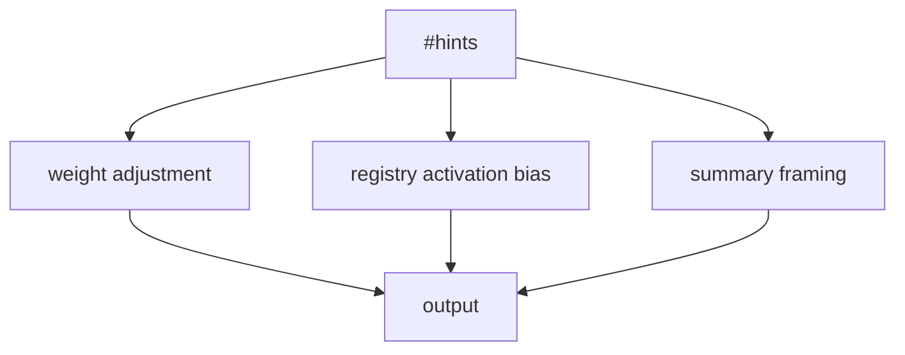

# Hints

Hints are short, user-provided semantic cues that shape how ContextHelp interprets and enriches incoming content. They influence pipelines, weighting, registry activation, and summarization — but they **do not** create tags, do not become taxonomy entries, and do **not** act as entities or mentions. Hints remain transient guidance, separate from the structured semantic layers (tags and mentions).

Hints also do **not** require or trigger plugin behavior automatically, though plugins *may* read hints through sanctioned plugin interfaces as part of optional, user-authorized workflows.

## What Hints Are

Hints serve as lightweight semantic markers:

- user-authored signals embedded in analysis requests
- inline annotations prefixed with `#`
- non-persistent instructions that do not convert into structured classification
- contextual nudges affecting pipeline behavior, weighting, and framing
- safe, read-only cues available to plugins that wish to use them for optional logic

Examples:

```text
#ux #bad #landingpage
#growth #idea
#prompt #example
#research #positive
```

Hints express **user intent**, not system inference.

## What Hints Are Not

Hints are **not**:

- tags
- taxonomy labels
- registry-defined vocabulary
- persistent semantic metadata
- mentions (`@entity`) or canonical concept references
- plugin-defined semantic entities
- contributors to the knowledge graph

Hints never mutate the controlled vocabulary and do not participate in graph indexing or entity resolution.

## Difference Between Hints, Tags, and Mentions

```mermaid
flowchart LR
    A[#hint] -->|influences| B((pipeline))
    B --> C[tag]
    A -. no identity .- D[@mention]
    D -->|resolves to| E[entity]

    C -->|classification| F[bookmark]
    D -->|reference| F
```

- **Hints** → User intent signals that bias interpretation
- **Tags** → AI-generated, registry-aligned classifications
- **Mentions** → Canonical references to entities/concepts

Hints cannot become tags or mentions automatically, though workflows may allow manual “promotion.”

## How Hints Influence the Engine

### Pipeline Selection

Hints help disambiguate ambiguous content:

- `#ui` → push toward UI-oriented pipeline steps
- `#transcript` → activate speech-processing flow
- `#ocr` → prioritize vision + text extraction

### Semantic Weighting

Hints adjust scoring during tag generation:

- strengthen weighting for associated taxonomy domains
- alter polarity (e.g., `#good`, `#bad`)
- raise or lower confidence thresholds

### Registry Alignment

Hints bias activation order:

- `#ux` → UX taxonomy registry
- `#growth` → marketing heuristics registry
- `#prompt` → prompt-engineering vocabulary

Hints never **force** registry activation; they bias selection probability.

### Knowledge Structuring

Hints shape summarization and decision extraction:

- `#negative` → focus on antipatterns
- `#example` → generate reference-style summaries



## How Hints Are Stored

Hints appear under the `hints` field of a bookmark:

```json
"hints": ["#ui", "#bad", "#landingpage"]
```

Properties:

- stored exactly as provided
- never rewritten or normalized
- used as metadata for retrieval filters
- treated as inert, non-structural signals
- available to plugins through standard plugin APIs (read-only)
- never integrated into the semantic graph

## Interaction Between Hints and Tags

**Hints influence tags; tags do not influence hints.**

Flow example:

1. User provides: `#ui #bad #landingpage`
2. Pipeline enriches and consults registries
3. Tags receive stronger UI/UX weights

Example output:

```json
{
  "label": "ui.hero.antipattern",
  "weight": 0.92,
  "polarity": "negative",
  "influencedBy": ["#ui", "#bad", "#landingpage"]
}
```

Hints never override taxonomy or produce new labels.

## Interaction Between Hints and Mentions

Hints and mentions occupy different semantic layers:

- `#ui.best-practice` → **hint**, interpreted as a semantic nudge
- `@ui.best-practice` → **mention**, referencing a stable entity

```mermaid
flowchart LR
    H[#hint] --> B[bias interpretation]
    M[@mention] --> E[resolve to entity]
    E --> G[graph index]
    B --> O[bookmark]
    G --> O
```

Hints do **not** create or modify entities. Mentions produce identity-bound references; hints do not.

## Best Practices for Users

- Prefer **specific, high-signal** hints (`#ux`, not `#design`)
- Combine domain + polarity (`#ui #negative`)
- Use context hints for ambiguous inputs (`#ocr`, `#transcript`)
- Keep hint sets minimal and expressive
- Use hints to refine retrieval (“find bookmarks with #research”)

## Best Practices for Pipeline Implementers

Pipelines should treat hints as:

- semantic nudges
- domain signals
- polarity indicators
- weighting modifiers

Pipelines **must not**:

- rewrite, reinterpret, or sanitize hints
- generate tags directly from hints
- convert hints into mentions or entities
- enforce irreversible routing purely from hints

Pipelines **may**:

- alter weighting curves
- bias registry activation
- adjust summarization framing
- modify classification temperature

Plugins may *read* hints as part of optional behavior, but must treat them as non-authoritative suggestions and never reinterpret them as structured semantics.

## Hints in Agent Profiles

Agents use hints in two contexts:

### During Analysis

- steer enrichment and classification
- reinforce pipeline selection
- nudge framing and weighting

### During Retrieval

Agents may:

- search bookmarks by hint presence
- model user hint patterns
- adapt retrieval scoring

Agents do not treat hints as semantic identity markers.

## Future Extensions

Potential enhancements:

- hint-to-registry activation maps
- learnable hint weighting curves
- customizable hint interpreters
- composable hint bundles for workflows
- community-defined hint packs
- manual workflows to “promote” hints into mentions/entities

Hints remain the user’s **intent signal** — flexible, ephemeral, expressive — shaping interpretation without altering taxonomies, mentions, or the semantic graph.