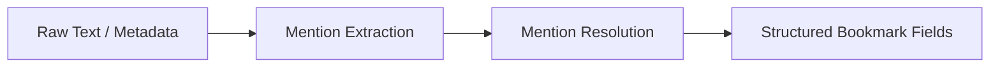

# Pipelines Reference

This document provides a complete specification for all built-in pipelines in ContextHelp, rewritten to incorporate the new **Mentions Layer**, **Entity Registry Integration**, **Mention Extraction & Resolution**, and **plugin-extensible pipeline definitions** across all modalities. Pipelines transform raw inputs into structured bookmarks using deterministic task sequences, registry alignment, mention resolution, plugin-defined logic, and asynchronous job execution under the ingestion system.

Pipelines share the unified `Pipeline` interface and the `PipelineContext`, which includes access to registries, configuration snapshots, semantic metadata layers (tags, hints, mentions), entity-resolution services, and **plugin hooks**.

A pipeline never writes a bookmark directly. It emits structured output only through the job system upon completion. Plugins may extend, wrap, or sequence additional post-processing steps without modifying core pipeline logic.

---

## Conceptual Flow

```mermaid
flowchart TD
    A[Raw Input] --> B[Inference Layer]
    B --> C[Create Job Record]
    C --> D[Pipeline Engine]
    D --> E1[Normalize]
    E1 --> E2[Task Sequence]
    E2 --> M1[Mention Extraction]
    M1 --> M2[Mention Resolution<br>via Entity Registry]
    M2 --> T1[Tag Generation]
    T1 --> R1[Registry Alignment<br>(taxonomy, weights, entities)]
    R1 --> P1[Plugin Hooks<br>(optional post-step work)]
    P1 --> BKM[Bookmark Construction]
    BKM --> ST[Local Storage]
```

The mention stages (`M1 → M2`) are mandatory for all pipelines unless explicitly disabled.

Plugins may add steps **after any major stage** through the standard pipeline hook system defined in the Plugin API.

---

## Pipeline Taxonomy

Pipelines are grouped by modality:

- `text.*`
- `url.*`
- `image.*`
- `audio.*`
- `video.*`
- `feed.*` (plugin-defined but standardized)
- `custom.*` (fully plugin-owned)

Each pipeline defines:

- ordered tasks
- mention extraction and mention resolution phases
- registry alignment logic
- plugin post-processing hooks
- job execution model
- structured output fields
- optional background job emissions
- optional refresh-driven re-execution behavior

---

## Mention Integration in Pipelines

All pipelines incorporate two semantic phases:

### Mention Extraction

- Scans content for `@identifier` syntax
- Parses mention tokens according to the Mentions Spec (`mentions.md`)
- Produces raw mention slugs

### Mention Resolution

- Attempts to resolve slugs against:
  - local entity registry
  - remote registries
  - user-defined local concepts
- Unresolved mentions become **local entities** owned by the user

### Mention Rules

- Mentions do **not** affect tag generation
- Mentions do **not** become hints
- Mentions create **entity→bookmark** graph edges
- Mentions populate the bookmark’s `mentions[]` field
- Mentions are always stored in canonical slug form
- Plugins may perform **post-resolution mention transformation**, but cannot modify canonical IDs



---

# 1. Text Pipelines

## text.short

Processes short-form content such as notes, fragments, or prompts.

**Tasks**

- NormalizeText
- InferIntent
- ExtractKeywords
- GenerateShortSummary
- MentionExtraction
- MentionResolution
- TagGeneration (light heuristic, independent of mentions)
- ApplyWeights

**Outputs**

- concise summary
- lightweight tags
- mentions resolved to entities
- local-entity stubs

**Registry Influence**

- entity resolution
- canonical mapping of domain concepts

**Job Model**

Single-step job unless refinement is configured.

**Plugin Hooks**

Plugins may extend output (e.g., track note metadata, inject custom semantic passes).

---

## text.long

Processes long-form documents such as articles, transcripts, and multi-paragraph text.

**Tasks**

- NormalizeText
- SegmentSections
- GenerateStructuredSummary
- TopicExtraction
- MentionExtraction
- MentionResolution
- TagGeneration
- Weighting + Polarity
- DecisionExtraction (optional)

**Outputs**

- hierarchical summaries
- semantic topic graph
- full mention list
- resolved entities
- backlinks into the knowledge graph

**Background Jobs**

- refinement
- clustering
- related-content lookups
- entity-anchored linking

**Plugin Hooks**

May append additional analyses (citations, semantic diffs, etc.).

---

# 2. URL Pipelines

## url.generic

Processes general webpages.

**Tasks**

- NormalizeURL
- FetchHTML
- ExtractMetadata
- ConvertToMarkdown
- SummarizeMarkdown
- MentionExtraction (markdown + metadata)
- MentionResolution
- ExtractTopics
- GenerateTags
- ApplyWeights

**Outputs**

- markdown content
- metadata
- resolved mentions

**Background Jobs**

- multi-pass analysis
- deeper segmentation

**Refresh Behavior**

May be refreshed by the Refresh Plugin when configured.

---

## url.repo

Processes repositories from GitHub/GitLab/etc.

**Tasks**

- NormalizeURL
- DetectRepoPlatform
- FetchRepoMetadata
- FetchREADME
- AnalyzeREADME
- MentionExtraction
- MentionResolution
- ExtractTopics
- TagDomain
- WeightSignals

**Outputs**

- repo metadata
- engineering tags
- resolved API/library mentions

**Background Jobs**

- contributor graph
- dependency analysis

**Plugin Hooks**

Plugins may extend repo intelligence (e.g., CVE scanning, version tracking).

---

# 3. Image Pipelines

## image.landing

Processes landing page screenshots.

**Tasks**

- DetectLayoutRegions
- OCRText
- AssessContrast + Typography
- EvaluateHierarchy
- GenerateUXTags
- MentionExtraction
- MentionResolution
- ProduceDecisions

**Outputs**

- UX assessments
- text-based mentions
- entity-linked UI concepts

---

## image.ui

Processes UI component screenshots.

**Tasks**

- ComponentDetection
- ComponentClassification
- MentionExtraction
- MentionResolution
- TagGeneration
- HeuristicWeights

**Outputs**

- UI component metadata
- UI taxonomy tags
- resolved design-system entities

---

## image.ocr

Extracts text then delegates to text pipeline.

**Tasks**

- OCRPass
- LanguageDetection
- MentionExtraction
- MentionResolution
- AutoSelectTextPipeline

**Job Model**

Two-step (OCR → text pipeline).

---

# 4. Audio Pipelines

## audio.transcript

Converts audio into transcripts then long-text enrichment.

**Tasks**

- AudioNormalization
- SpeechToText
- TranscriptCleanup
- MentionExtraction
- MentionResolution
- LongTextPipelineDelegation

**Outputs**

- transcript
- resolved mentions

---

# 5. Video Pipelines

## video.youtube

Processes YouTube videos.

**Tasks**

- FetchYouTubeMetadata
- FetchTranscript
- SummarizeTranscript
- MentionExtraction
- MentionResolution
- SegmentTopics
- GenerateTags

**Outputs**

- transcript
- mentions
- topic timeline

---

## video.local

Processes local videos.

**Tasks**

- ExtractAudio
- SpeechToText
- FrameSampling
- SceneDetection
- OCR on frames
- MentionExtraction
- MentionResolution
- TagGeneration

**Outputs**

- transcript
- scenes
- unified mention list

---

# 6. Feed Pipelines (Plugin-Defined But Standardized)

Plugins may define feed pipelines under the canonical namespace:

- `feed.fetch`
- `feed.parse`
- `feed.ingest_items`

These pipelines follow the same rules as built-in pipelines.

## feed.fetch

Fetches the raw feed document (RSS/Atom/JSONFeed).

**Tasks**

- NormalizeURL
- FetchFeed
- Basic Feed Validation

**Outputs**

- raw feed document

---

## feed.parse

Parses feed XML/JSON into metadata + item definitions.

**Tasks**

- DetectFeedType
- ParseFeedDocument
- ExtractFeedMetadata
- ExtractItemList

**Outputs**

- feed metadata
- unprocessed feed items

---

## feed.ingest_items

Emits ingestion jobs for new feed items.

**Tasks**

- DetectNewGUIDs
- EmitItemJobs
- AttachRefreshRules

**Plugin Benefit**

Allows auto-fetching content through refresh without core changes.

---

# 7. Custom Pipelines

Custom pipelines follow all standard rules:

**Requirements**

- MentionExtraction + MentionResolution (unless disabled)
- registry alignment
- deterministic task sequence
- structured output
- plugin-managed lifecycle

**Examples**

- price.monitor
- doc.diff
- telemetry.enrich

---

# Mention-Aware Pipeline Comparison Matrix

| Pipeline | Mentions | Tags | Decisions | Background Jobs | Registry-Aware | Plugin Hooks | Multi-Step Job |
|---------|----------|------|-----------|------------------|----------------|--------------|----------------|
| text.short | ✓ | ✓ | (opt.) | – | ✓ | ✓ | 1-step |
| text.long | ✓✓ | ✓✓ | ✓ | ✓ | ✓ | ✓ | multi-step |
| url.generic | ✓ | ✓ | (opt.) | ✓ | ✓ | ✓ | multi-step |
| url.repo | ✓✓ | ✓✓ | ✓ | ✓ | ✓ | ✓ | multi-step |
| image.landing | ✓ | ✓✓ | ✓✓ | ✓ | ✓ | ✓ | multi-step |
| image.ui | ✓ | ✓✓ | ✓ | ✓ | ✓ | ✓ | multi-step |
| image.ocr | ✓ | via text | – | – | ✓ | ✓ | 2-step |
| audio.transcript | ✓ | via text | – | ✓ | ✓ | ✓ | 2-step |
| video.youtube | ✓ | ✓ | – | ✓✓ | ✓ | ✓ | multi-step |
| video.local | ✓✓ | ✓ | – | ✓✓ | ✓ | ✓ | multi-step |
| feed.fetch | – | – | – | – | – | ✓ | 1-step |
| feed.parse | – | – | – | – | – | ✓ | 1-step |
| feed.ingest_items | – | – | – | ✓ | – | ✓ | multi-step |

---

# Pipeline Selection Logic

Pipeline inference considers:

- modality of input
- explicit user override
- plugin-defined pipeline mappings
- agent restrictions
- content cues

Mentions do not influence inference.

---

# Summary

This updated pipeline reference integrates:

- mentions
- entity resolution
- plugin-extensible pipeline definitions
- standardized feed pipelines
- refresh-driven re-execution
- safe post-processing hooks

Every pipeline now:

- extracts & resolves mentions
- aligns with registries
- contributes to the knowledge graph
- supports plugin orchestration without core modification

This document replaces the previous pipelines reference entirely.