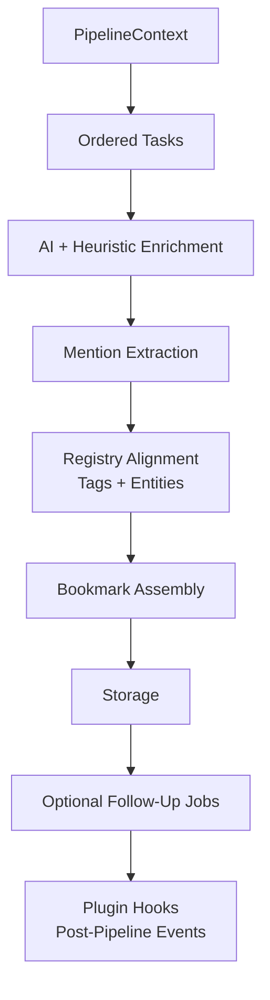
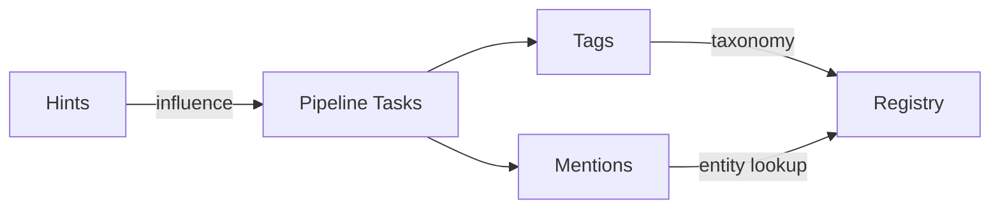
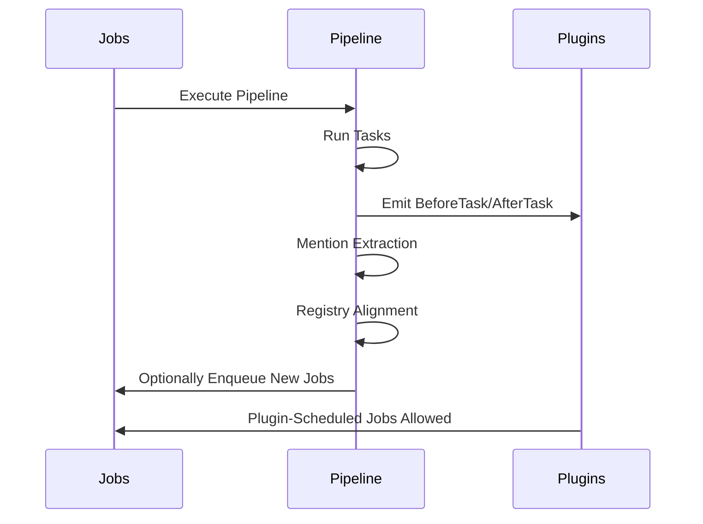

# Pipelines

Pipelines are the core processing units of ContextHelp. They transform raw, unstructured input into structured knowledge by applying ordered tasks such as inference, AI enrichment, metadata extraction, mention extraction, registry alignment, tagging, weighting, decision synthesis, and background job scheduling.

Pipelines are modular, deterministic, registry-aware, and fully extensible through plugins. They execute inside the transactional **Jobs** system, ensuring resilience, traceability, and crash-safe resumption.

In addition to built-in pipelines, **plugins can define custom pipelines, tasks, bookmark types, and post-processing hooks**, allowing complex workflows such as feed ingestion, price monitoring, notifications, and domain-specific enrichment to occur without modifying core.

---

## Overview

A pipeline:

- Accepts a `PipelineContext` containing raw content, hints, mentions, plugin config, registry state, and job metadata
- Executes a sequence of tasks (AI calls, heuristics, extraction routines)
- Produces a **Bookmark** (or additional `JobSteps`)
- Aligns output with taxonomies, entities, and weights from registries
- May enqueue follow-up background jobs
- Emits events for plugins before and after each task
- Allows plugins to attach their own tasks and semantic layers
- Runs deterministically inside the jobs engine



---

## Pipeline Goals

- Normalize and structure multimodal inputs
- Extract and resolve **mentions** (`@entities`)
- Apply AI and heuristic enrichment
- Extract domain metadata, decisions, summaries, sections
- Align tags using taxonomies and weights
- Align mentions using entity registries
- Produce deterministic structured bookmarks
- Integrate tightly with the Jobs system
- Provide extensible hooks for plugins (custom pipelines, custom tasks, post-ingest logic)
- Support localization/I18N
- Support plugin-managed background workflows (feeds, notifications, price tracking)

---

## Plugin Extensions to Pipelines

ContextHelp provides formal extension mechanisms that allow plugins to add behavior **without altering core code**:

### Plugin-defined Pipelines

A plugin may register entirely new pipelines:

- `feed.fetch`
- `feed.parse`
- `feed.ingest_items`
- `price.monitor`
- `custom.security.scan`

These appear in configuration under `customPipelines:`.

### Plugin-defined Tasks

Plugins may add tasks to:

- built-in pipelines (via before/after hooks)
- plugin-defined pipelines
- background pipelines (e.g., refresh jobs)

### Plugin-defined Bookmark Types

A plugin may define new logical bookmark types (e.g. `feed`, `feed_item`, `price_snapshot`) using the plugin metadata namespace within bookmarks.

### Plugin-defined Follow-Up Jobs

Any task—core or plugin—may enqueue background jobs:

- feed item ingestion
- price re-checks
- notification routing
- incremental analysis

No core changes are required.

### Plugin Hooks (Global)

Plugins may subscribe to:

- `BeforePipelineTask`
- `AfterPipelineTask`
- `PostPipelineExecute`
- `PostIngest`
- `PostRefresh`
- `OnJobCompleted`

These hooks enable plugins like RSS Feed, Price Monitor, and Notifications to activate workflows solely through official extension points.

---

## Relation Between Hints, Tags, and Mentions

**Hints**
- Influence pipeline behavior and weighting
- Never become tags
- Never become mentions automatically

**Tags**
- Emergent semantic classification
- Weighted, polarity-aware
- Normalized via taxonomies

**Mentions**
- Explicit canonical references
- Stored as stable entity slugs
- Resolved through registries
- Do not influence tag generation
- Represent identity, not classification



---

## Pipeline Types

### Text Pipelines

- `text.short`
- `text.long`

Includes mention extraction, semantic classification, registry alignment, etc.

### URL Pipelines

- `url.generic`
- `url.repo`

Extracts HTML/markdown, repo metadata, license, mentions, etc.

### Image Pipelines

- `image.landing`
- `image.ui`
- `image.ocr`

Performs OCR, heuristics, and passes extracted text to text pipelines.

### Audio Pipelines

- `audio.transcript`

Produces transcript → feeds into text pipeline tasks.

### Video Pipelines

- `video.youtube`
- `video.local`

Extracts transcripts, overlays, diagrams → feeds into enrichment and mention extraction.

---

## Custom Pipelines (Plugins)

Plugins may define arbitrary pipelines:

- `feed.fetch`
- `feed.parse`
- `feed.ingest_items`
- `price.monitor`
- `custom.mydomain`

Each may include:

- custom tasks
- optional mention extraction
- registry resolution
- job scheduling
- plugin-managed metadata

Custom pipelines behave identically to built-in pipelines with respect to:

- job lifecycle
- error handling
- plugin hooks
- context updates

Example:

```yaml
customPipelines:
  feed.fetch:
    module: ~/.contexthelp/pipelines/feed.so
    tasks:
      - FetchFeedDocument
      - ExtractFeedMetadata
      - ParseFeedItems
```

---

## Mention Extraction Stage

All pipelines include a standardized mention stage.

### Responsibilities

- Detect `@identifier`
- Validate slug + namespace rules
- Lookup entities in:
  - local registry
  - remote registries (if configured)
- Produce resolved and unresolved mentions

### Guarantees

- Deterministic resolution
- No influence on tagging
- No merging with hints
- Works identically for plugin pipelines

---

## Pipeline Lifecycle

All pipelines—core and plugin—execute inside the Jobs system.



### Stages

#### Preprocessing

- type inference
- metadata extraction
- plugin pre-scanning
- hint parsing
- optional plugin-defined pre-steps

#### Task Execution

Tasks run in order:

- AI tasks
- heuristic tasks
- plugin tasks
- mention extraction
- weighting
- structural parsing

#### Registry Alignment

- tag normalization
- entity resolution
- taxonomy mapping

#### Bookmark Assembly

Includes plugin metadata under namespaced fields:

```
bookmark.plugins.<pluginName>
```

#### Follow-Up Jobs

Plugins may schedule:

- feed ingestion
- price monitoring
- notification routing
- entity graph operations
- deep scan jobs

---

## Pipeline Context

The `PipelineContext` contains:

- raw input
- inferred type/subtype
- hints
- resolved & unresolved mentions
- registry handles
- job metadata
- plugin config
- plugin scratchpads
- intermediate task outputs

Plugins may extend context through namespaced keys:

```
ctx.Plugins["rss_feed"]
ctx.Plugins["price_monitor"]
ctx.Plugins["notifications"]
```

---

## Plugin Safety Guarantees

To ensure plugins cannot corrupt core systems:

- plugins cannot modify core DB schema
- plugins cannot override entity registries
- plugins operate only on their namespaced bookmark metadata
- plugins may only enqueue jobs, not modify pipeline routing
- pipeline context enforces namespacing for plugin fields
- plugins cannot interfere with mention/tag/hint logic

---

## Hint Influence

Hints affect pipeline behavior but never affect plugin-owned metadata.

---

## Tag Influence

Tags are normalized via registries and unaffected by plugin logic.

---

## Mention Influence

Mentions may be consumed by plugins (e.g., feed→entity links) but plugins cannot mutate mention resolution rules.

---

## Registry Influence

Registry alignment is immutable to plugins unless they provide private registries under user control.

---

## Background Jobs

Plugins rely heavily on background jobs.

They may:

- schedule new jobs
- attach metadata
- chain pipelines
- retry independently

Plugins **do not** modify core job mechanics.

---

## Localization & Translation (Optional)

Plugins may request automatic translation of their metadata via the I18N plugin.

---

## Testing Pipelines

Testing includes:

- built-in pipelines
- plugin pipelines
- plugin hooks
- crash-recovery behavior
- deterministic replay tests for plugin-defined tasks

---

## Summary

Pipelines in ContextHelp:

- perform structured multimodal enrichment
- extract hints, tags, and mentions
- integrate with registries
- are deterministic, extensible, and plugin-friendly
- support plugin-defined tasks, types, and post-pipeline workflows
- schedule background jobs without core modification
- provide a safe environment for advanced plugins such as RSS feed ingestion, price tracking, auto-refresh, and notifications

Pipelines form the computational backbone of ContextHelp’s semantic engine and provide stable, well-defined extension points that allow plugins to implement rich behaviors without ever touching core logic.