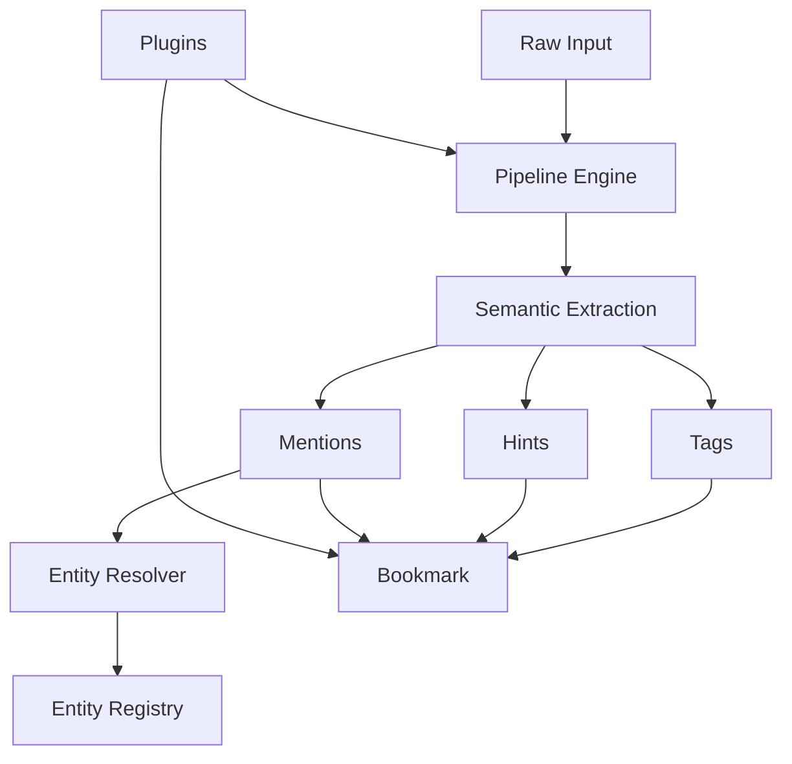

# Bookmark Schema

This document defines the full Bookmark schema used by ContextHelp, updated to incorporate **Mentions** and **Plugin Metadata** as first-class extensibility layers. Bookmarks represent enriched, structured, registry-aligned knowledge extracted from any input type.

They power retrieval, agent reasoning, semantic clustering, graph analysis, federated registry alignment, plugin-driven workflows, and deterministic reproduction.

## Overview

A Bookmark is a deterministic, JSON-serializable object produced by pipelines. All fields follow strict semantics to ensure stability across runs, machines, registries, agents, and plugins.

Below is the conceptual structure including the new `mentions` field and the new `plugins` metadata namespace:

```json
{
  "id": "uuid",
  "createdAt": "2025-01-01T12:00:00Z",
  "lastMatchedAt": "2025-01-15T14:30:00Z",

  "type": "image",
  "subtype": "image.landing",
  "raw": "...",
  "source": "engine-cli",
  "pipeline": "image.landing",

  "title": "...",
  "summary": "...",
  "sections": [],
  "content": {},

  "tags": [],
  "decisions": [],
  "hints": [],
  "mentions": [],

  "related": [],
  "registry": {},
  "metadata": {},
  "plugins": {},
  "debug": {}
}
```

## Conceptual Model



---

## Core Identification Fields

### id

Unique identifier for the bookmark.
**Type:** string (UUID v4 recommended)
**Generated by:** storage layer

### createdAt

Timestamp when the bookmark was created.
**Type:** ISO8601 string

### lastMatchedAt

Timestamp of last query match, used for ranking and sorting.
Automatically updated unless tracking is disabled.

---

## Input Classification

### type

High-level modality of the input.

Allowed values include core types:

- `text`
- `url`
- `image`
- `audio`
- `video`
- `other`

**Plugin-defined types** are also allowed:

Examples:

- `"feed"` (RSS/Atom/JSONFeed plugin)
- `"feed_item"`
- `"price_track"`

Plugin-defined types MUST be:

- lowercase
- namespaced or descriptive
- documented by the plugin

### subtype

More granular pipeline-specific classification.

Examples:

- `text.short`
- `url.repo`
- `image.ui`
- `feed.fetch`
- `feed.parse`

Plugins may register custom pipeline subtypes.

### raw

Raw input payload or pointer.

### source

Origin of the input:
`engine-cli`, `rest-api`, `extension`, `plugin:<name>`

### pipeline

Name of the pipeline that produced this bookmark.

Plugins may define new pipelines, and their names appear here.

---

## Content Structure

### title

Human-readable title.

### summary

Semantic summary of content.

### sections

List of semistructured content segments.

### content

Pipeline-defined structured data.

---

## Semantic Fields

### tags

AI-generated semantic labels aligned with registries.

### decisions

Structured evaluative insights.

### hints

User-provided lightweight semantic signals.

Hints NEVER automatically become tags or mentions.

---

## Mentions

Mentions are **canonical references to stable entities** and form the backbone of graph reasoning.

### Structure

```json
[
  "ui.best-practice",
  "stripe.api.checkout",
  "ux.signup-flow"
]
```

### Guarantees

- stable identity
- user-editable
- resolvable via registries
- non-influential (do not affect tags)
- not automatically produced from hints

---

## Plugin Metadata

The `plugins` namespace is reserved for **plugin-owned bookmark metadata**, ensuring plugins can store state without modifying core fields.

### Structure

```json
"plugins": {
  "rss_feed": {
    "feed_url": "https://example.com/feed.xml",
    "guid": "item-123",
    "published_at": "2025-01-02T10:00:00Z"
  },
  "price_monitor": {
    "current_price": 1199.00,
    "price_history": [
      { "timestamp": 1710000000, "price": 1299.99 },
      { "timestamp": 1710050000, "price": 1199.00 }
    ],
    "threshold_percent": 10
  },
  "notifications": {
    "suppress": false,
    "custom_channels": ["cli", "webhook"]
  }
}
```

### Plugin Metadata Rules

- Plugins MUST store all bookmark-specific state under their own key.
- Core MUST NOT interpret or mutate plugin metadata.
- Plugin metadata MUST be JSON-serializable.
- Plugins MUST NOT override or delete core fields.
- Plugins MAY attach refresh policies, item metadata, history arrays, etc.
- Conflicts between plugins MUST NOT occur because namespaces are segregated.

### Purpose

The `plugins` field ensures:

- **RSS Feed Plugin** can track feed URLs, GUIDs, item timestamps
- **Price Monitor Plugin** can track price history
- **Notification Plugin** can suppress or redirect notifications per-item
- **Future plugins** can extend bookmarks safely

No core schema changes are ever required.

---

## Related

Semantically related bookmarks.

---

## Registry Alignment

Tracks registry versions, taxonomy sources, weights, and provenance.

---

## Metadata

Auxiliary metadata from core pipelines (not plugins).

Plugins must NOT write to `metadata`. Only `plugins`.

---

## Debug

Diagnostics and pipeline traces.

---

## Minimal Example

```json
{
  "id": "a1b2c3",
  "createdAt": "2025-01-01T12:00:00Z",
  "type": "text",
  "subtype": "text.short",
  "raw": "Fix signup flow friction",

  "title": "Signup Flow Issue",
  "summary": "The signup flow has friction.",
  "tags": [
    { "label": "ux.issue.signup", "weight": 0.88 }
  ],
  "hints": ["#ux", "#bad"],
  "mentions": ["ux.signup-flow"],

  "plugins": {
    "price_monitor": {
      "enabled": false
    }
  },

  "pipeline": "text.short"
}
```

---

## Full Example

```json
{
  "id": "78d3e2d4-f144-47d8-b43b-9c8b0eab1515",
  "createdAt": "2025-01-18T12:45:00Z",
  "lastMatchedAt": "2025-01-19T08:12:33Z",

  "type": "image",
  "subtype": "image.landing",
  "raw": "<base64>",
  "source": "engine-cli",
  "pipeline": "image.landing",

  "title": "Landing Page UX Review",
  "summary": "The hero section lacks clarity and value hierarchy.",

  "sections": [
    { "name": "hero", "summary": "Weak value prop." }
  ],

  "content": {
    "text": "Get started...",
    "components": []
  },

  "tags": [
    { "label": "ui.hero.antipattern", "weight": 0.92 }
  ],

  "decisions": [
    {
      "section": "hero",
      "rating": "bad",
      "reason": "Unclear CTA"
    }
  ],

  "hints": ["#ui", "#bad"],
  "mentions": ["ui.best-practice", "ux.cta.weakness"],

  "related": [
    { "id": "d9c3f8e", "score": 0.74 }
  ],

  "registry": {
    "taxonomy": ["uxpatterns"],
    "weights": ["ux-defaults"]
  },

  "metadata": {
    "image": { "width": 1440, "height": 900 }
  },

  "plugins": {
    "rss_feed": {
      "feed_url": "https://example.com/feed.xml",
      "guid": "item123",
      "published_at": "2025-01-17T09:00:00Z"
    },
    "price_monitor": {
      "current_price": 1199.00,
      "price_history": [
        { "timestamp": 1710000000, "price": 1299.99 },
        { "timestamp": 1710050000, "price": 1199.00 }
      ]
    },
    "notifications": {
      "suppress": false
    }
  },

  "debug": {
    "taskTimings": {
      "OCR": 0.23,
      "ComponentDetect": 0.40
    }
  }
}
```

---

## Schema Evolution

- Additive changes permitted
- Breaking changes require schema version bump
- Plugins MUST NOT break core fields
- `plugins` namespace is guaranteed stable

---

## Summary

The Bookmark schema now formally supports:

1. **Mentions** — canonical entity references
2. **Plugin-defined bookmark types**
3. **Plugin metadata namespace (`plugins`)**
4. **Full isolation of plugin behavior from core**
5. **Deterministic, extensible knowledge representations**

This ensures plugins like RSS Feed, Price Monitor, Refresh, Notification, and future extensions can operate without modifying or interfering with core schema fields.