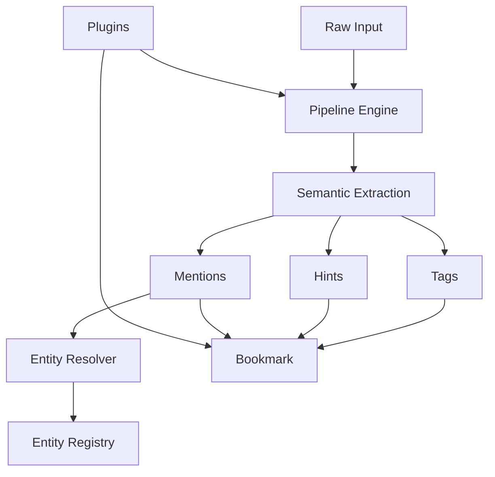

# Bookmark Schema

This document defines the full Bookmark schema used by ContextHelp, updated to incorporate **Mentions** and **Plugin Metadata** as first-class extensibility layers. Bookmarks represent enriched, structured, registry-aligned knowledge extracted from any input type.

They power retrieval, agent reasoning, semantic clustering, graph analysis, federated registry alignment, plugin-driven workflows, and deterministic reproduction.

## Overview

A Bookmark is a deterministic, JSON-serializable object produced by pipelines. All fields follow strict semantics to ensure stability across runs, machines, registries, agents, and plugins.

Below is the conceptual structure including the `mention_uris` field and the `plugins` metadata namespace:

```json
{
  "id": "uuid",
  "createdAt": "2025-01-01T12:00:00Z",
  "lastMatchedAt": "2025-01-15T14:30:00Z",

  "type": "image",
  "subtype": "image.landing",
  "raw": "...",
  "source": "engine-cli",
  "pipeline": "image.landing",

  "contentHash": "a1b2c3...",
  "reinforcementCount": 1,
  "lastReinforcedAt": "2025-01-15T14:30:00Z",

  "title": "...",
  "summary": "...",
  "sections": [],
  "content": {},

  "tags": [],
  "decisions": [],
  "hints": [],
  "mention_uris": [],

  "related": [],
  "registry": {},
  "metadata": {},
  "plugins": {},
  "debug": {}
}
```

## Conceptual Model



---

## Core Identification Fields

### id

Unique identifier for the bookmark.
**Type:** string (UUID v4 recommended)
**Generated by:** storage layer

### createdAt

Timestamp when the bookmark was created.
**Type:** ISO8601 string

### lastMatchedAt

Timestamp of last query match, used for ranking and sorting.
Automatically updated unless tracking is disabled.

---

## Input Classification

### type

High-level modality of the input.

Allowed values include core types:

- `text`
- `url`
- `image`
- `audio`
- `video`
- `other`

**Plugin-defined types** are also allowed:

Examples:

- `"feed"` (RSS/Atom/JSONFeed plugin)
- `"feed_item"`
- `"price_track"`

Plugin-defined types MUST be:

- lowercase
- namespaced or descriptive
- documented by the plugin

### subtype

More granular pipeline-specific classification.

Examples:

- `text.short`
- `url.repo`
- `image.ui`
- `feed.fetch`
- `feed.parse`

Plugins may register custom pipeline subtypes.

### raw

Raw input payload or pointer.

### source

Origin of the input:
`engine-cli`, `rest-api`, `extension`, `plugin:<name>`

### pipeline

Name of the pipeline that produced this bookmark.

Plugins may define new pipelines, and their names appear here.

---

## Deduplication Fields

### contentHash

SHA-256 hash of normalized `raw` content + `source`, used for content-based deduplication.
**Type:** string (hex-encoded, 64 characters)
**Generated by:** worker after pipeline execution
**Uniqueness:** Enforced via partial unique index (non-empty values only)

Normalization: trim whitespace, lowercase, collapse multi-whitespace to single space. The hash input is `normalized_content + "\x00" + source`, so identical content from different sources produces different hashes.

### reinforcementCount

Number of times this content has been ingested. Starts at 1 on creation and increments on each re-ingestion of content with the same hash.
**Type:** integer (default: 1)
**Updated by:** `Reinforce` operation

Higher counts indicate frequently encountered content, useful for importance ranking.

### lastReinforcedAt

Timestamp of the most recent reinforcement (re-ingestion).
**Type:** ISO8601 string (nullable)
**Updated by:** `Reinforce` operation

Null when the bookmark has only been ingested once.

---

## Content Structure

### title

Human-readable title.

### summary

Semantic summary of content.

### sections

List of structured content segments with heading levels and embedded atomic notes.

```json
[
  {
    "title": "Architecture Overview",
    "content": "The system uses a two-layer pipeline model...",
    "level": 2,
    "notes": [
      {
        "content": "Pipeline execution is idempotent and deterministic",
        "source_location": "paragraph 2",
        "confidence": 0.9,
        "tags": ["architecture"]
      }
    ]
  }
]
```

Fields:
- `title` — Section title or heading (required)
- `content` — Section content (required)
- `level` — Heading level 1-6 (required)
- `notes` — Atomic notes extracted from this section (required, may be empty)

### content

Pipeline-defined structured data.

---

## Semantic Fields

### tags

AI-generated semantic labels aligned with registries.

Each tag is a structured object:

```json
[
  {
    "label": "ux.issue.signup",
    "namespace": "uxpatterns",
    "confidence": 0.92,
    "weight": 0.88
  }
]
```

Fields:
- `label` — Tag label (required)
- `namespace` — Taxonomy namespace from registry (optional)
- `confidence` — Confidence in tag assignment, 0.0-1.0 (required)
- `weight` — Importance weight (optional)

### decisions

Structured decision extractions from content.

Each decision is a structured object:

```json
[
  {
    "what_was_decided": "Use PostgreSQL for the primary datastore",
    "rationale": "Need strong ACID guarantees and complex query support",
    "impact": "HIGH",
    "status": "RESOLVED",
    "stakeholders": ["@person.sarah", "@person.mike"],
    "timestamp": "2025-01-15T00:00:00Z",
    "confidence": 0.92,
    "alternatives_considered": ["MongoDB", "DynamoDB"]
  }
]
```

Fields:
- `what_was_decided` — Clear statement of the decision (required)
- `rationale` — Why this decision was made (optional)
- `impact` — Severity/scope: `LOW`, `MEDIUM`, or `HIGH` (required)
- `status` — Lifecycle state: `OPEN`, `RESOLVED`, or `SUPERSEDED` (required)
- `stakeholders` — People or entities involved (required, may be empty)
- `timestamp` — When decision was made (optional)
- `confidence` — Confidence this is actually a decision, 0.0-1.0 (required)
- `alternatives_considered` — Other options considered (required, may be empty)

### questions

Open questions or areas needing clarification extracted from content.

```json
[
  {
    "question": "Should we support real-time sync?",
    "context": "Multiple stakeholders raised this during architecture review",
    "potential_answers": ["WebSockets", "SSE", "Polling"],
    "confidence": 0.85
  }
]
```

Fields:
- `question` — The open question (required)
- `context` — Why this question matters (optional)
- `potential_answers` — Possible answers if any are suggested (required, may be empty)
- `confidence` — Confidence this is a real question, 0.0-1.0 (required)

### hints

User-provided lightweight semantic signals.

Hints NEVER automatically become tags or mentions.

---

## Mentions

Mentions are **canonical references to stable entities** and form the backbone of graph reasoning.

### Structure

Mentions are stored as a flat list of typed URIs under `mention_uris`:

```json
"mention_uris": [
  "ctxt://entity/organization/anthropic",
  "ctxt://entity/project/mobile-app-redesign"
]
```

The URI format is `ctxt://entity/<namespace>/<slug>`. The human-readable input form `@namespace.slug` (e.g., `@organization.anthropic`) is accepted at API ingestion boundaries and converted to URIs internally by the pipeline.

`ctxt://` URIs are also OS-clickable after running `ctxt uri register` — clicking opens the object or triggers a search directly in ctxt. See [api-cli.md §ctxt uri](api-cli.md#ctxt-uri).

### Input form (API ingestion)

When submitting to `POST /analyze` or `POST /inbox`, use the legacy `mentions` field with `@`-prefixed slugs:

```json
"mentions": ["@organization.anthropic", "@project.mobile-app-redesign"]
```

The pipeline converts these to `ctxt://entity/...` URIs automatically.

### Guarantees

- stable identity
- user-editable
- resolvable via registries
- non-influential (do not affect tags)
- not automatically produced from hints

---

## Plugin Metadata

The `plugins` namespace is reserved for **plugin-owned bookmark metadata**, ensuring plugins can store state without modifying core fields.

### Structure

```json
"plugins": {
  "rss_feed": {
    "feed_url": "https://example.com/feed.xml",
    "guid": "item-123",
    "published_at": "2025-01-02T10:00:00Z"
  },
  "price_monitor": {
    "current_price": 1199.00,
    "price_history": [
      { "timestamp": 1710000000, "price": 1299.99 },
      { "timestamp": 1710050000, "price": 1199.00 }
    ],
    "threshold_percent": 10
  },
  "notifications": {
    "suppress": false,
    "custom_channels": ["cli", "webhook"]
  }
}
```

### Plugin Metadata Rules

- Plugins MUST store all bookmark-specific state under their own key.
- Core MUST NOT interpret or mutate plugin metadata.
- Plugin metadata MUST be JSON-serializable.
- Plugins MUST NOT override or delete core fields.
- Plugins MAY attach refresh policies, item metadata, history arrays, etc.
- Conflicts between plugins MUST NOT occur because namespaces are segregated.

### Purpose

The `plugins` field ensures:

- **RSS Feed Plugin** can track feed URLs, GUIDs, item timestamps
- **Price Monitor Plugin** can track price history
- **Notification Plugin** can suppress or redirect notifications per-item
- **Future plugins** can extend bookmarks safely

No core schema changes are ever required.

---

## Related

Semantically related bookmarks.

---

## Registry Alignment

Tracks registry versions, taxonomy sources, weights, and provenance.

---

## Metadata

Auxiliary metadata from core pipelines (not plugins).

Plugins must NOT write to `metadata`. Only `plugins`.

---

## Debug

Diagnostics and pipeline traces.

---

## Minimal Example

```json
{
  "id": "a1b2c3",
  "createdAt": "2025-01-01T12:00:00Z",
  "type": "text",
  "subtype": "text.short",
  "raw": "Fix signup flow friction",
  "contentHash": "e3b0c44...",
  "reinforcementCount": 1,

  "title": "Signup Flow Issue",
  "summary": "The signup flow has friction.",
  "tags": [
    { "label": "ux.issue.signup", "namespace": "uxpatterns", "confidence": 0.92, "weight": 0.88 }
  ],
  "hints": ["#ux", "#bad"],
  "mention_uris": [
    "ctxt://entity/concept/signup-flow"
  ],

  "plugins": {
    "price_monitor": {
      "enabled": false
    }
  },

  "pipeline": "text.short"
}
```

---

## Full Example

```json
{
  "id": "78d3e2d4-f144-47d8-b43b-9c8b0eab1515",
  "createdAt": "2025-01-18T12:45:00Z",
  "lastMatchedAt": "2025-01-19T08:12:33Z",

  "type": "image",
  "subtype": "image.landing",
  "raw": "<base64>",
  "source": "engine-cli",
  "pipeline": "image.landing",
  "contentHash": "7f83b16...",
  "reinforcementCount": 3,
  "lastReinforcedAt": "2025-01-19T08:00:00Z",

  "title": "Landing Page UX Review",
  "summary": "The hero section lacks clarity and value hierarchy.",

  "sections": [
    {
      "title": "Hero Section",
      "content": "The hero section lacks clarity and value hierarchy.",
      "level": 2,
      "notes": [
        {
          "content": "CTA is unclear and buried below the fold",
          "source_location": "hero section",
          "confidence": 0.88,
          "tags": ["ux", "cta"]
        }
      ]
    }
  ],

  "content": {
    "text": "Get started...",
    "components": []
  },

  "tags": [
    { "label": "ui.hero.antipattern", "namespace": "uxpatterns", "confidence": 0.95, "weight": 0.92 }
  ],

  "decisions": [
    {
      "what_was_decided": "Hero section CTA needs redesign",
      "rationale": "Unclear call-to-action reduces conversion",
      "impact": "HIGH",
      "status": "OPEN",
      "stakeholders": [],
      "timestamp": null,
      "confidence": 0.85,
      "alternatives_considered": ["Keep current CTA", "Remove CTA entirely"]
    }
  ],

  "hints": ["#ui", "#bad"],
  "mention_uris": [
    "ctxt://entity/concept/ui-best-practice",
    "ctxt://entity/concept/cta-weakness"
  ],

  "related": [
    { "id": "d9c3f8e", "score": 0.74 }
  ],

  "registry": {
    "taxonomy": ["uxpatterns"],
    "weights": ["ux-defaults"]
  },

  "metadata": {
    "image": { "width": 1440, "height": 900 }
  },

  "plugins": {
    "rss_feed": {
      "feed_url": "https://example.com/feed.xml",
      "guid": "item123",
      "published_at": "2025-01-17T09:00:00Z"
    },
    "price_monitor": {
      "current_price": 1199.00,
      "price_history": [
        { "timestamp": 1710000000, "price": 1299.99 },
        { "timestamp": 1710050000, "price": 1199.00 }
      ]
    },
    "notifications": {
      "suppress": false
    }
  },

  "debug": {
    "taskTimings": {
      "OCR": 0.23,
      "ComponentDetect": 0.40
    }
  }
}
```

---

## Schema Evolution

- Additive changes permitted
- Breaking changes require schema version bump
- Plugins MUST NOT break core fields
- `plugins` namespace is guaranteed stable

---

## Summary

The Bookmark schema now formally supports:

1. **Mentions** — canonical entity references
2. **Content-hash deduplication** — SHA-256 based duplicate detection with reinforcement tracking
3. **Plugin-defined bookmark types**
4. **Plugin metadata namespace (`plugins`)**
5. **Full isolation of plugin behavior from core**
6. **Deterministic, extensible knowledge representations**

This ensures plugins like RSS Feed, Price Monitor, Refresh, Notification, and future extensions can operate without modifying or interfering with core schema fields.