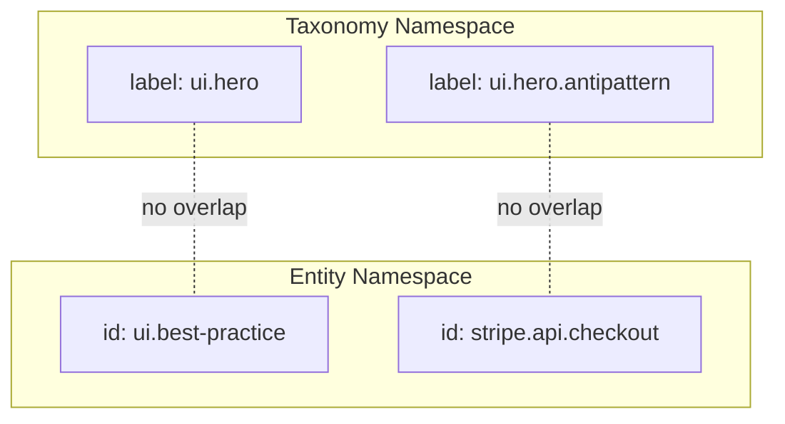

# Taxonomy Schema

This document defines the structure of taxonomy entries used by **ContextHelp**, updated to distinguish **Taxonomy Labels (Tags)** from **Entities (Mentions)**.
Taxonomies remain the authoritative system for **classification**, while entities provide **identity** and **canonical references**.
This file now formalizes that separation and clarifies how taxonomies coexist with the new **Entity Registry**.

## Purpose of the Taxonomy Schema

- Provide a **consistent, machine-readable structure** for semantic tags.
- Normalize AI-generated tags and user hints against a **trusted vocabulary**.
- Support **hierarchies, aliases, and polarity** to allow expressive meaning.
- Enable registries to publish interoperable taxonomies.
- Allow agents or pipelines to subscribe to specific vocabularies.
- Clarify the boundary between **tags** (classification) and **entities** (identity).
- Ensure taxonomies do not conflict with the **entity namespace**.

## Relationship Between Tags and Entities

Tags represent **semantic classifications** applied to bookmarks.
Entities (used by mentions) represent **canonical, identifiable concepts**.

Key distinctions:

- **Tags**
  - Purpose: classification
  - Hierarchical labels
  - Optional weights, polarity
  - Derived by pipelines or user hints
  - Stored as part of the bookmark's semantic structure
  - Defined in taxonomy registries
  - Not globally unique across all registries

- **Entities**
  - Purpose: identity + reference
  - Canonical, global slugs
  - Used explicitly via `@mention` syntax
  - Introduced in `schema-entity.md`
  - Stored in the entity registry

### Diagram: Tag vs Entity

```mermaid
flowchart LR
    A[Hint] -->|classification| T[Tag]
    T -->|taxonomy lookup| TR[Taxonomy Registry]

    A2[@mention] -->|identity| E[Entity]
    E -->|resolution| ER[Entity Registry]

    B[Bookmark] -->|stores| T
    B -->|stores| E
```

## Data Model Overview

A taxonomy registry returns an array of taxonomy entries.
Each entry represents a **canonical tag definition** with metadata and relations.

```jsonc
{
  "label": "ui.hero.antipattern",
  "description": "Patterns that demonstrate poor visual hierarchy or clarity in hero sections.",
  "aliases": ["bad-hero", "hero-fail"],
  "polarity": "negative",
  "weight": 0.9,
  "parents": ["ui.hero"],
  "children": [],
  "examples": [
    "Low contrast hero with unclear CTA",
    "Hero section without value proposition"
  ],
  "metadata": {
    "domain": "ui/ux",
    "version": "1.0.0"
  }
}
```

## Field Definitions

### label

**Type:** string
**Required:** yes

Canonical identifier for this **tag**.
Labels are hierarchical, dot-separated:

- `ui.hero.antipattern`
- `growth.experiment.win`
- `security.input.sanitization`

### description

**Type:** string
**Required:** recommended

Human-readable explanation of the concept.

### aliases

**Type:** array of strings
**Required:** no

Alternative names or synonyms pipelines may match.

### polarity

**Type:** `"positive" | "negative" | "neutral"`
**Default:** `"neutral"`

Indicates evaluative meaning.

### weight

**Type:** float (0–1)
**Required:** no

Optional guidance for tag scoring or ranking.

### parents

**Type:** array of strings
**Required:** no

Hierarchical ancestors of the tag.

### children

**Type:** array of strings
**Required:** no

Explicit downward references; may be inferred.

### examples

**Type:** array of strings
**Required:** no

Illustrative examples useful for AI-aligned interpretation.

### metadata

**Type:** object
**Required:** no

Registry-defined additional fields such as:

- domain classification
- versioning
- licensing
- custom behaviors

Unknown metadata fields must be ignored safely.

## Registry Response Shape

A taxonomy registry exposes a list of entries:

```json
{
  "registry": "ux-critique",
  "version": "1.2.0",
  "taxonomy": [
    {
      "label": "ui.hero.antipattern",
      "description": "Weak hero section patterns...",
      "aliases": ["bad-hero", "hero-fail"],
      "polarity": "negative",
      "parents": ["ui.hero"],
      "examples": ["Insufficient contrast", "Unclear CTA"]
    },
    {
      "label": "ui.hero.pattern",
      "description": "Effective hero patterns...",
      "polarity": "positive",
      "children": ["ui.hero.primary", "ui.hero.secondary"]
    }
  ]
}
```

## Validation Requirements

When loading taxonomy entries:

- `label` must be unique *within a registry*.
- Circular parent relationships are rejected.
- Missing descriptions allowed but discouraged.
- Unknown fields ignored.
- Weights must be 0–1.
- Polarity must be valid.
- Aliases must not conflict with labels or entities.
- **Labels must not collide with entity slugs.**

## Integration With Mentions & Entities

Taxonomies and entities operate in **parallel namespaces**:

- Tags classify bookmarks.
- Entities (referenced via mentions) identify canonical concepts.

### Rules

- A taxonomy label never implies an entity.
- A mention never produces a tag.
- Pipelines must not transform hints into mentions.
- Taxonomies may reference entities indirectly in metadata but must not overlap IDs.

### Diagram: Namespace Boundaries



## Interaction With Pipelines

Pipelines use taxonomy entries for:

- tag normalization
- tag canonicalization
- hierarchy inference
- tag scoring (via weights & polarity)
- mapping hints into structured meaning

Pipelines must not treat taxonomy labels as entities.

## Interaction With Agents

Agents may subscribe to taxonomy registries:

```yaml
agents:
  ux_critic:
    taxonomy:
      - global-default
      - registry:ux-critique
```

Agents use taxonomy metadata for:

- filtering
- interpretation
- polarity-aware reasoning
- domain-scoped retrieval

Agents treat entities separately according to `schema-entity.md`.

## Versioning

Registries should include:

- version (semantic recommended)
- optional changelog or diff endpoints

ContextHelp may cache versions and detect updates.

## Extensibility

Taxonomies may include:

- additional optional fields
- custom relations
- sub-ontologies
- domain tagging constraints
- registry-defined behaviors

All extensions must remain forward-compatible.

## Summary

The taxonomy schema defines an extensible structure for **classification tags**, independent from the new **entity/mention** system.
Tags categorize. Entities identify.
Both coexist cleanly within ContextHelp’s semantic architecture, enabling deterministic pipelines, decentralized registries, and a future-proof knowledge ecosystem.