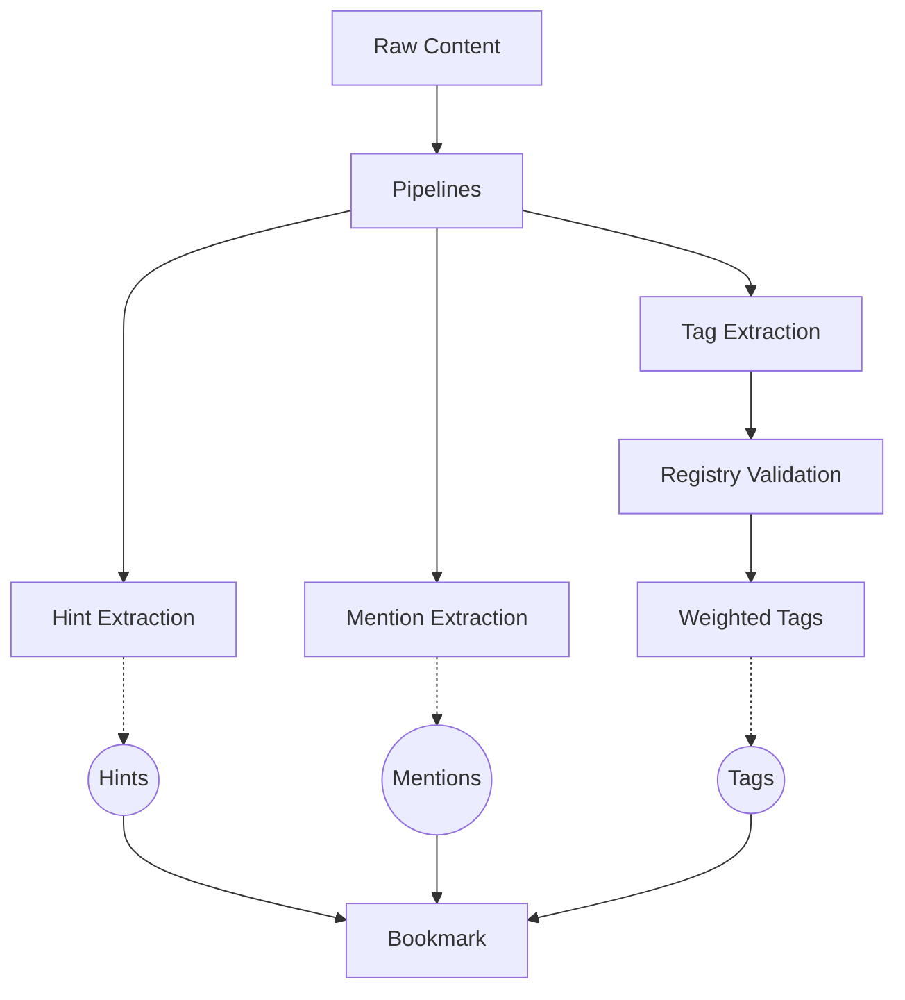
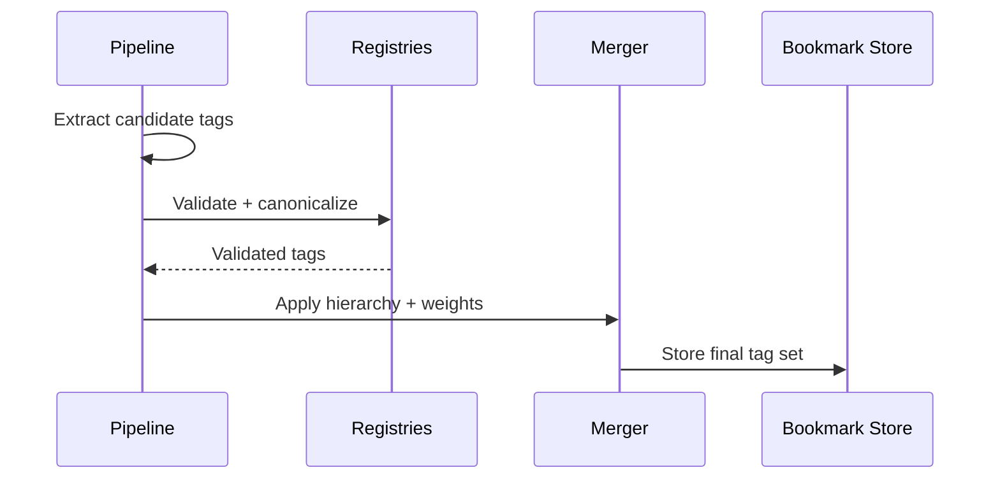
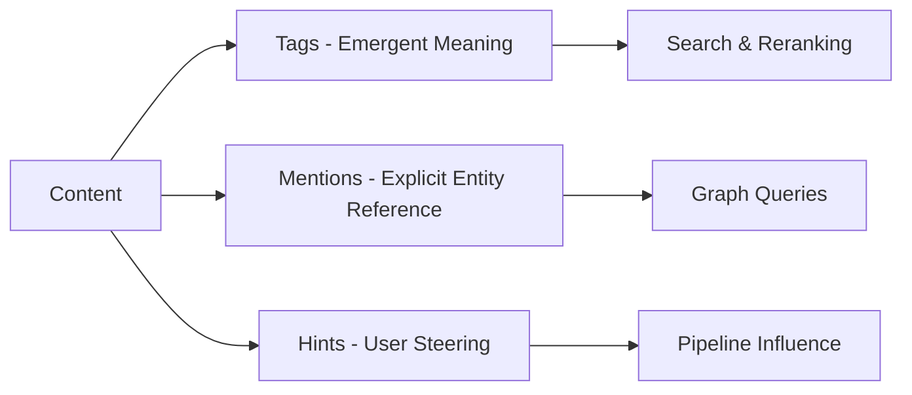

# Tags

ContextHelp uses tags as **AI-generated semantic classifications** that describe what a bookmark *is about*. Tags are produced by enrichment pipelines, validated against registries, weighted, and structured hierarchically. They are distinct from **hints** and **mentions**, which serve different semantic purposes. Tags may also be extended by plugins, but only within the boundaries of the tag system—they cannot replace or mimic mentions or hints.

Tags represent *emergent meaning*, not identity, not intent, and not explicit user references.

## Overview

Tags are:
- generated by pipelines
- validated against subscribed registries
- structured into hierarchies
- assigned weights and polarity
- used for filtering, scoring, and reranking
- optional: extended by plugins via tag-extraction extensions

Tags are *not* user-authored. They reflect what the system infers from content.

Tags are also **different from hints and mentions**:
- **Hints** = user steering
- **Mentions** = canonical entity references (`@concept`)
- **Tags** = emergent AI classification

Mermaid overview of the relationship:



## What Tags Represent

Tags classify content based on:
- thematic relevance
- domain-specific categories
- conceptual clusters
- behavioral / structural cues
- high-level semantic understanding

They can include:
- domains (e.g., `ui.design`)
- topics (`security.crypto`)
- tasks (`devops.deployment`)
- roles (`marketing.strategy`)
- content types (`architecture.pattern`)

Tags may also emerge in:
- hierarchical structures
- multi-parent category sets
- weighted embeddings

Plugins may introduce *additional tag extraction mechanisms*, but they still produce tags—never mentions.

## Definitions and Properties

### Deterministic Generation

Given identical inputs, registry states, and configuration, pipelines must generate **deterministic** tag sets and weights—this applies equally to plugin-provided tag logic.

### Hierarchical Structure

Tags follow a dotted namespace hierarchy:

```
ui.design.layout
security.auth.oauth
ml.nlp.embeddings
```

Registries may define:
- parent/child structures
- cluster mappings
- validity constraints
- canonical names

Plugins may define additional namespaces, but registry-based namespaces always take precedence.

### Weighting Model

Each tag receives a **weight** representing relevance:

- `1.0` = dominant theme
- `0.5` = medium relevance
- `0.1` = faint but valid signal

The weighting system supports:
- rank blending
- RRF-based reranking
- probabilistic scoring
- metadata-based scaling

### Polarity

Polarity represents directional sentiment or evaluative stance:

- `positive`: content advocates or supports
- `negative`: content warns or critiques
- `neutral`: descriptive

Polarity does **not** appear for all tags—only where relevant.

### Influence Attribution

Tag generation tracks which pipeline signals contributed:

- LLM classification
- embedding similarity
- rule-based heuristics
- extracted metadata
- registry hints
- plugin-defined tag extractors

Influence attribution is exposed via introspection APIs.

## Relationship to Registries

Tags are reconciled with registries when present.

### Validation

If a registry declares a canonical tag, all generated tags must be:
- mapped to a known canonical form
- rejected if invalid
- aliased if deprecated

### Autonomous Creation

If no registry governs a tag space, tags may be:
- locally created
- refined over time
- merged or split by plugins

Registries do **not** override user hints or mentions.

### Cross-Registry Consistency

Multiple registries may define overlapping taxonomies.
ContextHelp merges them deterministically based on:
- precedence order
- namespace
- versioning

## Tag Lifecycle



### Steps

1. **Extraction**
   NLP + heuristics propose candidate tags. Plugins may add additional extraction steps.

2. **Normalization**
   Canonical slug conversion.

3. **Validation**
   Registries confirm correctness/aliases.

4. **Weight Assignment**
   Scored by pipeline signals.

5. **Polarity Assignment**
   Optional sentiment-aware tagging.

6. **Bookmark Storage**
   Tags become part of the structured bookmark.

## Tags vs Hints vs Mentions

### Conceptual Differences

**Hints**
- Provided by user (`#ui.design`)
- Influence pipelines
- Not stored as semantic identity
- Not canonical
- Cannot become tags automatically

**Mentions**
- Explicit entity references (`@ui.best-practice`)
- Always user-authored
- Resolve to registry entities
- Provide stable identity
- Never inferred from pipeline or plugin behavior

**Tags**
- Generated automatically
- Represent emergent meaning
- Weighted and validated
- Used for search + reranking
- Can be extended by plugins, subject to deterministic rules

### Comparison Table

| Property | Tags | Hints | Mentions |
|---------|------|--------|----------|
| Created by | AI pipelines + plugins | user | user |
| Purpose | classification | steering | identity reference |
| Has weight | yes | no | no |
| Validated by registries | yes | no | yes |
| Drives search | yes | optional | yes |
| Stored in bookmark | yes | optionally | yes |
| Canonical | registry-dependent | no | always |

## How Tags Influence Search

Tags participate directly in:
- SQL metadata filtering
- FTS boosting
- embedding similarity scoring
- reranker blending
- agent-context constraints

Common query examples:

```
tag:ui.design
tag:security.*
NOT tag:marketing.strategy
```

Tags may also interact with:
- language filters
- date recency
- registry precedence
- plugin-defined tag weighting extensions

## How Tags Coexist With Mentions

Tags describe *what the content is about*.
Mentions describe *what entities the content explicitly references*.

Example:

- Bookmark contains:
  - Mentions: `@stripe.api.checkout`
  - Tags: `commerce.payments`, `integration.api`

A mention **never becomes a tag**, and a tag **never implies a mention**.
Plugins must respect this boundary.

Mermaid relationship:



## Plugin Extension Model

Plugins may introduce:

- additional tag extraction steps
- tag weighting augmentations
- tag clustering or normalization helpers
- registry-backed evaluation heuristics
- polarity extensions

However, plugins may **not**:

- generate mentions
- reinterpret mentions as tags
- convert hints into tags
- override canonical registry tag definitions

Plugins must preserve determinism and not conflict with entity semantics.

## API Surface (Conceptual)

Tags appear in:

- bookmark schema
- search query language
- registry lookups
- introspection endpoints
- reranker weighting configurations

Typical JSON representation:

```json
{
  "tag": "ui.design.layout",
  "weight": 0.82,
  "polarity": "positive",
  "sources": ["llm", "embedding", "plugin.rule"]
}
```

## Best Practices

### Keep Namespaces Stable
Use dotted slugs with clear ownership.

### Use Registries for Canonical Domains
Especially useful for:
- technical domains
- industry ontologies
- standardized practice areas

### Avoid Over-Tagging
More tags ≠ better classification.
Weights should distribute meaning, not dilute it.

### Preserve Boundaries With Hints and Mentions
Tags classify content.
Mentions identify entities.
Hints influence pipelines.

They must remain distinct.

## Summary

Tags are **AI-generated semantic labels** that classify content by meaning, validated through registries, weighted for relevance, structured hierarchically, and used heavily in retrieval and reranking. Plugins may extend tag extraction logic, but tags always remain separate from user hints and canonical mentions, forming one of the three pillars of ContextHelp’s semantic model.