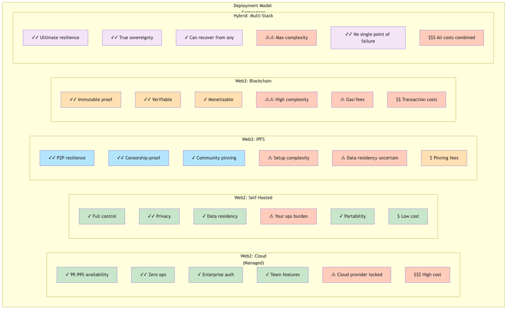

# Deployment Documentation

This directory contains comprehensive deployment guidance for ContextHelp (dPKMS + ctxt), supporting Web2, Web3, and hybrid deployment models.

## Quick Navigation

### Core Documents

1. **[WEB2-WEB3-HYBRID.md](WEB2-WEB3-HYBRID.md)** — Complete hybrid deployment architecture
   - Design philosophy and core principles
   - 4 deployment models (Web2 Cloud, Web2 Self-Hosted, Web3 IPFS, Web3 Blockchain)
   - Storage driver implementations (SQLite, PostgreSQL, IPFS, Arweave, Blockchain)
   - Network transport implementations (HTTP, libp2p, RPC)
   - Hybrid sync orchestration with code examples
   - Security & privacy guarantees per model
   - Migration paths between deployment models
   - Implementation roadmap

### Visual Diagrams

**System Architecture**
-  | [Mermaid](WEB2-WEB3-HYBRID.mmd)
  - Shows all storage drivers and network transports
  - How user interfaces connect to core
  - Integration with cloud, P2P, and blockchain infrastructure

**Deployment Scenarios**
-  | [Mermaid](DEPLOYMENT-SCENARIOS.mmd)
  - Solo developer (local + backup)
  - Team (cloud managed)
  - Community (Web3 P2P)
  - Enterprise (hybrid redundancy)

**Sync Orchestration**
-  | [Mermaid](SYNC-ORCHESTRATION.mmd)
  - Write path: local write → async replication to all targets
  - Read path: query all sources in parallel → merge → rerank
  - Job-based orchestration with retry guarantees

## Deployment Models at a Glance



**[View as Mermaid](COMPARISON-MATRIX.mmd)**

| Model | Target Users | Data Storage | Simplicity | Sovereignty | Cost |
|-------|---|---|---|---|---|
| **Web2 Cloud (Managed)** | Teams, enterprises | context.help cloud | ⭐⭐⭐⭐⭐ | ⚠️ | $$$ |
| **Web2 Self-Hosted** | Privacy users, DevOps | Your infra (cloud VM, on-prem) | ⭐⭐⭐ | ✅ | $ - $$ |
| **Web3 IPFS** | Communities, decentralization | IPFS cluster + pinning | ⭐⭐ | ✅ | $ |
| **Web3 Blockchain** | Verifiable, immutable | Arweave + on-chain settlement | ⭐⭐ | ✅ | $$ |
| **Hybrid** | Enterprises needing both | All of above simultaneously | ⭐⭐⭐⭐ | ✅ | $$$ |

## Key Design Principles

### ✓ Non-Negotiables Preserved
- **Sovereign** — Users own their data regardless of hosting choice
- **Durable** — Crash-safe execution works on any backend
- **Verifiable** — Audit trails and signatures work across networks
- **Interoperable** — Knowledge exports work across hosting models
- **Federated** — Registries work identically everywhere

### ✓ Pluggable Architecture
The same dPKMS + ctxt codebase deploys anywhere:
- **Storage drivers** — Choose where data persists (local, cloud DB, IPFS, Arweave, blockchain)
- **Network transports** — Choose how nodes communicate (HTTP, libp2p, RPC, Registry Protocol)
- **Sync targets** — Enable multiple targets simultaneously with automatic failover

### ✓ No Vendor Lock-In
- Portable data bundles work across all deployment models
- Deterministic sync means data is identical whether stored locally, in cloud, or on IPFS
- Can migrate between models without data loss
- Registries work identically regardless of infrastructure

## Common Scenarios

### "I'm a solo developer who values privacy"
```yaml
Use: Web2 Self-Hosted
Storage: SQLite (local)
Backup: USB drive or rsync
Cost: Free (your hardware)
Privacy: 100% (nothing leaves your machine)
```

### "Our team needs compliance and zero ops"
```yaml
Use: Web2 Cloud (Managed)
Storage: PostgreSQL (cloud)
Auth: SSO/SCIM
Backup: Automatic
Cost: $X/user/month
Compliance: SOC2, HIPAA ready
```

### "We want censorship-resistant knowledge sharing"
```yaml
Use: Web3 IPFS
Storage: IPFS Cluster (P2P pinning)
Networking: libp2p (DHT discovery)
Registry: IPFS-hosted taxonomy
Cost: Pinning fees (~$0.001-0.01/GB/month)
Permanence: Requires active pinning
```

### "We need immutable proof of authorship"
```yaml
Use: Web3 Blockchain + Arweave
Storage: Local SQLite (hot), Arweave (cold), blockchain (metadata)
Settlement: Solana (low cost) or Ethereum (high assurance)
Cost: ~$0.01/commit anchor
Permanence: Forever (immutable)
```

### "We're an enterprise needing everything"
```yaml
Use: Hybrid (Web2 + Web3)
Storage: PostgreSQL (master) + IPFS (replicas) + Arweave (archive)
Settlement: Blockchain for proof-of-update
Redundancy: Multi-region cloud + P2P replication
Cost: Cloud + blockchain fees
Resilience: Can recover from any single target
```

## Getting Started

### Phase 1: Choose Your Model
Review the deployment models above and decide which fits your needs.

### Phase 2: Review Architecture
Read [WEB2-WEB3-HYBRID.md](WEB2-WEB3-HYBRID.md) for:
- Detailed storage driver specs
- Network transport APIs
- Sync orchestration code
- Security model for your choice

### Phase 3: Configuration
Check the example configs in the document for your scenario.

### Phase 4: Deploy
Follow the implementation roadmap:
- **Phase 1 (MVPs Exist):** SQLite + HTTP + Registries
- **Phase 2 (3-6 mo):** PostgreSQL + cloud service + Docker
- **Phase 3 (6-12 mo):** IPFS + libp2p + Solana
- **Phase 4 (12+ mo):** Arweave + Ethereum + advanced features

## Implementation Status

| Component | Status | Notes |
|-----------|--------|-------|
| SQLite Storage | ✅ MVP | Local-first default |
| HTTP Transport | ✅ MVP | REST API for cloud |
| Registry Protocol | ✅ MVP | Sync across all networks |
| PostgreSQL Driver | 🟡 Phase 2 | Cloud-ready |
| Cloud Managed Service | 🟡 Phase 2 | context.help cloud |
| IPFS Driver | 🟡 Phase 3 | DHT + pinning |
| libp2p Transport | 🟡 Phase 3 | P2P sync |
| Arweave Driver | 🟡 Phase 4 | Permanent storage |
| Blockchain Settlement | 🟡 Phase 4 | Proof-of-update |
| Smart Contract Registries | 🟡 Phase 4 | On-chain governance |

## FAQ

**Q: Can I start with Web2 and move to Web3?**
A: Yes! Portable bundles work everywhere. Just export, reconfigure, and import.

**Q: Can I use multiple backends simultaneously?**
A: Yes! That's the whole point of hybrid. Write once, sync to all targets asynchronously.

**Q: What if one storage backend fails?**
A: With hybrid setup, you can recover from any other target. With single backend, you have the data, just need to restore.

**Q: Do I need to understand blockchain to use Web3 options?**
A: No. We handle all signing/verification. You just point to an RPC endpoint.

**Q: What's the cost difference?**
A: Web2 managed (~$15-50/user/month), Web2 self-hosted (free if you have infra), Web3 IPFS (~$0.01/GB/month pinning), Web3 blockchain (~$0.01-0.50/commit).

**Q: Which model should a startup choose?**
A: Start with Web2 Cloud (simplicity). Add Web3 later if you need decentralization/verification.

**Q: Can I use dPKMS without the cloud service?**
A: Yes! The node is fully OSS. Cloud is optional for managing multi-user orgs and upgrades.

## Related Documentation

- `../architecture.md` — Overall system design
- `../dpkms/` — dPKMS substrate documentation
- `../ctxt/` — ctxt agentic brain documentation
- `../cloud/` — Cloud service details (identity, billing, access management)

## Support

For deployment questions or issues:
1. Review the relevant deployment model section
2. Check configuration examples for your scenario
3. Review implementation roadmap to see phase status
4. Refer to core architecture docs for underlying principles

---

**Last Updated:** February 2026

This design enables **maximum flexibility** without compromising core guarantees:
- Users choose their infrastructure
- Data stays portable
- Sovereignty is non-negotiable
- Decentralization is optional, not imposed
- Registries work identically everywhere
