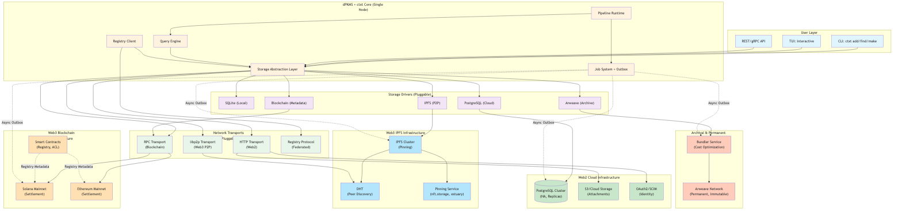
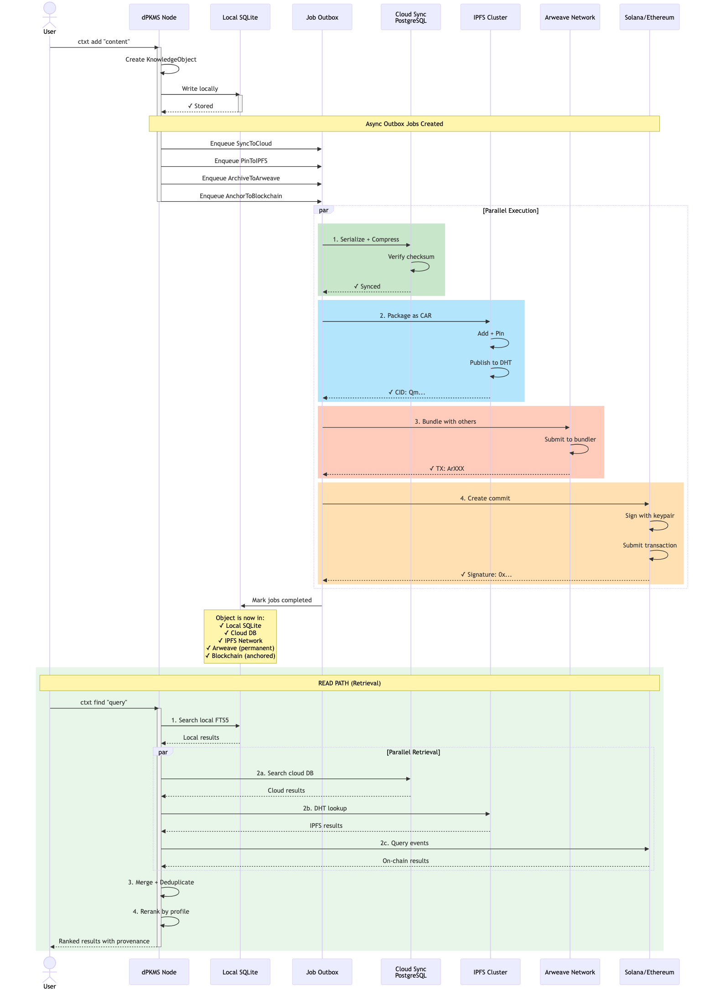
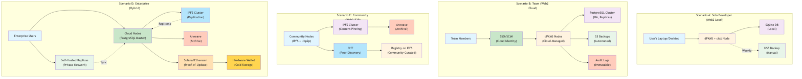

# Web2/Web3 Hybrid Deployment Model

## Executive Summary

This document describes a **deployment-agnostic** architecture that allows users and organizations to run ContextHelp (dPKMS + ctxt) on their choice of infrastructure:

1. **Web2 (Traditional Cloud)** — Centralized hosting via managed cloud services
2. **Web3 (Decentralized)** — Self-hosted or decentralized networks (IPFS, Arweave, Filecoin, Solana, Ethereum, etc.)
3. **Hybrid** — Same setup hosted simultaneously on multiple networks

The design respects the core principle: **dPKMS is substrate-agnostic; storage and networking are pluggable.**

---

## Design Philosophy

### Non-Negotiables Preserved

This hybrid model maintains dPKMS core principles:

- **Sovereign** — Users own their data regardless of hosting choice
- **Durable** — Crash-safe execution works on any backend
- **Verifiable** — Audit trails and signatures work across networks
- **Self-Authenticating** — Bundle signatures validate on-chain and off-chain
- **Interoperable** — Knowledge exports work across hosting models
- **Federated** — Registries work identically whether nodes are centralized or distributed
- **Extensible** — Storage drivers and network transports are pluggable
- **Fast** — Performance is optimized per-backend (local SQLite, cloud Postgres, IPFS pinning, etc.)

### Key Architectural Insight

**The node (self-hosted OSS) remains identical regardless of where it runs.**

```
dPKMS + ctxt Node
├── Storage (pluggable: SQLite, Postgres, custom)
├── Job System (deterministic, resumable)
├── Pipeline Runtime (local-first, capability-scoped)
├── Registry Client (thin sync + just-in-time pulls)
└── Network Transport (pluggable: HTTP, IPFS, libp2p, Solana RPC, etc.)
```

The **only variables** are:
- Where data persists (local disk, cloud database, IPFS, Arweave, blockchain)
- How nodes discover and communicate (DNS, DHT, smart contracts, etc.)
- Who manages infrastructure (user, organization, Web2 provider, Web3 provider)

---

## Architecture Diagrams

### System Overview



**Full architecture showing pluggable storage and network layers:**

```
User Layer (CLI, TUI, API)
    ↓
dPKMS + ctxt Core (Single Node)
    ↓
Storage Drivers (SQLite, PostgreSQL, IPFS, Arweave, Blockchain)
    ↓
Network Transports (HTTP, libp2p, RPC, Registry Protocol)
    ↓
Infrastructure (Web2 Cloud, Web3 P2P, Blockchain, Archival)
```

**[View as Mermaid](WEB2-WEB3-HYBRID.mmd)**

---

## Deployment Models

### 1. Web2: Managed Cloud Service (Recommended for Teams)

**Operator:** context.help cloud (or user's own cloud)

**Infrastructure:**
```
User Login (SSO/SCIM) → Cloud Org Service
    ↓
Multi-Tenant Admin API (cloud-managed)
    ↓
Managed Node Cluster (hosted on AWS/GCP/Azure)
    ↓
PostgreSQL (encrypted at rest)
    ↓
S3/Cloud Storage (attachments, backups)
```

**What cloud provides:**
- Multi-user org lifecycle
- SSO/SCIM integration
- Automatic backups and HA
- Version upgrades managed
- Monitoring and alerting
- Billing and marketplace

**What node provides (OSS):**
- Policy enforcement (RBAC, quotas)
- Registry protocol client
- Plugin runtime sandbox
- Audit events emission

**Data ownership:**
- User data stays in their org's database
- Encryption keys managed per-org
- Full export capability (portable bundles)
- No telemetry without opt-in

**Use case:**
- Teams and enterprises wanting zero ops
- Organizations needing audit/compliance
- Users wanting managed backups

---

### 2. Web2: Self-Hosted (Recommended for Privacy-Conscious Users)

**Operator:** User, organization, or independent host

**Infrastructure:**
```
User's machine (laptop, server, docker container)
    ↓
dPKMS + ctxt Node (OSS)
    ↓
Local SQLite or Postgres
    ↓
Local attachments directory or S3-compatible
```

**Deployment options:**
- Binary on macOS/Linux/Windows
- Docker container (self-hosted or provider-hosted)
- Kubernetes (multi-user, high availability)
- Cloud VM (AWS EC2, DigitalOcean, Hetzner, etc.)

**Data ownership:**
- 100% local control
- No cloud access required
- Full portability
- Can sync across devices via optional cloud backup

**Use case:**
- Solo developers and writers
- Privacy-first users
- Organizations with data residency requirements
- Air-gapped/offline-first deployments

---

### 3. Web3: Decentralized Storage + Coordination

**Operator:** User, community, or protocol

**Infrastructure Option A: IPFS + DHT**
```
User's machine
    ↓
dPKMS + ctxt Node (OSS)
    ↓
Storage:
├── Local SQLite (hot data)
├── IPFS Cluster (replicated knowledge bundles)
└── Filecoin (archival cold storage)

Networking:
├── libp2p (peer discovery and sync)
├── DHT (distributed hash table for node discovery)
└── BitTorrent DHT (optional fallback)
```

**Infrastructure Option B: Blockchain-Anchored (Solana/Ethereum)**
```
User's machine
    ↓
dPKMS + ctxt Node (OSS)
    ↓
Storage:
├── Local SQLite (hot data)
├── Arweave (permanent, immutable knowledge bundles)
└── Solana/Ethereum (anchor metadata, signatures, proof-of-update)

Networking:
├── RPC connections (just-in-time data pull)
├── Smart contracts (registry discovery, node registry)
└── Token incentives (optional: pin rewards, registry subscriptions)
```

**Infrastructure Option C: Hybrid (Best of Both)**
```
User's machine
    ↓
dPKMS + ctxt Node (OSS)
    ↓
Storage:
├── Local SQLite (hot, mutable)
├── IPFS Cluster (replication, redundancy)
├── Arweave (permanent backup, historical audit trail)
└── Blockchain (commit hashes, signatures, proof-of-authorship)

Networking:
├── libp2p (peer-to-peer sync)
├── Blockchain RPC (commit verification, registry discovery)
└── Smart contracts (access control, monetization, registry governance)
```

**Data ownership:**
- Cryptographic proof of authorship
- Tamper-evident history on chain
- Private by default (encryption before upload)
- Selective sharing via smart contracts
- Composable with any Web3 infrastructure

**Use case:**
- Sovereign individuals wanting censorship-resistant storage
- Communities building shared knowledge
- Monetizable registries (Solana/Ethereum payments)
- Verifiable publishing (publications anchored on-chain)
- Organizations needing Byzantine-fault-tolerant consensus

---

### 4. Hybrid: Dual-Stack (Same Node, Multiple Networks)

**Operator:** User or organization

**Architecture:**
```
Single dPKMS + ctxt Node
    ↓
Storage Layer (multi-target):
├── Local SQLite (write master)
├── Cloud Postgres (sync target 1)
├── IPFS Cluster (sync target 2)
├── Arweave (sync target 3)
└── Blockchain metadata (Solana/Ethereum)

Networking Layer (multi-target):
├── HTTP API (cloud consumers)
├── libp2p (P2P consumers)
├── RPC (blockchain consumers)
└── Registry Protocol (federated consumers)
```

**Synchronization Strategy:**
```
Write to Local SQLite
    ↓
Async Outbox Job for each target:
├── Replicate to cloud DB (low latency)
├── Package + pin to IPFS (replication)
├── Archive to Arweave (immutable)
├── Anchor to blockchain (proof-of-update)
    ↓
Verification:
├── Cloud DB checksum
├── IPFS CID verification
├── Arweave TX confirmation
├── Blockchain event confirmation
```

**Data ownership:**
- Single source of truth (local SQLite)
- Cryptographic proof across networks
- Can recover from any target
- Users choose redundancy level
- Can disable any target without data loss

**Use case:**
- Organizations needing Web2 compliance + Web3 sovereignty
- Public-private hybrid organizations
- Decentralized teams with cloud backups
- Registries exposed on multiple networks simultaneously

---

## Storage Driver Implementations

### SQLite Driver (Default)
```go
type SQLiteDriver struct {
    dbPath   string
    mode     string // local, encrypted
    wal      bool   // write-ahead logging
}

func (d *SQLiteDriver) Store(object KnowledgeObject) error {
    // Local write
    // WAL ensures durability
    // Optional: encrypt at rest
}

func (d *SQLiteDriver) Query(filter QueryAST) ([]KnowledgeObject, error) {
    // Local FTS5 search
    // Fast for <1M objects
}
```

### PostgreSQL Driver (Cloud)
```go
type PostgresDriver struct {
    connStr  string
    pool     *pgxpool.Pool
    replicas []string // HA
}

func (d *PostgresDriver) Store(object KnowledgeObject) error {
    // Write to primary with replication
    // SSL encryption in transit
    // Automated backups
}

func (d *PostgresDriver) Query(filter QueryAST) ([]KnowledgeObject, error) {
    // Read from replica if configured
    // Consistent snapshot isolation
}
```

### IPFS Driver (Decentralized)
```go
type IPFSDriver struct {
    cluster   *cluster.Client
    pinning   string // local, nft.storage, estuary, web3.storage
    recursive bool   // pin object + dependencies
}

func (d *IPFSDriver) Store(object KnowledgeObject) error {
    // Package as CAR format
    // Pin with specified redundancy
    // Publish to DHT
    // Return CID (content-addressed identifier)
}

func (d *IPFSDriver) Query(filter QueryAST) ([]KnowledgeObject, error) {
    // Query via local index
    // Lazy-load objects from IPFS via CID
    // Fallback to DHT lookup if needed
}
```

### Arweave Driver (Permanent)
```go
type ArweaveDriver struct {
    client    *ar.Client
    wallet    *Wallet
    bundler   string // Bundler for cost efficiency
}

func (d *ArweaveDriver) Store(object KnowledgeObject) error {
    // Bundle with other objects for efficiency
    // Submit to Arweave network
    // Wait for finality confirmation
    // Return TX ID (permanent address)
}

func (d *ArweaveDriver) Query(filter QueryAST) ([]KnowledgeObject, error) {
    // Query local index
    // Fetch via Arweave gateway if needed
    // Verify data integrity
}
```

### Blockchain Driver (Metadata + Anchoring)
```go
type BlockchainDriver struct {
    chain      string // solana, ethereum
    contract   string // program/contract address
    signer     *Signer
    bundler    *TransactionBundler
}

func (d *BlockchainDriver) Store(object KnowledgeObject) error {
    // Create commit: {objectID, hash, timestamp, signer}
    // Submit to smart contract/program
    // Emit event for indexing
    // Return transaction signature
}

func (d *BlockchainDriver) GetProof(objectID string) (*Proof, error) {
    // Retrieve from blockchain
    // Verify signature
    // Check timestamps
}
```

---

## Network Transport Implementations

### HTTP Transport (Cloud / Web2)
```go
type HTTPTransport struct {
    apiURL   string
    token    string
    tlsCert  *tls.Certificate
}

func (t *HTTPTransport) Publish(object KnowledgeObject) error {
    // POST /api/v1/objects
    // TLS encrypted
    // Bearer token auth
}

func (t *HTTPTransport) Sync(registryURL string) ([]KnowledgeObject, error) {
    // GET /registry/entities?since=timestamp
    // Scatter-gather for multiple registries
}
```

### libp2p Transport (Web3 / P2P)
```go
type LibP2PTransport struct {
    host     libp2p.Host
    dht      *dht.IpfsDHT
    protocol protocol.ID
}

func (t *LibP2PTransport) Publish(object KnowledgeObject) error {
    // Publish to pubsub topic: /contexthelp/objects
    // Propagate to connected peers
    // Pin to IPFS if configured
}

func (t *LibP2PTransport) Discover() ([]PeerInfo, error) {
    // DHT: find peers advertising /contexthelp
    // Return peer IDs and multiaddrs
}

func (t *LibP2PTransport) Sync(peerID string) ([]KnowledgeObject, error) {
    // Open stream to peer
    // Send sync request
    // Receive delta updates
    // Close stream
}
```

### Blockchain RPC Transport (Web3 / Settlement)
```go
type BlockchainTransport struct {
    rpc       *rpc.Client
    contract  string
    events    chan BlockchainEvent
}

func (t *BlockchainTransport) Publish(commit Commit) error {
    // Prepare transaction: updateObject(objectID, hash, metadata)
    // Sign with private key
    // Send to RPC endpoint
    // Wait for finality
}

func (t *BlockchainTransport) Stream() (<-chan BlockchainEvent, error) {
    // Subscribe to smart contract events
    // Filter: ObjectUpdated, ObjectShared, RegistrySync
    // Return channel of events
}
```

---

## Hybrid Sync Orchestration

### Sync Flow Diagram



**Sequence showing write and read paths across all targets:**

1. **Write Path** — Write to local, then async replicate to all configured targets
2. **Read Path** — Query local first, then parallel retrieval from all targets, merge and rerank results

**[View as Mermaid](SYNC-ORCHESTRATION.mmd)**

---

### Write Path (Multi-Target)
```
User invokes: ctxt add "some content"
    ↓
dPKMS: Create knowledge object
    ↓
Store locally (SQLite)
    ↓
Create outbox jobs:
├── Job: SyncToCloud(objectID)
├── Job: PinToIPFS(objectID)
├── Job: ArchiveToArweave(objectID)
└── Job: AnchorToBlockchain(objectID)
    ↓
Worker processes each job asynchronously:

    Job 1: SyncToCloud
    ├── Serialize object to JSON
    ├── Compress and encrypt
    ├── POST to /api/v1/objects
    ├── Verify cloud DB entry
    └── Mark job completed

    Job 2: PinToIPFS
    ├── Package object as CAR
    ├── Call IPFS add --pin
    ├── Publish to DHT
    ├── Store CID locally
    └── Mark job completed

    Job 3: ArchiveToArweave
    ├── Bundle with other pending objects
    ├── Submit to Bundler
    ├── Wait for inclusion
    ├── Store TX ID locally
    └── Mark job completed

    Job 4: AnchorToBlockchain
    ├── Create commit: {objectID, hash, timestamp}
    ├── Sign with user's private key
    ├── Submit transaction to chain
    ├── Wait for finality
    └── Mark job completed
    ↓
All jobs completed → Object is:
├── ✓ In local SQLite
├── ✓ In cloud (if configured)
├── ✓ Pinned to IPFS (if configured)
├── ✓ Archived to Arweave (if configured)
└── ✓ Anchored to blockchain (if configured)
```

### Read Path (Multi-Source)
```
User invokes: ctxt find "query"
    ↓
Profile context applied
    ↓
dPKMS Query Engine:

    1. Local Retrieval (SQLite)
    ├── FTS5 search
    ├── Metadata filters
    ├── Entity resolution (local index)
    └── Return local results

    2. Remote Retrieval (parallel if configured)
    ├── Cloud API search (if cloud sync enabled)
    ├── IPFS DHT lookup (if IPFS enabled)
    ├── Blockchain event query (if anchored)
    └── Registry scatter-gather

    3. Deduplication & Reranking
    ├── Merge results by ID/URL/content-hash
    ├── Apply profile weights
    ├── Consider source priority (local > cloud > IPFS > archives)
    └── Return ranked results

    4. Lazy Loading (if needed)
    ├── If result found only in IPFS, fetch via CID
    ├── If result found only in Arweave, fetch via TX ID
    ├── Verify integrity via blockchain anchor
    └── Cache locally for future access
    ↓
Results returned to user with provenance
```

---

## Registry Synchronization (Works Identically Across Networks)

### Scenario: Decentralized Registry on Multiple Networks

**Registry provider publishes taxonomy via:**

1. **Web2:** HTTP endpoint + CDN
   ```
   https://registry.example.com/entities
   ```

2. **Web3 (IPFS):** Content-addressed
   ```
   ipfs://QmXyz123.../entities
   (pinned by provider and community pinners)
   ```

3. **Web3 (Blockchain):** Metadata anchor
   ```
   Solana Program: registryProgram
    └── Account: registryState
        ├── metadataURI: ipfs://QmXyz123...
        ├── version: 42
        ├── signer: provider.publicKey
        └── lastUpdate: 1708293600
   ```

**Node synchronization:**

```go
// User configures registry:
registries:
  entities:
    - name: example-taxonomy
      sources:
        - type: http
          url: https://registry.example.com/entities
        - type: ipfs
          cid: QmXyz123... // fallback
        - type: blockchain
          chain: solana
          program: registryProgram
          account: registryState
      cache:
        ttl: 24h
        local_path: ~/.dpkms/registries/example-taxonomy.json
      auth:
        token: $REGISTRY_TOKEN // optional
      verify:
        signer: provider.publicKey // blockchain verification
```

**Sync logic:**

```
On demand or scheduled:
    ↓
1. Try primary (HTTP)
   ├── GET /entities with ETag
   ├── If 304 Not Modified, use cache
   ├── Else, download and verify signature

2. If primary fails, try IPFS
   ├── Resolve IPFS name/CID to latest version
   ├── Fetch via IPFS gateway
   ├── Verify content hash matches expected

3. If IPFS fails, try blockchain
   ├── Query smart contract for latest metadataURI
   ├── Fetch metadata from returned IPFS/HTTP
   ├── Verify signer signature

4. If all fail
   ├── Use cached version
   ├── Log warning
   ├── Retry on schedule
    ↓
Registry merged with local definitions
Deterministically (same result across all nodes)
```

---

## User Deployment Choices

### Scenario Overview



**Four distinct deployment patterns side-by-side:**

- **Scenario A:** Solo developer, local encryption, manual backup
- **Scenario B:** Team at organization, cloud cluster, audit logging
- **Scenario C:** Decentralized community, P2P + IPFS + Arweave
- **Scenario D:** Enterprise, hybrid with multiple redundancy levels

**[View as Mermaid](DEPLOYMENT-SCENARIOS.mmd)**

---

### Scenario A: Solo Developer (Privacy-First)

```yaml
# ~/.dpkms/config.yaml
storage:
  driver: sqlite
  path: ~/.dpkms/data.db
  encryption: enabled
  key_source: system-keychain

transports:
  http: disabled
  libp2p: disabled
  blockchain: disabled

backup:
  enabled: true
  target: ~/Backups (manual USB drive)
  frequency: weekly

registries:
  - local: ./taxonomies/default.json
```

**Result:** Fully local, encrypted, offline-capable, zero cloud access.

---

### Scenario B: Team at Organization

```yaml
# ~/.ctxt/config.yaml
storage:
  driver: postgres
  url: postgres://internal-db.example.com/org-main
  ssl: required
  replication: 3x
  backup: s3://org-backups

network:
  http:
    enabled: true
    listen: 127.0.0.1:8080
    auth: oauth2
    audit_log: enabled

encryption:
  at_rest: enabled
  key_provider: aws-kms
  key_rotation: monthly

registries:
  - http: https://registry.example.com/entities
    auth: bearer-token
    cache: 1h
  - local: ./taxonomies/internal.json

plugins:
  - org-slack-notifier
  - org-audit-logger
```

**Result:** Centralized cloud storage, team access, audit logging, internal registries, compliance-ready.

---

### Scenario C: Decentralized Community

```yaml
# ~/.dpkms/config.yaml
storage:
  driver: ipfs-cluster
  cluster_peers:
    - /ip4/144.76.1.1/tcp/9096
    - /ip4/138.201.67.220/tcp/9096
  replication: 5
  pinning:
    - local
    - nft.storage
    - estuary

network:
  libp2p:
    enabled: true
    dht: enabled
    bootstrap:
      - /dnsaddr/bootstrap.libp2p.io/p2p/QmNnooDu...
      - /dnsaddr/bootstrap.libp2p.io/p2p/QmQCU2E...
  blockchain:
    enabled: true
    chain: solana
    program: CommunityContextProgram
    rpc: https://api.mainnet-beta.solana.com

encryption:
  at_rest: enabled
  key_source: solana-keypair

registries:
  - ipfs: QmCommunityTaxonomy...
    fallback: https://registry-mirror.community.org
  - blockchain:
      chain: solana
      program: CommunityRegistry
      verify: true
```

**Result:** P2P networked, censorship-resistant, community-governed, verifiable.

---

### Scenario D: Hybrid (Enterprise)

```yaml
# ~/.ctxt/config.yaml
storage:
  driver: postgres # write master
  primary: postgres://internal-db.example.com/main
  replicas:
    - postgres://replica1.example.com/main
    - postgres://replica2.example.com/main
  sync_targets: # async replication to other networks
    - ipfs_cluster
    - arweave
    - blockchain_solana

network:
  http:
    enabled: true
    listen: 0.0.0.0:8080
    auth: bearer-token
    tls: required
  libp2p:
    enabled: true
    bootstrap: # public-private hybrid
      - /dnsaddr/internal-bootstrap.example.com
      - /dnsaddr/bootstrap.libp2p.io
  blockchain:
    enabled: true
    chains:
      - solana: SolanaMainnet
      - ethereum: EthereumMainnet
    signer: hardware-wallet # cold storage

encryption:
  at_rest: enabled
  in_transit: tls
  key_provider: hashicorp-vault

backup:
  targets:
    - s3://org-backups (daily)
    - ipfs-cluster (continuous)
    - arweave (weekly milestone)

registries:
  - http: https://enterprise-registry.example.com
  - ipfs: QmEnterpriseBackup
  - blockchain: SolanaRegistry

audit:
  enabled: true
  destinations:
    - cloudwatch
    - blockchain (immutable)
```

**Result:** Multiple redundancy levels, Web2 compliance, Web3 sovereignty, archival resilience.

---

## Advantages by Deployment Model

| Feature | Web2 (Cloud) | Web2 (Self-Hosted) | Web3 (IPFS) | Web3 (Blockchain) | Hybrid |
|---------|---|---|---|---|---|
| **Availability** | 99.99% | ⚠ Up to operator | Medium (P2P) | High (consensus) | Excellent |
| **Cost** | $$ (subscription) | $ (your infra) | $ (pinning) | $$ (tx fees) | $$$ |
| **Privacy** | ✓ (org-managed) | ✓✓ (user-owned) | ✓✓ (encrypted) | ✓✓ (encrypted) | ✓✓ |
| **Sovereignty** | ⚠ (depends on provider) | ✓✓ | ✓✓ | ✓✓ | ✓✓ |
| **Verifiable** | ✓ (audit logs) | ✓ (local history) | ✓ (IPFS CID) | ✓✓ (on-chain) | ✓✓ |
| **Compliance** | ✓✓ (HIPAA, SOC2) | ✓ (depends) | ⚠ (jurisdiction issues) | ⚠ (depends) | ✓ |
| **Simplicity** | ✓✓ | ✓ | ⚠ (requires P2P setup) | ⚠ (requires wallet) | ⚠ |
| **Scalability** | ✓✓ (infinite) | ✓ (limited by hardware) | ✓ (P2P limits) | ⚠ (chain throughput) | ✓ |
| **Permanence** | ⚠ (provider dependent) | ✓ (if backed up) | ✓ (IPFS persistence) | ✓✓ (immutable) | ✓✓ |

---

## Implementation Roadmap

### Phase 1 (MVPs Exist)
- ✓ SQLite driver (local-first)
- ✓ HTTP transport (API)
- ✓ Registry protocol (sync)

### Phase 2 (3-6 months)
- [ ] PostgreSQL driver (cloud-ready)
- [ ] Managed cloud service (context.help cloud)
- [ ] Docker/K8s packaging
- [ ] Documentation for self-hosting

### Phase 3 (6-12 months)
- [ ] IPFS driver (pinning + DHT)
- [ ] libp2p transport (P2P sync)
- [ ] Basic Solana integration (anchoring)
- [ ] Community node discovery

### Phase 4 (12+ months)
- [ ] Arweave driver (archival)
- [ ] Ethereum integration (marketplace)
- [ ] Smart contract registries
- [ ] Advanced hybrid sync strategies

---

## Security & Privacy Guarantees

### Web2 Cloud
```
Data at rest: TLS + AES-256 (customer-managed keys optional)
Data in transit: TLS 1.3
Authentication: OAuth2 + MFA
Authorization: RBAC + resource-level policies
Audit: Immutable event logs
Compliance: SOC2, HIPAA, GDPR ready
```

### Web2 Self-Hosted
```
Data at rest: Optional encryption (user's responsibility)
Data in transit: TLS (user's responsibility)
Authentication: None (local) or OAuth2 (if exposed)
Authorization: Local policies
Audit: User maintains logs
Compliance: User's responsibility
```

### Web3 IPFS
```
Data at rest: Encrypted before upload (user's responsibility)
Data in transit: TLS (gateway) or libp2p (P2P encrypted)
Authentication: DHT + peer reputation
Authorization: Smart contract or ACL in metadata
Audit: Blockchain settlement (if used)
Compliance: Data residency challenges
```

### Web3 Blockchain
```
Data at rest: Off-chain (encrypted), on-chain (public metadata)
Data in transit: RPC TLS + signed transactions
Authentication: Cryptographic signatures
Authorization: Smart contracts
Audit: Immutable on-chain settlement
Compliance: Depends on jurisdiction and use case
```

### Hybrid
```
All guarantees are composable:
- Write locally with encryption
- Verify cloud replica with checksums
- Pin to IPFS with content-addressed integrity
- Anchor to blockchain for immutable proof
- Any target can serve as recovery point
```

---

## Migration Paths

### From Web2 Cloud → Web3 Hybrid

```
1. Export from cloud: ctxt export --format=bundle
2. Install node locally + configure hybrid targets
3. Import bundle: dpkms import bundle.tar.gz
4. Configure IPFS pinning and blockchain anchoring
5. Sync in background (outbox jobs handle it)
6. Verify all targets have replica
7. Optionally sunset cloud subscription
```

### From Web3 IPFS → Web2 Cloud

```
1. Verify IPFS pin health: dpkms health check
2. Export from IPFS: dpkms export --from=ipfs-driver
3. Set up cloud node
4. Import: dpkms import bundle.tar.gz
5. Verify cloud sync complete
6. Optionally unpin from IPFS
```

### From Solo Local → Team Hybrid

```
1. Start with Web2 cloud node for team (managed service)
2. Keep local SQLite as offline replica
3. Configure hybrid sync: local ↔ cloud ↔ IPFS
4. Onboard team members
5. Central registries for consistency
6. Local customization per member
```

---

## Conclusion

This hybrid model achieves **maximum flexibility** without compromising **core guarantees**:

| Goal | Achievement |
|------|-------------|
| Users choose their infrastructure | ✓ Web2, Web3, Hybrid all supported |
| Data stays portable | ✓ Bundles work across all networks |
| Sovereignty is non-negotiable | ✓ Encryption + verification everywhere |
| Decentralization is optional, not imposed | ✓ Works great locally, improves with federation |
| Registries work identically everywhere | ✓ Protocol-agnostic sync |
| Plugins work across all deployments | ✓ Storage/transport abstraction |
| No forced vendor lock-in | ✓ Export works from any target |

**A single dPKMS + ctxt codebase, deployed anywhere, owned by users.**

