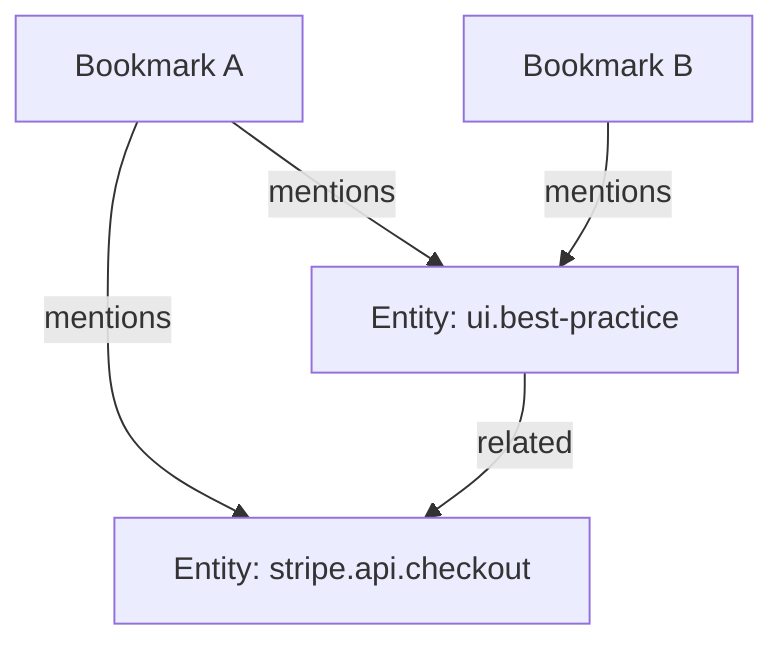

# Knowledge Graph

The knowledge graph integrates knowledge objects, entities, and their semantic relationships
into a structured system supporting retrieval, navigation, inference, and automation.

## Two Graph Layers (ADR-063 + ADR-049)

The system maintains two distinct graph layers:

| Layer | Scope | Storage | Types |
|---|---|---|---|
| **Intra-object graph** | Within one KO | `objects.graph_json` (`ObjectGraph`) | section, tag, entity_mention, decision, task, summary, code_block |
| **Inter-object graph** | Across KOs + entities | `edges` table | mentions, related, derives_from, alias_of, parent_of |

Intra-object edges live entirely in `graph_json` and reference node IDs of the form
`<objectID>/<nodeType>/<ordinal>`. Inter-object edges go to the `edges` table and may
target object IDs or stable node IDs for sub-object precision.

## Overview

The inter-object graph models:
- Nodes: knowledge objects and entities
- Edges: explicit or inferred cross-object relationships
- Backlinks: reverse edges enabling discovery of all references to a concept

Its goal is to provide a durable, canonical representation of how information connects across
the system.

## Node Types

### Knowledge Objects (inter-object graph)

Knowledge objects represent captured items. Each KO contains an `ObjectGraph` with typed
intra-object nodes (sections, tags, decisions, etc.). A KO participates in the inter-object
graph when it includes at least one mention resolving to an entity.

### Entities

Entities are canonical concepts provided by registries or defined locally.

They serve as stable identifiers, allowing:
- cross-bookmark connection
- unambiguous reference
- semantic navigation across the dataset

## Edges

Edges describe relationships between nodes. They are typed and directional.

### Bookmark → Entity

When a bookmark contains a mention such as `@ui.best-practice`, an edge is formed:

```
bookmark[id] → entity[ui.best-practice]
```

### Entity → Entity

Entities may reference each other through:
- hierarchy
- aliases
- conceptual relationships

External registries may provide structured links.

### Backlinks

Backlinks are reverse edges allowing quick lookup of all bookmarks referencing a specific entity.

```
entity[slug] → [bookmark_id, bookmark_id, ...]
```

## Graph Structure Diagram



## Purpose of the Graph

### Semantic Retrieval

Querying by mentions, entity hierarchy, or related concepts becomes possible.
Examples:
- `mention:stripe.api.*`
- bookmarks connected to a deprecated entity
- cross-entity exploration

### Inference

The graph can support:
- clustering of related bookmarks
- suggestion of new entities
- entity promotion based on repeated hints
- detection of emerging themes

### Navigation

The graph powers:
- backlink navigation
- entity summaries
- concept-based exploration

## Graph Consistency

### Identity Stability

Entities must maintain stable IDs across:
- registry updates
- merges
- version upgrades

### Namespace Isolation

Conflicts are prevented by using structured namespaces such as:
- `ui.*`
- `stripe.api.*`
- `internal.product.*`

### Versioning

Entities may evolve over time.

Rules include:
- maintain backward compatibility when possible
- expose deprecation status
- track alias history

## Integrating Mentions

Mentions anchor bookmarks to entities and form the core connective tissue of the graph.

Rules:
- mentions never auto-generate tags
- mentions do not influence classification
- unresolved mentions create local entities

## Representing Relationships

### Strong vs Soft Connections

- **Strong**: explicitly defined (mention, alias, parent-child).
- **Soft**: model-inferred from content similarity or frequent co-occurrence.

### Typed Edges

Edges are described with a type field, such as:
- `mention`
- `alias_of`
- `parent_of`
- `related_to`
- `inferred_cluster`

## Storage Model

### On-Disk Structure

Lightweight storage includes:
- entity index
- backlinks table
- edge list

### Example Backlink Entry

```
{
  "entity": "ui.best-practice",
  "bookmarks": ["bk123", "bk914", "bk002"]
}
```

## Graph Usage by Agents

Agents may:
- pull all bookmarks referencing a concept
- build entity summaries
- construct embeddings per entity
- use graph neighborhoods for context expansion

### Example Workflow

1. User queries `@stripe.api.checkout`.
2. System fetches the entity definition and backlinks.
3. Related entities form secondary context.
4. Agents assemble a coherent summary or perform an action.

## Future Extensions

**Entity-level embeddings**
Representing entities via aggregate embeddings of linked bookmarks.

**Multi-registry merging**
Combining entity definitions from separate providers with conflict resolution.

**Temporal graph**
Tracking how relationships evolve over time.

**Graph-based recommendations**
Suggesting tags, hints, or potential entities based on structural patterns.