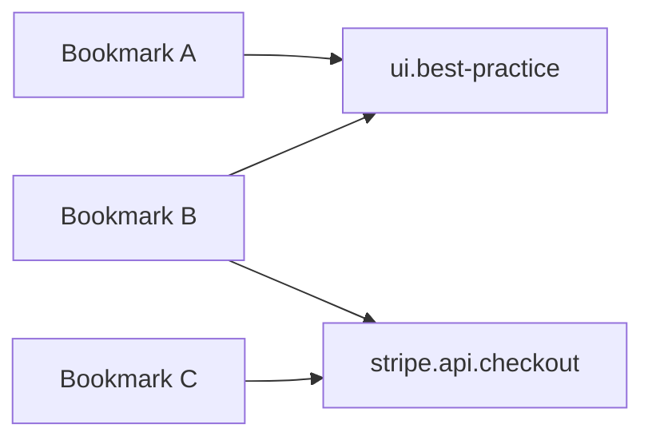

# Mentions

Mentions provide an explicit, canonical mechanism for referencing concepts, entities, APIs, components, patterns, and other named units of knowledge within the system. They are identity-level references, distinct from tags and hints, and form the backbone of semantic linking, entity resolution, plugin interoperability, and graph-based navigation.

---

## What Mentions Are

Mentions are **explicit identity references** using the `@` prefix.

Examples:

- `@ui.best-practice`
- `@stripe.api.checkout`
- `@ux.signup-flow`

A mention always refers to a **canonical entity**, which may be:

- a **known registry entity**, or
- a **local entity** (created implicitly if no registry defines it yet)

Mentions maintain **stable, scope-independent identity** used across bookmarks, pipelines, plugins, agents, and the knowledge graph.

---

## Syntax

- Must begin with `@`.
- Allowed characters:
  - `a–z` (lowercase)
  - `0–9`
  - `.`, `_`, `-`
- Namespaced using dot notation:
  - `@domain.subdomain.entity`
- Mention ends on any invalid character or whitespace.

Examples:

- Valid: `@ui.forms.input-validation`
- Valid: `@stripe.api.checkout.v2`
- Invalid: `@UI/BestPractice` (uppercase + slash)

Plugins and pipelines must treat mentions as **literal slugs** without normalization beyond lowercasing and trimming.

---

## Parsing Rules

The mention extraction step operates consistently across all pipelines and plugin-defined ingestion flows.

Rules:

- Scan text for `@`.
- Capture until first invalid character.
- Normalize to lowercase.
- Validate slug against allowed characters.
- Produce a structured mention list for the bookmark or item.

Plugins may register additional extraction steps, but they must not alter base mention semantics.

---

## Storage Semantics

Mentions are stored on the bookmark as a typed URI list under the `mention_uris` field:

```json
"mention_uris": [
  "ctxt://entity/ui/best-practice",
  "ctxt://entity/stripe/api.checkout"
]
```

The URI format is `ctxt://entity/<namespace>/<slug>`, derived from the `@namespace.slug` input form by splitting on the first `.` and converting to a `ctxt://` URI.

Guarantees:

- No duplicates
- Order not guaranteed
- Unresolved entities remain stored literally
- Resolution is performed lazily, not during extraction
- Plugins may add new mentions, but cannot mutate canonical ones

> **API ingestion:** The `POST /analyze` and `POST /inbox` endpoints accept the legacy `mentions` field as `[]string` of `@namespace.slug` strings for backward compatibility. The pipeline converts them to `mention_uris` URIs internally.

A lightweight **entity → bookmarks** reverse index (backlinks) supports graph queries and plugin lookups.

---

## Difference From Tags and Hints

### Tags
- Emergent AI-driven classification.
- Weighted, contextual, cluster-friendly.
- Not identity references.

### Hints
- User-supplied behavioral signals (e.g., `#ui`, `#bad`).
- Influence extraction, weighting, or pipeline heuristics.
- Not canonical and not durable.

### Mentions
- **Explicit identity anchors.**
- Canonical, durable, resolvable.
- Drive graph structure and entity lookup.
- Primary vehicle for semantic precision.

Plugins may consume tags and hints, but may **not** transform them into mentions automatically.

---

## Entity Resolution via Registries

Mentions resolve through the **entity registry** subsystem.

Resolution steps:

1. If a local entity exists → use it.
2. Else query remote registries.
3. If unresolved → create/keep a local unresolved entity with the same slug.
4. Apply alias normalization if provided by registry metadata.

Entity definition example:

```json
{
  "entities": {
    "ui.best-practice": {
      "title": "UI Best Practice",
      "aliases": ["ux.best-practice"],
      "translations": { "fr": "Bonnes pratiques UI" }
    }
  }
}
```

Plugins may read entity metadata to enhance behavior but cannot modify canonical entities without user consent.

---

## Backlinks and Graph Semantics

Each mention creates a graph edge:

**bookmark → entity**

A reverse index maintains:

**entity → bookmarks[]**

Graph excerpt (Mermaid):



Plugins and agents rely on this graph for:

- entity pages
- cross-reference navigation
- semantic clustering
- domain-scoped retrieval
- entity-driven workflows (RSS, Price Monitor, etc.)

---

## Plugin Integration Rules

Plugins may:

- add mentions during ingestion or post-processing
- read mentions for analytics, price-monitoring, feed discovery, etc.
- define new bookmark types that include mentions
- produce notifications based on mention-linked entities

Plugins may **not**:

- reinterpret or rewrite mentions
- override entity resolution
- merge or alias entities automatically
- modify the canonical mention list without explicit user intent

These rules preserve semantic stability across the ecosystem.

---

## Suggested UI / CLI Behavior

### Recognition
Autocompletion and entity suggestions when typing `@`.

### Display
Mentions should be visually distinct (badge, highlight, etc.).

### CLI Support
- `--mention @slug`
- `--mentions-only`
- `--include-backlinks`

### API Support
- `GET /entities`
- `GET /entities/{slug}`
- `GET /entities/{slug}/related`

Plugins may extend these with additional entity-related endpoints if scoped inside plugin namespaces.

---

## Reserved Characters

- `@` for mention prefix
- `/` disallowed
- `:` reserved for query language
- space terminates mention

Plugins must respect these invariants.

---

## Problems to Avoid

- Converting hints/tags into mentions implicitly
- Using mentions as classification labels
- Allowing uppercase characters or inconsistent casing
- Silently resolving ambiguous entities without user awareness
- Letting mentions influence tagging behavior

Plugins must adhere to mention semantics and avoid reinterpreting them.

---

## Integration With Localization (L10N)

Mentions remain canonical across languages.

Localization applies only to:

- entity title
- description
- UI rendering
- plugin hints or messages

Mentions themselves never change.

---

## Promotion Workflow: Converting Hints Into Entities

When hint frequency suggests the presence of an overlooked entity:

1. Detect frequent hint patterns.
2. Recommend promotion to canonical entity.
3. On user approval:
   - Create a local entity.
   - User may begin using `@new-entity`.

Plugins may participate by:

- recommending promotions
- assisting with generating entity metadata
- surfacing notifications via a notification plugin

But they cannot unilaterally create entities.

---

## Putting It All Together

Mentions provide ContextHelp with:

- precise semantic identity
- stable reference points for plugins and agents
- grounding for the knowledge graph
- multi-registry interoperability
- durable user-defined entities

They enable plugins like RSS Feed, Price Monitor, or Notification Plugin to interact with content safely and predictably, without altering core semantics.

Mentions are the **semantic backbone** of the system: stable, explicit, resolvable, and foundational for the entire contextual ecosystem.