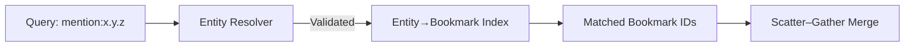
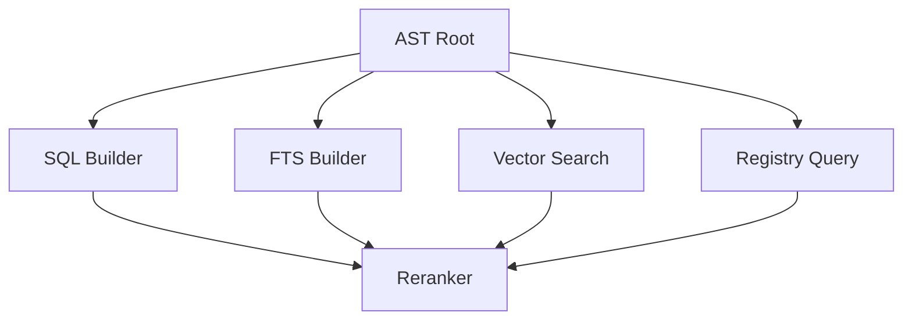

# Query Language Specification

The ContextHelp Query Language enables structured, expressive filtering across bookmarks, pipelines, tags, mentions, entities, languages, registries, and metadata. It is designed for both human authors and AI agents, supporting Boolean logic, field-specific operators, parentheses, and extensible semantic operators. This document defines the grammar, semantics, and execution model for the query language used by the CLI, REST API, and gRPC API.

## Overview

The query language provides:

- Boolean logic (`AND`, `OR`, `NOT`)
- Parentheses for grouping
- Field filters (e.g., `tag:ui`, `mention:ui.best-practice`, `type:url`)
- Comparison operators (`>`, `<`, `>=`, `<=`, `=`, `!=`)
- String matching (`"exact phrase"`, prefix*, wildcard?)
- Date comparisons
- Language filtering (`lang:en`)
- Registry scoping (`registry:uxpatterns`)
- Tag/alias matching
- Mention/entity filtering
- Pipeline filtering (`pipeline:text.short`)
- Semantic query operators (future: `similar:"..."`)

Queries evaluate to a filtered, ranked set of bookmarks returned by the search engine.

## Motivation

ContextHelp supports complex retrieval scenarios across:

- Local bookmarks
- Remote/decentralized registries
- Canonical entity references (mentions)
- Agent-driven structured querying

A dedicated query language with AST parsing ensures correctness, determinism, and composability. This becomes more critical with the introduction of **mentions**, which provide identity-based filtering independent from tagging.

## Grammar (Informal)

```
QUERY        := EXPR
EXPR         := TERM ( (AND | OR) TERM )*
TERM         := NOT? FACTOR
FACTOR       := PRIMARY | "(" EXPR ")"
PRIMARY      := FIELD_FILTER | STRING | IDENT

FIELD_FILTER := FIELD ":" VALUE | FIELD OP VALUE
FIELD        := "tag" | "mention" | "entity" | "type" | "lang"
               | "pipeline" | "registry" | "created" | "modified"
               | "source" | IDENT

VALUE        := STRING | IDENT | NUMBER | DATE

OP           := "=" | "!=" | "<" | "<=" | ">" | ">="

STRING       := QUOTED_STRING | BAREWORD
IDENT        := [a-zA-Z0-9._-]+

DATE         := ISO8601 timestamp or date
```

Examples:

- `mention:ui.best-practice`
- `mention:stripe.api.*`
- `NOT mention:deprecated.pattern`
- `tag:ui AND type:image`
- `(tag:signup OR mention:flows.signup) AND created > 2024-01-01`

## Mention and Entity Filters

Mentions are canonical identity references. Query language adds:

- `mention:<slug>` filters bookmarks that reference the given entity
- `mention:<namespace>.*` enables hierarchical filtering
- `entity:` is an alias for `mention:`

Examples:

- `mention:ui.best-practice`
- `mention:stripe.api.checkout`
- `mention:framework.react.*`

### How Mention Filtering Works

Filtering utilizes the entity index:

```
(entity_slug) → [bookmark_ids]
```

Bookmarks referencing a given mention are retrieved before final ranking.

### Mermaid Diagram: Mention Resolution



## Operators

### Boolean

- `AND`
- `OR`
- `NOT`

Precedence:

1. `NOT`
2. `AND`
3. `OR`

### Comparison

Supports all standard comparison operators.

### Field Matching

Reserved fields:

- `tag`
- `mention`
- `type`
- `lang`
- `pipeline`
- `registry`
- `created`
- `modified`
- `source`

Plugins may introduce custom fields.

### String Matching

Supports:

- Exact phrases: `"signup flow"`
- Prefix matching: `foo*`
- Wildcards: `error.?4`

Internal implementation uses SQL `LIKE` when possible.

## Date Filtering

Supported formats:

- `2024-01-01`
- `2025-02-15T12:30:00Z`

Examples:

- `created > 2024-01-01`
- `modified <= 2025-12-31T23:59:59Z`

## AST Structure

Example query:

```
tag:ui AND (type:image OR mention:ui.best-practice)
```

AST:

```
AND
 ├── FIELD_FILTER(tag:ui)
 └── OR
      ├── FIELD_FILTER(type:image)
      └── FIELD_FILTER(mention:ui.best-practice)
```

### Mermaid Diagram: AST Walk



## Execution Model

Execution phases:

1. **Parse → AST**
2. **Compile → Query Plan**
3. **Parallel Retrieval**
   - Local metadata SQL
   - Local FTS
   - Mention/entity index lookup
   - Semantic search (optional)
   - Registry fan-out queries
4. **Merge & deduplicate**
5. **Rerank**
6. **Return results**

## Reserved Fields

Stable system-defined fields:

- `tag`
- `mention`
- `entity` (alias)
- `type`
- `lang`
- `pipeline`
- `registry`
- `source`
- `created`
- `modified`

Plugins may add new fields such as:

- `sentiment`
- `rating`
- `i18n`

## Error Handling

The parser reports:

- Unexpected token
- Unterminated string
- Invalid operator
- Invalid date/time
- Unknown field (warning, not error)
- Unbalanced parentheses

REST/gRPC provide structured responses.

## Examples

### Mention-Based Queries

- `mention:ui.best-practice`
- `mention:stripe.api.*`
- `NOT mention:deprecated.pattern`
- `mention:design.* AND type:image`

### Mixed-Mode Queries

```
(tag:ux OR mention:ux.signup-flow)
AND created > 2024-09-01
AND (lang:en OR lang:fr)
```

### Registry-Specific Queries

- `registry:uxpatterns AND mention:hero.antipattern`
- `registry:stripe AND tag:api`

### Date and Metadata

- `pipeline:text.short AND created > 2025-01-01`
- `type:url AND NOT tag:spam`

## Future Extensions

- `similar:"..."` → embedding-based similarity search
- `related:<bookmark_id>` → graph-based neighborhood search
- `entityrelated:<entity_slug>` → entity graph traversal
- custom operators defined by registries
- weighted neural boolean logic

## Summary

The Query Language now fully integrates mentions and entity filtering as first-class identity references. It remains:

- deterministic
- AST-based
- extensible
- registry-aware
- agent-friendly

Mentions provide a powerful new semantic dimension by enabling identity-based filtering that complements tags and supports the global entity graph.