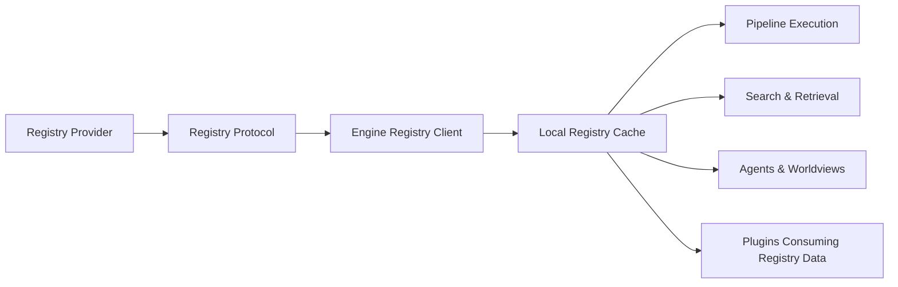
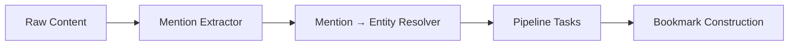

# Registries

Registries are a core architectural pillar in ContextHelp.
They allow users, teams, communities, and commercial providers to publish **structured semantic knowledge**—including taxonomies, entities, bookmarks, weights, translations, signals, and plugin-defined metadata—through a stable, decentralized interface.

Registries operate independently of the engine.
They do **not** need to run ContextHelp; they only need to expose data that conforms to the **Registry Protocol Specification**.

Registries are decentralized, composable, pluggable, and now support **Entities & Mentions** as a first-class semantic layer and **plugin-visible semantic extensions** without requiring changes to core.

---

## Overview

A **registry** is any service, file, or endpoint that exposes structured knowledge through a predictable interface.
Registries are **read-only** from the engine’s perspective—they provide data but never receive data.

Registries now expose four major semantic layers:

- **Tags** (classification vocabulary)
- **Entities** (canonical concepts referenced by Mentions)
- **Bookmarks** (curated datasets)
- **Weights** (ranking and shaping influence)

Optional layers include:

- translations
- aliasing rules
- plugin-defined semantic extensions

Plugins may consume these layers but do not modify registry behavior or schema.

---

## Registry Types

### Taxonomy Registries

Provide structured tag definitions:

- tag labels
- hierarchical relationships
- synonyms and alias rules
- polarity metadata
- classification vocabularies
- translations

These support pipelines, retrieval, ranking, and agent reasoning.

### Entity Registries (New)

Provide **canonical concepts** used by Mentions.

Entities include:

- stable IDs (e.g., `ui.best-practice`)
- titles and descriptions
- aliases
- translations
- metadata
- plugin-defined extensions (optional)

Entities form a semantic graph via backlinks and relationships.
Plugins may read these entities for their own tasks but cannot modify them.

### Bookmark Registries

Provide externally stored bookmark collections:

- curated examples
- design galleries
- research corpora
- enterprise knowledge libraries

Bookmarks retrieved from registries:

- do not pollute local storage
- appear in retrieval results
- integrate with local tags, entities, and mentions
- remain immutable unless overridden locally

### Weights Registries

Provide scoring heuristics:

- tag weight overrides
- domain-specific rank shaping
- custom weighting functions
- entity-level weight adjustments

Weights influence classification, retrieval ranking, and agent reasoning.

### Translation Registries

Provide translations for:

- tag labels
- entity titles & descriptions
- bookmark metadata
- plugin-defined extensions (optional)

They integrate with the I18N/L10N layer.

---

## Registry Architecture



Registries are pluggable and interchangeable.
Plugins can consume exposed registry data safely without modifying core or registry definitions.

---

## Guiding Principles

- **Decentralized** — Anyone can publish a registry.
- **Local-first** — Engine caches registry data automatically.
- **Composable** — Multiple registries can coexist harmoniously.
- **Versioned** — Content and schema are explicitly versioned.
- **Deterministic** — Merging and lookup produce deterministic results.
- **Extensible** — Plugins can consume registry layers without core changes.
- **Optional** — ContextHelp runs without any external registry.
- **Protocol-driven** — Guarantees compatibility across providers.

---

## Registry Providers

Registries may be:

- static JSON/YAML files
- Git repositories
- authenticated HTTP endpoints
- commercial SaaS APIs
- local files
- distributed storage (future)

As long as they conform to the Registry Protocol, the engine can subscribe.

For deploying separate org / team / personal registry tiers, see [tiered-deployment.md](tiered-deployment.md).

---

## Entities & Mentions in Registries (New)

Registries expose an **entities** section:

```json
{
  "entities": {
    "ui.best-practice": {
      "title": "UI Best Practice",
      "aliases": ["ux.best-practice"],
      "description": "Canonical UX/UI principle",
      "translations": { "fr": "Bonne pratique UI" },
      "metadata": { "domain": "design" }
    }
  }
}
```

### Purpose

- Provide stable identity for **mentions** (`@ui.best-practice`)
- Allow pipelines to resolve references to canonical concepts
- Bootstrap semantic graphs for retrieval & reasoning
- Enable plugin-driven workflows (validation, metadata lookups)

### Behavior

- Entities may come from multiple registries
- Namespaces determine conflict boundaries
- Aliases are resolved deterministically
- Conflict resolution uses:
  - registry priority
  - entity namespace
  - user overrides

A merged semantic graph is built locally from registry and local entities.

---

## How Registries Integrate with ContextHelp

### Pipelines

During ingestion, pipelines may:

- validate & normalize tags
- resolve mentions → entities
- fetch entity metadata
- apply tag or entity weights
- align content with registry semantics
- support translations
- allow plugins to interpret registry data (e.g., price patterns, feed metadata)

Two new components handle mention/entity semantics:



### Retrieval

Retrieval now spans:

- local bookmarks
- remote bookmark registries
- entity-based graph lookup
- taxonomy-aware expansions
- plugin-enhanced filters (RSS filters, price-tracking filters, etc.)

Reranking incorporates:

- tag weights
- entity relationships
- registry priorities
- agent preferences
- plugin-supplied scoring (optional, isolated in plugin space)

### Agents

Agents define which registries they subscribe to:

```yaml
agents:
  ux_critic:
    taxonomies:
      - global-default
      - registry:uxpatterns/taxonomy
    entities:
      - registry:uxpatterns/entities
    bookmarks:
      - local
      - registry:uxpatterns/examples
    translations:
      - registry:uxpatterns/i18n
```

Agents operate within a **scoped worldview** defined by local and registry sources.

Plugins may read agent registry configurations but cannot override them.

---

## Registry Sources

### Local File Registry

```yaml
registries:
  taxonomy:
    - name: local-ux
      type: file
      path: ./taxonomies/ux.json
```

### HTTP Registry

```yaml
registries:
  entities:
    - name: uxpatterns
      type: http
      url: https://registry.uxpatterns.io/entities
      auth:
        token: ENV.UXPATTERNS_TOKEN
```

Supports caching, throttling, authentication, versioning.

### Git Registry

Cloned locally, then consumed as a file registry.

### Commercial Registry

Premium endpoints with curated taxonomies, entities, or corpora.

---

## Versioning & Caching

Registries declare:

- schema version
- content version
- entity graph version
- ETag / Last-Modified
- checksum

Engine updates only when content changes.
Local cache enables full offline capability.

Plugins read cached registry data through stable APIs—never directly.

---

## Merging Multiple Registries

### Tag Merging

- deterministic unification
- alias resolution
- conflict resolution via priority
- translation merging

### Entity Merging (New)

Entities merge using:

- namespace precedence
- alias graph flattening
- deterministic tie-breaking rules

If conflicts remain unresolved:

- highest-priority registry wins
- user-defined overrides always take precedence

### Bookmark Merging

- retrieval-time merging
- deterministic deduplication
- stable IDs used for reconciliation

### Weight Merging

- explicit overrides
- per-registry defaults
- fallback strategies

### Translation Merging

- entity translations
- tag translations
- bookmark summary translations
- plugin-defined extensions (read-only)

---

## Authentication

Registries may require:

- static tokens
- Bearer tokens
- header-based keys
- Basic auth
- OAuth2 (future)

Credentials remain local and are never shared.

---

## Registry Failure Behavior

If a registry fails:

- cached data remains active
- ingestion continues gracefully
- retrieval does not break
- merges degrade safely
- plugins depending on registry data fallback to defaults

---

## Registry Discovery (Roadmap)

Future enhancements include:

- decentralized registry directories
- DID/IPFS-based registry hosting
- signed and verified manifests
- registry introspection APIs

---

## Plugin Consumption of Registry Data (New)

Plugins may **read** registry data using the stable plugin API:

- taxonomies
- entities
- translations
- bookmark metadata
- weights

Plugins **cannot**:

- modify registry data
- override registry structure
- alter merge order

Example plugin uses:

- RSS Plugin: entity enrichment for authors/tags
- Price Monitor: vendor-specific patterns stored in a registry
- Notification Plugin: translation of alert messages

This allows rich ecosystem growth without modifying core or registry definitions.

---

## Summary

Registries now provide ContextHelp with:

- extensible taxonomies
- canonical entities resolving mentions
- curated bookmarks
- weight models and translations
- mergeable, decentralized semantic sources
- plugin-consumable semantic extensions
- agent-scoped worldview configuration

The registry system is fully compatible with the new plugin architecture.
Plugins can read and leverage registry semantics without ever modifying core, ensuring a stable and extensible foundation for the evolving ContextHelp ecosystem.