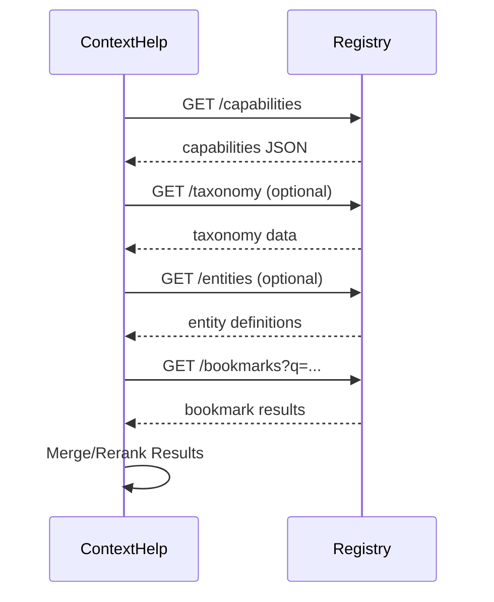
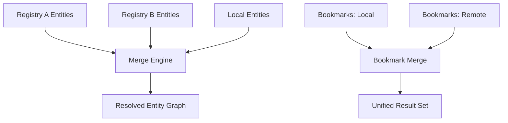

# Registry Protocol Specification

The **ContextHelp Registry Protocol** defines how independent external services (“registries”) expose structured knowledge, taxonomies, weights, **entities**, mentions-related metadata, and optionally bookmark-like resources to ContextHelp instances.

Registries:

- Do **not** need to run ContextHelp.
- May be public, private, commercial, paid, or offline/local.
- May be standalone, distributed, federated, or peer-to-peer nodes.
- Must simply conform to this protocol.

ContextHelp queries multiple registries in parallel and may optionally mirror registry content locally. Registries now support **entities** as first-class semantic units used for canonical mentions (`@entity.slug`).

---

## Capabilities

A registry can support one or more capability types:

- **Taxonomy Registry**
- **Entity Registry** (NEW)
- **Bookmark Registry**
- **Weights Registry**
- **Sync Registry (Optional)**

Each registry declares its supported capabilities via `/capabilities`.

---

## Capability Discovery

### `GET /capabilities`

Registries MUST expose a capabilities document:

```json
{
  "name": "uxpatterns",
  "version": "2025-01-12",
  "capabilities": {
    "taxonomy": true,
    "entities": true,
    "bookmarks": true,
    "weights": true,
    "sync": {
      "enabled": true,
      "mode": "delta",
      "interval": "daily"
    }
  }
}
```

### Fields

- `taxonomy`: supports `/taxonomy`
- `entities`: supports `/entities` (NEW)
- `bookmarks`: supports `/bookmarks`
- `weights`: supports `/weights`
- `sync.enabled`: registry allows local synchronization
- `sync.mode`: `"full" | "delta" | "schema-only"`
- `sync.interval`: sync hint or cron-like string

---

## Registry Types

### Taxonomy Registry

Supplies:

- canonical tag labels
- aliases
- structural grouping
- tag polarity
- optional translations

### `GET /taxonomy`

```json
{
  "version": "2025-01-12",
  "tags": [
    {
      "label": "ui.hero.antipattern",
      "aliases": ["bad-hero"],
      "polarity": "negative",
      "description": "A flawed hero section pattern.",
      "group": "ui.hero",
      "translations": {
        "fr": "anti-modèle de héros UI"
      }
    }
  ]
}
```

---

## Entity Registry (NEW)

Entities define **canonical concepts** used by Mentions (`@`).

Entities are:

- stable
- versionable
- translatable
- aliasable
- referenceable across bookmarks

### `GET /entities`

Returns all entities or a subset via parameters:

```json
{
  "version": "2025-01-12",
  "entities": [
    {
      "id": "ui.best-practice",
      "title": "UI Best Practice",
      "description": "High-quality UI design guidelines.",
      "aliases": ["ux.best-practice"],
      "translations": {
        "fr": "Bonnes pratiques UI"
      },
      "metadata": {}
    }
  ]
}
```

### `GET /entities/{id}`

Returns full metadata for a specific entity.

### `GET /entities/{id}/related`

Returns backlinks or related entities (optional):

```json
{
  "id": "ui.best-practice",
  "related": ["ux.accessibility", "ux.signup-flow"]
}
```

---

## Bookmark Registry

Registries may expose federated knowledge items (never user-private data).

### `GET /bookmarks`

### Query Parameters

- `q`: optional RSQL-like query
- `tag`: comma-separated tag filters
- `mention`: comma-separated entity slugs (NEW)
- `limit`, `offset`
- `lang`

### Response

```json
{
  "source": "uxpatterns.io",
  "items": [
    {
      "id": "uxp-001",
      "type": "image",
      "subtype": "image.landing",
      "title": "Weak Hero Example",
      "summary": "Low contrast, unclear CTA.",
      "tags": ["ui.hero.antipattern"],
      "mentions": ["ui.best-practice"],
      "url": "https://uxpatterns.io/examples/hero-weak",
      "metadata": {},
      "language": "en"
    }
  ]
}
```

Bookmarks now support `mentions[]` referencing registry entities.

---

## Weights Registry

Provides ranking and scoring weights.

### `GET /weights`

```json
{
  "tagWeights": {
    "ui.hero.antipattern": 1.2
  },
  "entityWeights": {
    "ui.best-practice": 1.3
  },
  "hintWeights": {
    "#bad": 1.1
  },
  "pipelineWeights": {
    "image.landing": 1.3
  }
}
```

---

## Sync Registry

Sync is optional and applies to taxonomy, entities, bookmarks, or any combination.

### Sync Modes

- `"none"`
- `"schema-only"`
- `"full"`
- `"delta"`

### Snapshot Sync

`GET /sync/snapshot`

### Delta Sync

`GET /sync/changes?since=<version>`

```json
{
  "version": "2025-01-14",
  "added": [],
  "updated": [],
  "removed": []
}
```

---

## Retrieval Model

Retrieval merges multiple registry sources with local data.

### Retrieval Sequence

1. local bookmarks
2. remote registries
3. optional synced registry snapshots
4. merge, deduplicate
5. rerank

### Mentions in Retrieval

Mention-based filtering hits **entity graphs**, not tags.

---

## Mermaid Diagram: Registry Interaction Flow



---

## HTTP Requirements

- JSON only
- Must support at least HTTP 200/304/400/401/429/500
- Required headers:
  - `Content-Type: application/json`
  - `ETag`
  - `Last-Modified`
  - `X-Registry-Version`
  - optional rate-limit headers

---

## Authentication

Supports:

- API key header
- Bearer token
- Basic auth
- JWT
- Signed URL parameters

Example:

```yaml
registries:
  - name: uxpatterns
    url: https://api.uxpatterns.io
    capabilities: ["taxonomy","entities","bookmarks"]
    auth:
      header: "X-API-Key"
      token: "${UXP_API_KEY}"
```

---

## Versioning

Registries must implement deterministic versioning:

- explicit `version` field
- or stable ETag
- or semantic versioning
- or timestamp versioning

Used for:

- caching
- delta sync
- compatibility checks

---

## Schema Requirements

### Taxonomy Entries

Required:

- `label`
- optionally: `aliases`, `translations`, `polarity`, `description`, `group`

### Entity Entries (NEW)

Required:

- `id`
- `title`
- `description` (optional)
- `aliases` (optional)
- `translations` (optional)
- `metadata` (optional)

### Bookmark Items

Required:

- `id`
- `type`
- `title`
- `tags`
- `summary`
- `mentions` (optional)
- `url` or canonical identifier

Forbidden:

- any user-private data

---

## Merging Semantics

### Taxonomies

Merged by canonical label:

- aliases merged
- translations merged
- precedence determines conflict resolution

### Entities

Merged by entity ID:

- aliases aggregated
- translation maps merged
- metadata resolved by precedence

### Bookmarks

Merged by canonical identifiers:

- dedup by registry ID, URLs, or normalized keys

### Weights

Layered precedence:

```yaml
registryOrder:
  taxonomy: ["local","company","public"]
  entities: ["local","company","public"]
  weights: ["team","public"]
  bookmarks: ["local","team","public"]
```

---

## Mermaid Diagram: Entity + Bookmark Merge



---

## Rate Limits

Registries may enforce limits.

ContextHelp should implement:

- exponential backoff
- stale-while-revalidate
- cached fallbacks
- retry-after semantics

---

## Error Handling

Errors must be structured JSON:

```json
{
  "error": "Unauthorized",
  "message": "Missing or invalid credentials.",
  "code": 401
}
```

---

## Security Considerations

Registries must:

- sanitize metadata
- avoid active code
- avoid leaking private data

ContextHelp must:

- treat registries as untrusted
- validate schemas
- prevent malicious tag/entity injection

---

## Compliance Checklist

A registry is compliant if it:

- exposes `/capabilities`
- supports at least one of `/taxonomy`, `/entities`, `/bookmarks`, `/weights`
- uses JSON
- implements deterministic versioning
- adheres to schema rules
- returns proper HTTP status codes
- avoids private user data

---

## Future Extensions

Potential extensions:

- `/graph/entities`
- `/graph/relations`
- streaming updates (`/events`)
- signed manifests
- peer registry discovery
- trust networks
- embedding vectors endpoint
- registry licensing/policy metadata
- replayable change logs

---

# End of Specification