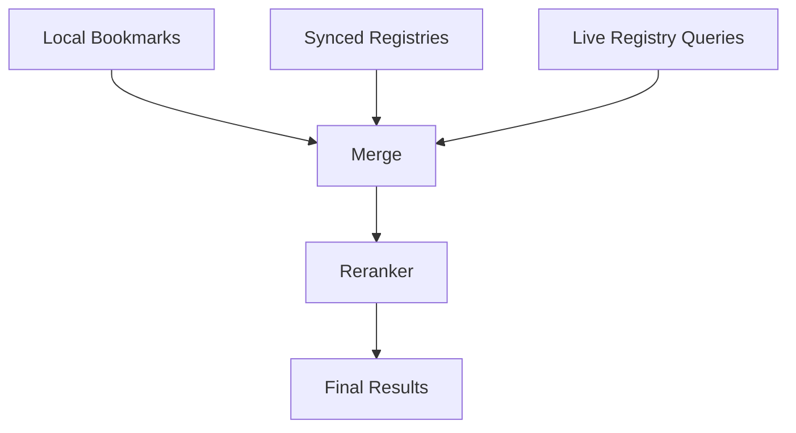

# Registry Syncing & Multi-Source Retrieval

This document formalizes how ContextHelp interacts with registries within a decentralized architecture, and introduces **Entities** (canonical concepts) and **Mentions** (`@concept`) into the registry retrieval and syncing model. It replaces the previous version of this document.

---

## Overview

ContextHelp uses a hybrid model for registry interaction:

- **Multi-Source Retrieval** — dynamic, on-demand, remote queries (default)
- **Registry Syncing** — optional local mirroring of registry content
- **Entity Resolution** — mapping mentions and entity slugs to canonical definitions
- **Graph Integration** — linking bookmarks to entities for enriched reasoning

Local bookmarks remain authoritative; registries extend and contextualize them.

---

## Registry Roles

Registries supply:

- taxonomy definitions
- tag descriptors and semantics
- **entity definitions** (canonical concepts)
- aliases and translations
- patterns, examples, embeddings
- metadata and plugin modules

Registries may be:

- public or private
- authenticated
- static or dynamic
- local or remote

They need only implement the Registry API, not run ContextHelp.

---

## Retrieval Models

ContextHelp supports two complementary models:

1. **Multi-Source Retrieval** – fresh, decentralized, lightweight
2. **Registry Syncing** – high-performance, offline-capable, analytics-ready

Both operate simultaneously without conflict.

---

## Multi-Source Retrieval

### How It Works

When a search or query executes:

1. Query is parsed into an AST.
2. Subqueries are dispatched to:
   - local bookmarks
   - synced registry content
   - live registries
3. Results return asynchronously.
4. Merge & rerank produce a unified answer set.

### Merits

- always up-to-date
- nearly zero storage cost
- ideal for dynamic registries
- compatible with commercial/licensed content
- avoids sync conflicts

### Limitations

- latency depends on network
- missing results if registry is down
- requires reranking normalization
- subject to remote search capabilities

---

## Registry Syncing

### How Syncing Works

Registries advertise capabilities:

```json
{
  "supportsSync": true,
  "syncModes": ["schema", "partial", "full", "delta"],
  "allowLocalCopy": true
}
```

ContextHelp uses this metadata to:

- determine available sync modes
- construct sync plans
- apply deltas or full updates
- store synced data into local tables

### Sync Modes

- **Schema-only** — taxonomy, tag definitions, entity schemas
- **Partial** — selected namespaces or categories
- **Full** — complete content
- **Delta-based** — minimal updates

### Benefits

- offline support
- extremely fast local search
- consistent ranking
- enables local embeddings, clustering, graph algorithms
- ideal for stable datasets

### Downsides

- disk growth
- requires conflict resolution
- may become stale without scheduled sync
- cannot sync content with redistribution restrictions

---

## Hybrid Retrieval Strategy

ContextHelp blends both approaches into a unified flow:

```
Local Search  →  Synced Registries  →  Remote Registries
       \               |                 /
        +--------- Merge & Rerank -------+
```

### Mermaid Diagram



### Why Hybrid?

- local results give speed and stability
- synchronized registries give rich semantics and offline utility
- remote registries give freshness and breadth

Users and agents experience them as one cohesive retrieval system.

---

## Entities & Mentions in Retrieval

Mentions (`@ui.best-practice`) reference **Entities**, which are canonical, stable concepts supplied by:

- registries
- local user-defined entity files
- plugins

### Entity Retrieval Path

1. Search request contains entity filters or mention operators.
2. The engine resolves entities by checking:
   - local entity store
   - synced registry entity definitions
   - remote registry entity endpoints
   - alias tables
3. Backlinks are gathered (bookmarks that mention this entity).
4. Search continues normally with entity-aware reranking.

### Mermaid Diagram

```mermaid
flowchart LR
    M[@mention] --> R[Entity Resolver]
    R --> L[Local Entities]
    R --> SR[Synced Registry Entities]
    R --> RR[Remote Registries]
    R --> G[Graph Index]
    G --> B[Bookmark Backlinks]
```

---

## Multi-Source Retrieval: Detailed Flow

### Steps

1. **Parse Query → AST**
2. **Generate Query Plan**
   - metadata filters
   - FTS
   - vector search
   - entity filters
   - mention filters
3. **Fan-Out Execution**
   - local store
   - synced registries
   - remote registries
4. **Gather Responses**
5. **Rerank + Deduplicate**

### Benefits for Entities

- mention queries (`mention:ui.best-practice`) expand through entity graphs
- entities unify cross-registry semantics
- alias resolution enables multi-registry harmonization

---

## Reranking Layer

Because each source uses different scoring mechanisms, the unified reranker normalizes ranking via:

- reciprocal rank fusion
- registry weight profiles
- recency scoring
- semantic relevance
- entity signal strength
- tag-entity interactions
- canonical duplication rules

### Deduplication

Normalization uses:

- canonical ID
- URL normalization
- semantic embeddings
- entity-cooccurrence patterns

---

## Syncing & Retrieval Interaction

Syncing **never disables** multi-source retrieval unless configured.

### Typical Combined Behavior

- lookup synced taxonomies → instant results
- augment with remote updates → fresh coverage
- merge everything → unified knowledge graph view

### User Controls

Users can enforce modes like:

- **local-only**
- **remote-only**
- **registry-specific search**
- **manual sync**

---

## Registry Metadata Schema

### Example

```json
{
  "name": "uxpatterns",
  "version": "1.3.0",
  "supportsQuery": true,
  "supportsSync": true,
  "supportsDelta": true,
  "syncModes": ["schema", "partial", "full"],
  "maxPageSize": 200,
  "rateLimits": { "requestsPerMinute": 60 },
  "allowLocalCopy": true,
  "provides": {
    "tags": true,
    "entities": true,
    "taxonomy": true,
    "embeddings": false
  }
}
```

Key additions:

- **provides.entities** → required for mention resolution
- **allowLocalCopy** → legal/safety constraint
- **provides.taxonomy** → tag + entity alignment

---

## Query Language Extensions

Registries must support queries involving entity/mention operators:

- `mention:ui.best-practice`
- `mention:stripe.api.*`
- `NOT mention:deprecated.flow`

Mentions may also appear directly in free-text filters.

---

## CLI Support

```
--registry <name>
--no-remote
--local-only
--sync
--sync-mode <schema|partial|full>
--mentions-only
```

---

## API Support

```
?registry=uxpatterns
?localOnly=true
?remoteOnly=true
?syncMode=schema
?entities=true
?mentions=true
```

---

## Security, Licensing, & Privacy

Registries specify redistribution and privacy constraints. If a registry declares:

```
"allowLocalCopy": false
```

then:

- syncing is disabled
- multi-source retrieval is used exclusively
- entity definitions remain remote-only

ContextHelp must enforce these constraints.

---

## When to Use Each Model

### Multi-Source Retrieval

Best for:

- fast-changing datasets
- minimizing local storage
- licensed/protected registries
- global public knowledge
- decentralized networks

### Registry Syncing

Best for:

- offline requirements
- agent loops performing many queries
- stable or massive registries
- local embeddings and clustering
- enterprise workflows
- knowledge mining and analytics

---

## Summary

ContextHelp’s registry system is built around:

### **Multi-Source Retrieval**
fresh, decentralized, low-storage, ideal for dynamic knowledge

### **Selective Sync**
fast, offline-capable, analytics-ready, ideal for stable large datasets

### **Entity & Mention Integration**
canonical identity, cross-registry reasoning, graph-powered retrieval

Together these form a flexible, powerful, decentralized knowledge ecosystem supporting:

- long-running agents
- distributed collaboration
- registry-driven semantics
- mention-aware reasoning
- extensible knowledge graphs

The hybrid model is central to ContextHelp’s architecture and future evolution.