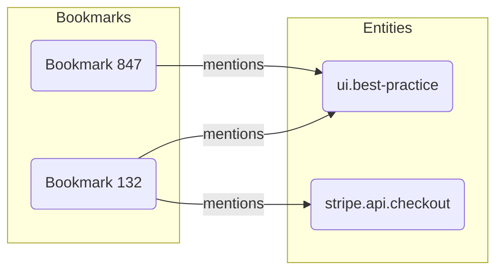

# Entity Schema Specification

This document defines the canonical structure, rules, and behaviors for **Entities** within the ContextHelp semantic layer. Entities serve as stable, referenceable concepts used by Mentions (@), enabling cross-document identity, backlinking, multilingual metadata, and registry-based resolution.

---

## Purpose

Entities represent uniquely identified concepts that remain stable across:
- user content
- registries
- pipelines
- versions of the system
They provide the foundation for **mentions**, semantic graph relationships, and concept-driven retrieval.

---

## Overview

An Entity is:
- **Canonical** — one stable ID per concept.
- **Referenceable** — used through `@entity.slug`.
- **Structured** — includes metadata, translations, aliases.
- **Versionable** — supports evolution without breaking references.
- **Registry-compatible** — may be sourced from local or remote registries.

---

## JSON Schema

```json
{
  "id": "ui.best-practice",
  "title": "UI Best Practice",
  "description": "Canonical concept for recurring UI guidelines, patterns, and standards.",
  "aliases": ["ux.best-practice"],
  "translations": {
    "fr": {
      "title": "Bonnes pratiques UI",
      "description": "Concept canonique pour les lignes directrices UI."
    },
    "es": {
      "title": "Buenas prácticas UI",
      "description": "Concepto canónico para pautas habituales de UI."
    }
  },
  "namespace": "contexthelp.ui",
  "version": "1.0.0",
  "source": "registry://contexthelp/ui",
  "metadata": {
    "created_at": "2025-01-01T00:00:00Z",
    "updated_at": "2025-02-01T00:00:00Z",
    "tags": ["design", "ui"],
    "contributors": ["contexthelp-team"]
  }
}
```

---

## Fields

### id

Unique canonical identifier used for mention resolution.

- Must be stable across versions.
- Case-insensitive.
- Recommended format: `namespace.slug` (e.g., `stripe.api.checkout`).

### title

Human-readable label.
Used in UI, CLI, registry exploration, and entity summaries.

### description

Short definition describing the concept's scope and meaning.

### aliases

Alternate identifiers that resolve to the same entity.

Examples:
- deprecations (`ui.bestpractice` → `ui.best-practice`)
- historical names
- user-friendly names

### translations

Localized labels and descriptions.

Supports:
- multilingual UI
- region-specific naming
- future L10N workflows

### namespace

Groups entities logically and prevents conflicts.

Examples:
- `contexthelp.ui`
- `stripe.api`
- `user.workspace`

### version

Semver-compliant string marking schema evolution.

Rules:
- Minor/patch version updates must not break identity.
- Major version indicates conceptual transformation.

### source

Indicates where the entity originates.

Examples:
- `registry://contexthelp/ui`
- `local://user/definitions`

### metadata

Flexible structured data for internal and external tools.

Typical fields:
- creation/update timestamps
- tags
- maintainers
- importance scores
- documentation links

---

## Identity Rules

- The `id` is **global and immutable**.
- Deleting an entity requires leaving a tombstone with metadata.
- Aliases must always resolve deterministically to the canonical `id`.

---

## Versioning Rules

Entities evolve without breaking references.

Allowed:
- Updating title, description, translations.
- Adding metadata fields.

Not allowed:
- Renaming `id` without preserving backwards-compatible aliases.
- Reassigning the same `id` to a different concept.

---

## Resolution Rules

Entity resolution follows:

```mermaid
flowchart TD
    A[@mention] --> B{Local Entity?}
    B -->|Yes| C[Resolve Local]
    B -->|No| D{Registry Entity?}
    D -->|Yes| E[Resolve Registry]
    D -->|No| F[Create Local Placeholder]
    C --> G[Return Entity]
    E --> G
    F --> G
```

Resolution sources in priority:
1. Local overrides
2. Local entity definitions
3. Remote registry
4. Placeholder (unresolved) entity

---

## Namespace Convention

Namespaces prevent collisions and improve conceptual grouping.

Recommended structure:
- Vendor-level: `stripe.api.*`
- Domain-level: `contexthelp.ui.*`
- User workspace: `user.<workspace>.*`

Rules:
- Must use dot-separated segments.
- Should avoid spaces or special characters.
- Should reflect conceptual hierarchy.

---

## Aliasing & Conflict Management

Entities with overlapping meaning may be linked via aliases.

Conflicts are resolved via:
- namespace priority
- registry precedence
- explicit overrides

Aliases should be:
- deterministic
- reversible (“which canonical ID does this alias lead to?”)

---

## Lifecycle

An entity may go through:

1. **Created** — local or registry-defined.
2. **Resolved** — referenced by mentions.
3. **Evolved** — version bump.
4. **Deprecated** — still referenceable, marked as deprecated.
5. **Tombstoned** — preserved to avoid breaking references.

---

## Backlink Semantics

Entities form graph edges when mentioned in bookmarks.



Backlink index supports:
- reverse lookups
- entity popularity scoring
- semantic graph analysis
(See: knowledge-graph.md)

---

## Reserved Characters

In entity IDs:
- Allowed: `[a-z0-9.-]`
- Not allowed: spaces, slashes, commas, emojis
- Meaningful punctuation: `. -`

---

## Integration With Mentions

Entities are referenced via:

```
@ui.best-practice
@stripe.api.checkout
```

Mentions resolve to entity IDs and never:
- auto-generate tags
- convert into hints
- impact classification

---

## Promotion Workflow

When a concept appears frequently as a hint or recurring cluster:
- The system may recommend promoting it to an Entity.
- Promotion creates a canonical ID + metadata.
- Existing hints can be linked automatically.

This workflow is optional but recommended.

---

## Summary

Entities define the backbone of semantic identity in ContextHelp:
- stable ids
- registry-compatible
- multilingual
- versioned
- structured
- canonical

Entities make mentions powerful, predictable, and scalable across the entire system.