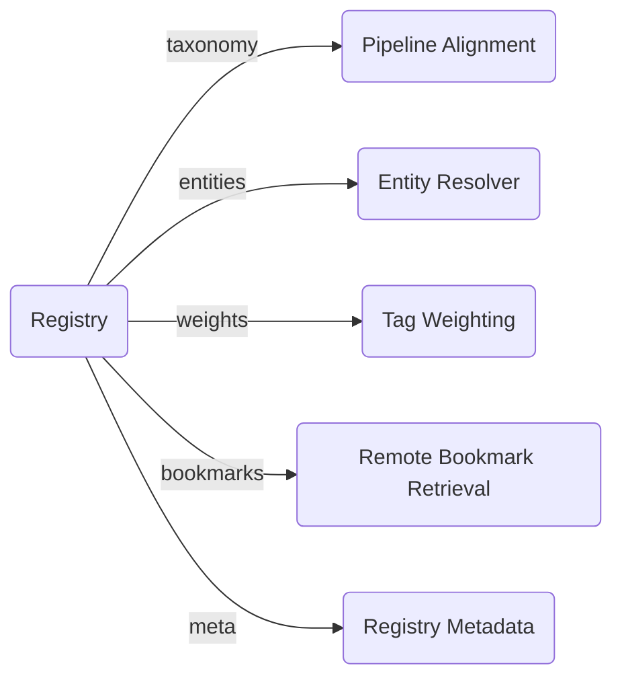
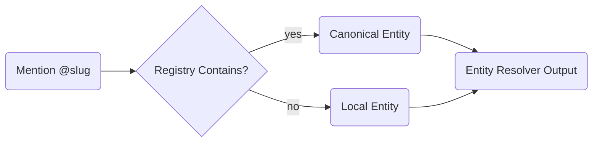

# Registry Schema (Revised with Entity Support)

A **Registry** is a decentralized provider of semantic knowledge used by ContextHelp to enrich, classify, validate, and relate bookmarks. Registries expose versioned, deterministic knowledge overlays that may include taxonomies, entities, weights, curated bookmarks, and metadata. Registries enable multi-source semantic reasoning without centralization.

Registries MAY expose any combination of:

- taxonomy
- entities
- weights
- bookmarks
- metadata

All components are optional.
Registries remain pure knowledge sources and never execute side-effecting operations.

## Overview

Registries MUST expose a root manifest as JSON or YAML:

```json
{
  "id": "uxpatterns",
  "name": "UX Patterns Library",
  "version": "1.3.0",
  "description": "A taxonomy, entity graph, and weighting system for UI/UX pattern analysis.",
  "components": {
    "taxonomy": "taxonomy.json",
    "entities": "entities.json",
    "weights": "weights.json",
    "bookmarks": "bookmarks.json",
    "meta": "meta.json"
  }
}
```

All paths in `components` MUST be addressable relative to the registry root.

Clients MUST treat registries as deterministic and immutable per version.

## Required Top-Level Fields

### `id`

A globally unique registry identifier.

- lowercase
- snake_case or dash-case recommended

Examples:
- `uxpatterns`
- `growth-heuristics`
- `research-papers`
- `myteam-taxonomy`

### `name`

Human-readable display name.

### `version`

Semantic version string (`MAJOR.MINOR.PATCH`).

Used for update detection, compatibility checks, and reproducibility.

### `description`

Short explanation of the registry’s purpose.

### `components`

Paths to registry component files.
Any component may be omitted if unsupported.

## Architectural Position of Registries

Registries interact with ContextHelp as knowledge overlays that influence semantic alignment and retrieval.



Registries do not override local-first behavior; they augment it.

---

## Taxonomy Component

The taxonomy defines canonical **labels** used for tag normalization, validation, and hierarchical reasoning.

File: `taxonomy.json`

### Schema

```json
{
  "version": "1.0.0",
  "labels": [
    {
      "id": "ui.hero.antipattern",
      "description": "Common issues with hero sections...",
      "polarity": "negative",
      "aliases": ["landing.hero.bad", "ui.hero.fail"],
      "parents": ["ui.hero"]
    }
  ],
  "rules": {
    "polarityPropagation": true,
    "allowUnmappedTags": false
  }
}
```

### Fields

- **version** — taxonomy version
- **labels** — canonical tag definitions
- **aliases** — deprecated or alternate tags
- **parents** — hierarchical taxonomic structure
- **polarity** — positive / negative / neutral
- **rules** — global validation/propagation rules

### Behavior

- Normalize hints → canonical tags
- Resolve aliases deterministically
- Enforce or infer polarity
- Validate missing or misaligned tags
- Provide clustering and semantic grouping hints

---

## Entity Component

Entities introduce canonical **concept identifiers** referenced by Mentions (`@something`) inside bookmarks.

File: `entities.json`

### Schema

```json
{
  "version": "1.0.0",
  "entities": {
    "ui.best-practice": {
      "title": "UI Best Practice",
      "description": "A canonical concept for UX/UI guidance.",
      "aliases": ["ux.best-practice"],
      "translations": {
        "fr": "Bonnes pratiques UI"
      },
      "metadata": {
        "category": "design"
      }
    },
    "stripe.api.checkout": {
      "title": "Stripe Checkout API",
      "description": "Reference entry for the Stripe Checkout flow.",
      "aliases": [],
      "translations": {},
      "metadata": {
        "provider": "Stripe"
      }
    }
  }
}
```

### Fields

- **entities** — map of concept slug → definition
- **aliases** — alternative identifiers that resolve to canonical ID
- **translations** — L10N-ready human-readable names
- **metadata** — arbitrary extension fields

### Resolution Rules

- Mentions `@slug` MUST resolve to canonical entity IDs if known
- Alias resolution MUST be deterministic
- Unknown entities remain local-only without breaking pipelines
- Entities MUST NOT influence tagging
- Entities MAY be used for semantic linking and backlink graphs

### Mermaid: Entity Resolution Flow



---

## Weights Component

Weights define quantitative heuristics that influence pipeline ranking, interpretation, or decision scoring.

File: `weights.json`

### Schema

```json
{
  "version": "1.2.1",
  "weights": {
    "ui.hero.antipattern": {
      "boost": 1.2,
      "dampen": 0.4,
      "notes": "Hero anti-patterns are high-signal"
    },
    "ux.cta.weak": {
      "boost": 1.0
    }
  },
  "rules": {
    "defaultBoost": 1.0,
    "defaultDampen": 0.5
  }
}
```

### Fields

- **weights** — per-label numeric adjustments
- **boost** — importance multiplier
- **dampen** — lowering multiplier
- **rules** — fallback heuristics

### Influence

Weights may affect:

- ranking
- pipeline decisions
- similarity
- clustering
- job prioritization

Weights DO NOT modify mentions or entities.

---

## Bookmarks Component

Registries may include curated bookmarks to support reference examples.

File: `bookmarks.json`

### Schema

```json
{
  "version": "1.0.0",
  "items": [
    {
      "id": "example-hero-bad",
      "title": "Bad Hero Example",
      "tags": ["ui.hero.antipattern"],
      "mentions": ["ui.best-practice"],
      "summary": "This landing page demonstrates weak value hierarchy...",
      "sourceUrl": "https://example.com/bad-hero"
    }
  ]
}
```

Registered bookmarks are:

- immutable
- optional
- merged deterministically during retrieval

They may include **mentions**, but clients MAY ignore them.

---

## Metadata Component

Metadata provides descriptive and administrative information.

File: `meta.json`

### Schema

```json
{
  "maintainers": ["UX Patterns Foundation"],
  "license": "MIT",
  "website": "https://uxpatterns.io",
  "updatedAt": "2025-01-10T12:00:00Z"
}
```

### Use Cases

- provenance
- lineage
- UI surfacing
- search filtering
- version auditing

---

## Registry Validation Rules

A valid registry MUST:

- expose a root manifest with `id`, `version`, `components`
- provide deterministic, versioned component files
- use stable canonical identifiers
- avoid breaking taxonomy or entity structures without a major version bump
- maintain hierarchical consistency
- avoid side-effecting logic (pure data only)

Invalid or malformed fields MUST NOT crash ingestion.

---

## Registry Evolution

Permitted:

- adding new labels
- adding new entities
- adding new weights
- adding examples
- adding metadata

Forbidden without major bump:

- removing entities or labels without alias mapping
- renaming canonical IDs
- restructuring hierarchies incompatibly

Registries remain append-friendly, versioned semantic layers.

---

## Minimum Viable Registry

```json
{
  "id": "mytaxonomy",
  "name": "My Custom Taxonomy",
  "version": "0.1.0",
  "components": {
    "taxonomy": "taxonomy.json"
  }
}
```

Taxonomy file:

```json
{
  "version": "0.1.0",
  "labels": [
    {
      "id": "knowledge.note",
      "description": "A personal knowledge note.",
      "polarity": "neutral"
    }
  ]
}
```

---

## Full Registry Example (With Entities)

```json
{
  "id": "uxpatterns",
  "name": "UX Patterns Registry",
  "version": "1.3.0",
  "description": "Standardized semantic vocabulary, entities, and heuristics for UI/UX evaluation.",
  "components": {
    "taxonomy": "taxonomy.json",
    "entities": "entities.json",
    "weights": "weights.json",
    "bookmarks": "examples.json",
    "meta": "meta.json"
  }
}
```