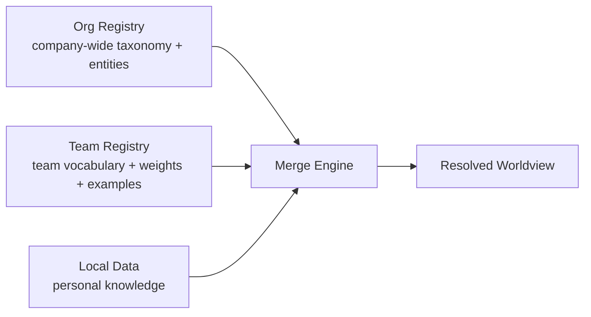

# Tiered Registry Deployment

This document describes the recommended pattern for deploying **organization / team / personal knowledge tiers**: one registry instance per visibility class. It builds on the registry model in [registries.md](registries.md), the wire contract in [registry-protocol.md](registry-protocol.md), and the trust boundaries in [security.md](security.md) and [privacy.md](privacy.md).

---

## The Pattern: One Registry per Visibility Class

When an organization wants layered knowledge — company-wide vocabulary, team-specific heuristics, and personal curation — the answer is **not** one big registry with per-object permissions. It is **separate registry instances**, one per audience:



Each tier is an independent registry conforming to the [Registry Protocol](registry-protocol.md): it exposes `/capabilities` plus one or more of `/taxonomy`, `/entities`, `/bookmarks`, `/weights`. It does not need to run ContextHelp, and it never sees another tier's data.

---

## Why the Registry Is the Unit of Trust

Two properties of the registry model make per-object ACLs unnecessary — and undesirable:

1. **Registries are read-only.** From the engine's perspective a registry provides data but never receives data ([registries.md](registries.md)). No raw input, bookmarks, or personal data are ever sent to a registry ([privacy.md](privacy.md)). There is no user state inside a registry to protect per-object.
2. **Access is subscription + transport auth.** A user either subscribes to a registry or does not; if the registry requires authentication (API key, Bearer token, Basic auth, JWT — see [registry-protocol.md](registry-protocol.md) § Authentication), the transport credential gates *everything* the registry serves.

Consequently:

- **Everything inside one registry shares one audience.** If you can authenticate to the team registry, you can read all of it.
- **The registry is the unit of trust.** ContextHelp already treats each registry as a single untrusted-or-trusted source with its own precedence, credentials, and failure isolation ([security.md](security.md) § Registry Trust Model).
- **Need finer visibility grades? Split registries.** A "team-confidential" subset does not get object ACLs inside the team registry — it becomes its own registry with its own credential. Splitting keeps the security model auditable: the question "who can see X?" is always answered by "who holds credentials to the registry that serves X?", never by inspecting per-object policy.

This mirrors the guiding principles in [decentralization.md](decentralization.md): registries are *read-only semantic overlays*; the user always chooses which ones apply.

---

## Overlay Resolution: Personal > Team > Org

Merging across registries is deterministic and precedence-ordered ([registries.md](registries.md) § Merging Multiple Registries). Subscription order expresses tier priority — list the most specific tier first:

```yaml
registries:
  - name: local   # personal definitions win
  - name: team    # shadow org for team members
  - name: org     # base layer
```

> **Per-facet precedence is not implemented.** A single `registries:` order applies to every facet (taxonomy, entities, weights, bookmarks) alike. The per-facet `registryOrder:` map described in [registries.md](registries.md) is a design target, not current config — do not put it in a config file expecting it to apply.

Resolution behavior:

- A tag or entity defined only in the org registry resolves from the org registry.
- The same label redefined in the team registry **shadows** the org definition for team members.
- Local (personal) definitions and user overrides always take precedence — consistent with "user-defined overrides always take precedence" in [registries.md](registries.md) and "local data always has priority unless configured otherwise" in [decentralization.md](decentralization.md).

The effect is an overlay filesystem for semantics: org provides the base layer, team overlays it, personal overlays both.

---

## Minimal 3-Tier Configuration

### Client-side subscription

`registries:` is a flat list of registry sources, ordered most-specific-first — the list order *is* the precedence order. The fields below match `RegistryConfig` in `internal/config/config.go`:

```yaml
registries:
  # Personal tier first: local definitions win over team and org.
  - name: personal
    url: file://~/knowledge/registry
    sync_mode: full
    trust_level: trusted        # locally authored; may write to the graph
  - name: team-platform
    url: https://registry.example-corp.internal/team-platform
    sync_mode: full
    trust_level: trusted        # only the platform team holds this credential
    auth:
      type: api_key
      header_name: "X-API-Key"  # defaults to X-API-Key; token lives in the OS keychain
  - name: org
    url: https://registry.example-corp.internal/org
    sync_mode: thin             # index-only; pull bodies on demand
    trust_level: untrusted      # entity writes require approval
    auth:
      type: api_key
```

Note what is *not* in this file: tokens. `RegistryAuthConfig` carries the auth mechanism only — credentials live in the OS keychain, never in config ([security.md](security.md) § Registry Trust Model). Set them with `ctxt registry login <name>`, not by interpolating environment variables into YAML.

Access control falls out of credential distribution: revoking a person's team membership means revoking their team-registry credential, and the team tier vanishes from their worldview on the next sync. No object-level cleanup required.

### Server-side: one instance per tier (illustrative)

> **Illustrative shape.** The repository does not yet ship a registry-server binary — registries are anything that speaks the Registry Protocol (static JSON/YAML files, Git repos, HTTP endpoints; see [registries.md](registries.md) § Registry Providers). The compose file below shows the *intended deployment shape* for HTTP-served tiers, styled after the repository's `docker-compose.yml`; substitute any protocol-compliant server (even a static file server fronting registry JSON).

```yaml
# compose.registries.yml — one registry instance per visibility class (illustrative)
name: knowledge-registries

services:
  registry-org:
    image: caddy:2-alpine            # static file server is protocol-sufficient
    restart: unless-stopped
    volumes:
      - ./org:/srv/registry:ro       # capabilities.json, taxonomy.json, entities.json ...
      - ./caddy/org.Caddyfile:/etc/caddy/Caddyfile:ro
    networks: [registries]

  registry-team-platform:
    image: caddy:2-alpine
    restart: unless-stopped
    volumes:
      - ./team-platform:/srv/registry:ro
      - ./caddy/team.Caddyfile:/etc/caddy/Caddyfile:ro   # enforces X-API-Key
    networks: [registries]

networks:
  registries:
    driver: bridge
```

The personal tier needs no server at all — a local `type: file` registry suffices.

Deployment invariants, all grounded in the trust model above:

- Each instance serves **read-only** content (`:ro` mounts reinforce this at the container level).
- Each instance holds **no user data** — only the tier's published taxonomy/entities/bookmarks/weights.
- Authentication (where present) is enforced at the transport edge, per registry, not per object.
- A failing tier degrades gracefully: cached data remains active and the other tiers keep working ([registries.md](registries.md) § Registry Failure Behavior).

---

## Anti-Pattern: Per-Object ACLs

Do not attempt to model tiers by adding object-level permissions inside a single registry:

- The protocol has no per-object authorization surface — auth applies to the endpoint ([registry-protocol.md](registry-protocol.md)).
- It would break the security posture: ContextHelp validates and merges registry data as whole, versioned sources ([security.md](security.md)); per-object filtering by requester identity would make responses non-deterministic and cache-hostile (ETag/version semantics assume one content view per registry).
- It reintroduces exactly the centralized policy engine the decentralized design avoids ([decentralization.md](decentralization.md)).

When two audiences need different views, that is by definition two registries.

---

## Summary

- One registry instance per visibility class: org, team, personal.
- Access = subscription + transport auth; the registry is the unit of trust.
- Registries are read-only and receive no user data — so there is nothing for per-object ACLs to protect.
- Subscription/precedence order yields overlay resolution: personal > team > org.
- Finer visibility grades → split registries; never object ACLs.
- Client config uses the real flat `registries:` shape (list order = precedence); per-facet `registryOrder:` and the multi-instance compose layout are intended shapes, illustrative until they ship.
