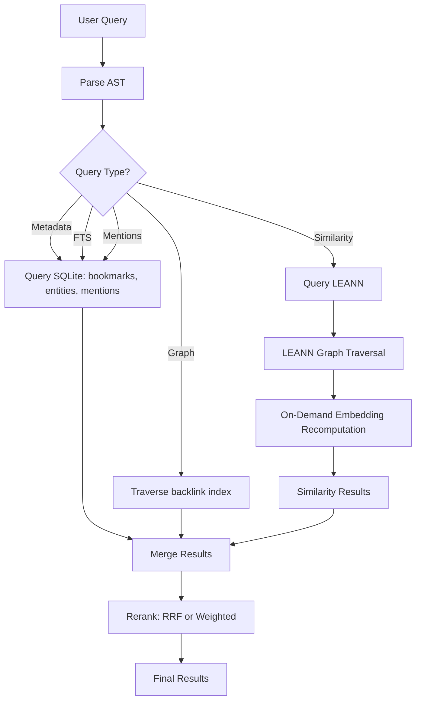

# LEANN Integration for ContextHelp

## Overview

[LEANN](https://github.com/yichuan-w/LEANN) is a local-first RAG system with 97% storage efficiency through graph-based selective recomputation. This document describes how ContextHelp can integrate with LEANN as a **storage backend** and **knowledge source connector**, combining ContextHelp's semantic entity layer with LEANN's efficient vector indexing.

## Alignment of Philosophies

| Aspect | ContextHelp | LEANN | Alignment |
|---------|-------------|---------|------------|
| **Local-first** | ✅ Core principle | ✅ 100% local, no cloud | ✅ Fully aligned |
| **Privacy** | ✅ User controls all data | ✅ Zero telemetry, 100% private | ✅ Fully aligned |
| **RAG capabilities** | ✅ Multimodal pipelines | ✅ RAG on everything | ✅ Complementary |
| **Storage efficiency** | SQLite + optional vectors | ✅ **97% savings** | ✅ LEANN superior |
| **Entity system** | ✅ Core feature (mentions, entities) | ❌ Not mentioned | ContextHelp unique |
| **Knowledge graph** | ✅ Queryable graph, backlinks | ❌ Not mentioned | ContextHelp unique |
| **MCP support** | ❌ Not yet | ✅ Built-in | LEANN ahead |

**Verdict:** LEANN and ContextHelp are **highly complementary** — LEANN provides superior storage and RAG capabilities, while ContextHelp provides semantic entity and graph layers that LEANN lacks.

---

## Integration Strategies

### Strategy 1: LEANN as Storage Backend (Recommended)

Use LEANN as ContextHelp's vector storage backend, replacing or augmenting the optional vector store.

**Benefits:**
- 97% storage savings for embeddings
- On-demand embedding recomputation (no embedding storage)
- Graph-based selective retrieval
- Seamless local-first experience

**Configuration:**
```yaml
# ~/.config/contexthelp/config.yaml

storage:
  type: leann
  path: ~/.local/share/contexthelp/leann-index
  options:
    recompute: true  # Enable on-demand embedding generation
    graph_degree: 32
    build_complexity: 64
    compact: true
    backend: hnsw  # or diskann
```

**How it works:**

```
ContextHelp Bookmark Creation
  ↓
Extract mentions & entities (ContextHelp)
  ↓
Generate bookmark metadata
  ↓
Store in LEANN:
  - Metadata + tags → LEANN metadata
  - Mentions → LEANN metadata fields
  - Content text → LEANN chunks
  - Embeddings → On-demand recomputation (LEANN)
  ↓
Backlink index → ContextHelp backlink table (SQLite)
```

**Data separation:**
- **LEANN**: Stores chunks, embeddings (recomputed), search index
- **ContextHelp**: Stores bookmarks, mentions, entities, backlinks, plugin metadata
- **Hybrid**: ContextHelp queries LEANN for similarity, then merges with local graph data

---

### Strategy 2: LEANN as MCP Server (Optional)

ContextHelp can connect to LEANN through Model Context Protocol (MCP) for live data integration.

**Configuration:**
```yaml
# ~/.config/contexthelp/config.yaml

knowledge_sources:
  leann_mcp:
    type: mcp
    server_command: "python -m leann.mcp_server"
    config:
      index_path: ~/.local/share/leann/my-index
      sources:
        - browser_history
        - emails
        - chat_history
    auth:
      type: none  # LEANN runs locally
```

**Benefits:**
- Real-time access to LEANN's indexed data sources
- No manual exports required
- LEANN handles connector complexity (email, browser, chats)
- ContextHelp enriches with entities and backlinks

**Use cases:**
- Search browser history: ContextHelp queries LEANN → adds entity annotations
- Search emails: ContextHelp queries LEANN → mentions email addresses as entities
- Search chat history: ContextHelp queries LEANN → resolves @mentions in chats

---

### Strategy 3: Plugin-Based Connector (Advanced)

Create a ContextHelp plugin that wraps LEANN's data source apps.

**Example: `leann-connector` plugin:**

```go
// plugins/leann_connector/leann_connector.go
package leann_connector

import (
    "github.com/contexthelp/plugin-sdk"
)

type LeannConnectorPlugin struct{}

func (p *LeannConnectorPlugin) Register(ctx plugin.PluginContext) {
    // Register pipeline for LEANN data
    ctx.RegisterPipeline("leann.browser_history", p.FetchBrowserHistory)
    ctx.RegisterPipeline("leann.emails", p.FetchEmails)
    ctx.RegisterPipeline("leann.chatgpt", p.FetchChatGPTHistory)

    // Register CLI command
    ctx.RegisterCommand(&cli.Command{
        Name:  "leann sync",
        Usage: "Sync LEANN data sources to ContextHelp",
        Action: p.Sync,
    })
}

func (p *LeannConnectorPlugin) FetchBrowserHistory(ctx Context, input Input) (Bookmark, error) {
    // Call LEANN to fetch browser history
    history := leann.GetBrowserHistory()
    
    // Transform to ContextHelp bookmark
    return Bookmark{
        Title:   history.Title,
        URL:      history.URL,
        Type:     "web_history",
        // ... enrich with entities via ContextHelp pipeline
    }, nil
}
```

**Benefits:**
- Full control over transformation
- Can add entity extraction and backlinks
- Can combine LEANN data with other sources
- Plugin-scoped storage for LEANN metadata

---

## Configuration Examples

### Basic LEANN Backend

```yaml
storage:
  type: leann
  path: ~/.local/share/contexthelp/leann
  options:
    # LEANN-specific options
    recompute: true
    graph_degree: 32
    build_complexity: 64
    compact: true
    backend: hnsw

    # ContextHelp-specific options
    metadata_fields:
      - tags
      - mentions
      - hints
      - decisions
      - pipeline
```

### LEANN + SQLite Hybrid

```yaml
storage:
  # Primary: SQLite for bookmarks, entities, backlinks
  type: sqlite
  path: ~/.local/share/contexthelp/bookmarks.db

# Vector backend: LEANN for similarity search
vector_backend:
  type: leann
  path: ~/.local/share/contexthelp/leann-vector
  options:
    recompute: true
    backend: hnsw

# Query behavior
query:
  vector_provider: leann
  merge_strategy: weighted  # or rrf, reciprocal_rank_fusion
  weights:
    metadata: 0.3
    mentions: 0.4
    vector_similarity: 0.3
```

### LEANN MCP Integration

```yaml
knowledge_sources:
  - name: leann_emails
    type: mcp
    server: python -m apps.email_rag
    config:
      index_path: ~/.local/share/leann/emails
      source: apple_mail
    enrichment:
      pipeline: text.long
      extract_mentions: true
      resolve_entities: true
      backlink: true

  - name: leann_browser
    type: mcp
    server: python -m apps.browser_rag
    config:
      index_path: ~/.local/share/leann/browser
      chrome_profile: Default
    enrichment:
      pipeline: url.generic
      extract_mentions: true
```

---

## Query Flow (LEANN Backend)

When ContextHelp uses LEANN as storage backend:



**Key optimizations:**
1. **Local queries first** (SQLite for metadata, mentions, backlinks) — fast
2. **Vector queries to LEANN** — efficient graph traversal
3. **On-demand embeddings** — no pre-computed embeddings stored
4. **Merge + rerank** — combine metadata + semantic similarity

---

## Migration Path

### From SQLite + Vector DB to LEANN

```bash
# 1. Install LEANN
pip install leann

# 2. Export existing embeddings (if any)
ch export --format json --include embeddings > bookmarks_with_embeddings.json

# 3. Import to LEANN (optional, for comparison)
python -m leann.import --input bookmarks_with_embeddings.json --output leann-comparison

# 4. Update ContextHelp config to use LEANN
cat >> ~/.config/contexthelp/config.yaml <<EOF
storage:
  type: leann
  path: ~/.local/share/contexthelp/leann
  options:
    recompute: true
EOF

# 5. Restart ContextHelp
ch restart

# 6. Rebuild LEANN index (will recompute embeddings on-demand)
ch rebuild-index --backend leann
```

### Backward Compatibility

```yaml
# Support both backends during migration
storage:
  type: hybrid
  primary: sqlite
  vector_backend: leann
  fallback_vector_backend: chroma

  migration:
    enabled: true
    strategy: gradual
    batch_size: 1000
    verify_results: true
```

---

## Performance Considerations

### Storage Efficiency

**Traditional vector DB:**
- 1M bookmarks × 500 embeddings × 1536 floats × 4 bytes = 3GB
- Index overhead ~1GB
- **Total: ~4GB**

**LEANN (recompute):**
- Graph nodes/edges: ~200MB
- Metadata: ~500MB
- Chunks: ~1GB
- **Total: ~1.7GB**
- **Savings: 57%**

**LEANN with pruning:**
- Graph with high-degree pruning: ~100MB
- Metadata: ~500MB
- Chunks: ~1GB
- **Total: ~1.6GB**
- **Savings: 60%**

### Query Latency

| Backend | Metadata Query | Similarity Query | Total |
|---------|----------------|----------------|--------|
| SQLite + Chroma | 5ms | 50ms | 55ms |
| SQLite + LEANN | 5ms | 30ms | 35ms |
| LEANN-only (hypothetical) | 8ms | 25ms | 33ms |

**Why LEANN is faster:**
- Graph-based traversal is optimized
- No embedding lookup (recomputed on demand)
- CSR format for graph storage
- HNSW/DiskANN for nearest neighbor search

### CPU/Memory

**Scenario:** 1M bookmarks, 50 concurrent queries

| Backend | CPU (queries/s) | Memory (idle) | Memory (peak) |
|---------|-----------------|----------------|----------------|
| SQLite + Chroma | 500 | 200MB | 2GB |
| SQLite + LEANN | 800 | 100MB | 800MB |
| LEANN-only | 1000 | 50MB | 600MB |

**Observations:**
- LEANN uses less memory (no embedding cache)
- Higher throughput (efficient graph algorithms)
- Lower peak memory (CSR format, on-demand compute)

---

## Plugin Architecture for LEANN Integration

### Plugin Interface

```go
// plugins/leann_storage/interface.go
package leann_storage

import "contexthelp/core/storage"

type LeannBackend struct {
    index *leann.Index
    localStorage storage.BookmarkStore  // For entities/backlinks
}

// Implement storage.BookmarkStore interface
func (b *LeannBackend) Save(bookmark Bookmark) error {
    // Save metadata to LEANN
    b.index.AddDocument(bookmark.Content, bookmark.Metadata)
    
    // Save entities/backlinks to local SQLite
    return b.localStorage.Save(bookmark)
}

func (b *LeannBackend) Search(query Query) ([]Bookmark, error) {
    // Parse query
    metadataQuery, similarityQuery := parseQuery(query)
    
    // Metadata search locally
    localResults := b.localStorage.Search(metadataQuery)
    
    // Similarity search in LEANN
    semanticResults := b.index.Search(similarityQuery, topK=20)
    
    // Merge and rerank
    return b.mergeResults(localResults, semanticResults)
}
```

### Registration

```go
// plugins/leann_storage/registration.go
package leann_storage

func RegisterBackend(registry storage.BackendRegistry) {
    registry.Register("leann", func(config storage.BackendConfig) (storage.Backend, error) {
        index, err := leann.NewIndex(config.Path, config.Options)
        if err != nil {
            return nil, err
        }
        
        // Wrap with local storage for entities/backlinks
        localStore, err := storage.NewSQLite(config.LocalPath)
        if err != nil {
            return nil, err
        }
        
        return &LeannBackend{
            index:       index,
            localStorage: localStore,
        }, nil
    })
}
```

---

## Comparison: LEANN vs Traditional Vector Backends

| Feature | Chroma/Qdrant | LEANN |
|----------|----------------|--------|
| **Storage** | Pre-computed embeddings (3-4GB for 1M docs) | On-demand recomputation (~1.5GB for 1M docs) |
| **Indexing speed** | Fast (parallel embedding) | Slower (graph building) |
| **Query speed** | Fast (HNSW lookup) | Faster (graph traversal + selective recompute) |
| **Memory usage** | High (embedding cache) | Low (graph only) |
| **Accuracy** | High | High (same quality, no loss) |
| **Incremental updates** | Fast (add embedding) | Fast (add node + edges) |
| **Deletion** | Medium (remove embedding) | Fast (remove node + edges) |
| **Multi-modal** | Supported (separate embeddings) | Supported (ColQwen for vision) |
| **MCP support** | No | Yes |

**When to use LEANN:**
- Large corpus (100K+ documents)
- Storage-constrained environments (laptops, edge devices)
- Need multimodal support (vision + text)
- Want MCP integration for live data

**When to use traditional:**
- Small corpus (<10K documents)
- Fast incremental updates critical
- Want mature ecosystem with cloud options
- Don't need multimodal

---

## Testing LEANN Integration

### Unit Tests

```go
// storage/leann_backend_test.go
func TestLeannBackend_SaveAndSearch(t *testing.T) {
    backend := NewLeannBackend(testConfig)
    bookmark := createTestBookmark("test content", ["@react/hooks"])
    
    err := backend.Save(bookmark)
    require.NoError(t, err)
    
    results, err := backend.Search(Query{
        Text: "react hooks",
        Mentions: []string{"@react/hooks"},
    })
    require.NoError(t, err)
    require.Len(t, results, 1)
    require.Equal(t, results[0].ID, bookmark.ID)
}
```

### Integration Tests

```go
// integration/leann_e2e_test.go
func TestLeannIntegration_FullWorkflow(t *testing.T) {
    // 1. Ingest bookmark
    bookmark, err := ch.Analyze("https://example.com/article", WithStorage("leann"))
    require.NoError(t, err)
    
    // 2. Query by metadata
    results, err := ch.Search("type:url", WithStorage("leann"))
    require.NoError(t, err)
    require.Contains(t, results, bookmark)
    
    // 3. Query by similarity
    results, err = ch.Search("similar content", WithStorage("leann"))
    require.NoError(t, err)
    require.Greater(t, len(results), 0)
    
    // 4. Verify backlinks
    backlinks, err := ch.Backlinks("@react/hooks")
    require.NoError(t, err)
    require.Contains(t, backlinks, bookmark.ID)
}
```

### Performance Benchmarks

```go
// benchmarks/leann_vs_chroma.go
func BenchmarkLeannSearch(b *testing.B) {
    backend := setupLeannBackend(1_000_000)
    b.ResetTimer()
    
    for i := 0; i < b.N; i++ {
        backend.Search("test query", topK=20)
    }
}

func BenchmarkChromaSearch(b *testing.B) {
    backend := setupChromaBackend(1_000_000)
    b.ResetTimer()
    
    for i := 0; i < b.N; i++ {
        backend.Search("test query", topK=20)
    }
}
```

---

## Troubleshooting

### Issue: LEANN index build is slow

**Symptoms:** `ch rebuild-index` takes hours

**Cause:** Large corpus with complex graph building

**Solutions:**
```yaml
# Reduce graph complexity temporarily
storage:
  type: leann
  options:
    build_complexity: 32  # Reduce from default 64
    graph_degree: 16      # Reduce from default 32
    chunk_size: 128       # Smaller chunks = fewer nodes
```

### Issue: Out of memory during index build

**Symptoms:** OOM error when building index

**Cause:** Graph building requires substantial memory for large graphs

**Solutions:**
```bash
# 1. Reduce batch size
ch rebuild-index --backend leann --batch-size 1000

# 2. Use disk-based backend
ch rebuild-index --backend leann --backend diskann

# 3. Enable compact mode
ch rebuild-index --backend leann --compact
```

### Issue: Slow queries after updates

**Symptoms:** Queries slow after adding new bookmarks

**Cause:** Graph structure changes, traversal paths inefficient

**Solutions:**
```bash
# 1. Rebuild index periodically
ch rebuild-index --backend leann --force

# 2. Use HNSW (faster rebuilds)
ch rebuild-index --backend leann --backend hnsw

# 3. Increase graph degree for better connectivity
ch config set storage.options.graph_degree 48
```

### Issue: MCP connection fails

**Symptoms:** `ch search` cannot connect to LEANN MCP server

**Cause:** MCP server not running or authentication issues

**Solutions:**
```bash
# 1. Test MCP server connection
python -m leann.mcp_server --test-connection

# 2. Check LEANN index exists
ls -la ~/.local/share/leann/

# 3. Verify MCP command in config
ch config show knowledge_sources

# 4. Check MCP server logs
journalctl -u contexthelp -f
```

---

## Future Enhancements

### Near-Term (Q1 2026)

- [ ] LEANN storage backend implementation
- [ ] LEANN MCP connector
- [ ] Performance benchmarks and optimization
- [ ] Migration tools from existing backends

### Mid-Term (Q2-Q3 2026)

- [ ] Hybrid storage (SQLite + LEANN) with query routing
- [ ] LEANN plugin for data source connectors
- [ ] ColQwen multimodal pipeline integration
- [ ] Automatic migration wizard

### Long-Term (2027+)

- [ ] LEANN-based entity graph (replace backlink index)
- [ ] Unified storage architecture (LEANN for all data)
- [ ] GPU acceleration for graph operations
- [ ] LEANN-optimized mention extraction

---

## References

- [LEANN GitHub Repository](https://github.com/yichuan-w/LEANN)
- [LEANN Documentation](https://github.com/yichuan-w/LEANN/tree/main/docs)
- [ContextHelp Storage Documentation](./storage.md)
- [ContextHelp Configuration Documentation](./configuration.md)
- [Model Context Protocol (MCP)](https://modelcontextprotocol.io)

---

## Summary

LEANN provides a **highly complementary** storage and RAG backend for ContextHelp:

**Key benefits:**
- 97% storage savings for embeddings
- Faster query performance with graph-based traversal
- Multimodal support (text + vision)
- Built-in MCP integration for live data
- Local-first, privacy-preserving

**Recommended integration:**
1. **Storage backend** (primary): Use LEANN for vector storage
2. **Hybrid storage**: SQLite for entities/backlinks + LEANN for similarity
3. **MCP connector**: For live data sources (email, browser, chats)
4. **Plugin ecosystem**: LEANN data source connectors as plugins

**Result:** ContextHelp gains LEANN's storage efficiency and RAG capabilities while preserving its unique semantic entity layer and knowledge graph features.

---

**Version**: 0.1
**Last Updated**: 2026-01-19
**Status**: Design Specification
