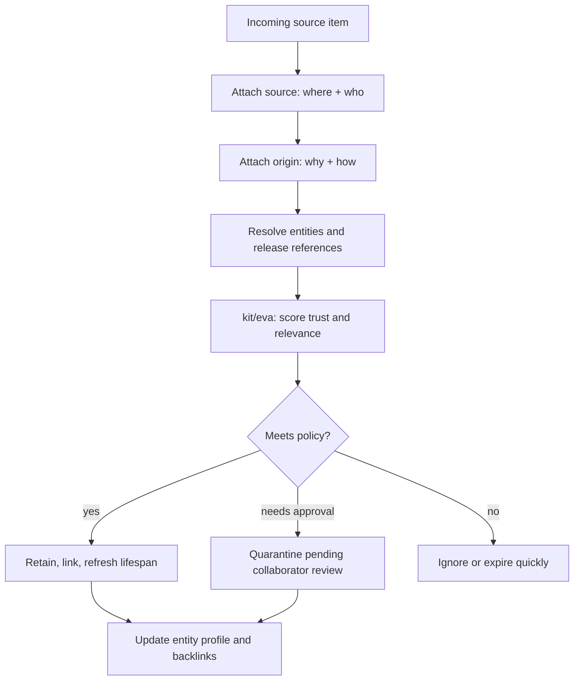
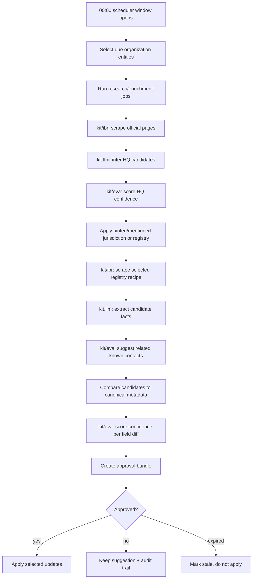

# Workflow: Entity Auto-Enrichment

## Goal

Set up repeatable enrichment for a real-world entity, such as an organization,
person, project, product, or vendor, so captured sources produce a current
profile with facts, provenance, confidence, resource mappings, and approval
history.

This chapter uses organizations as the running example, but the same pattern
applies to any canonical entity.

## Scope

- Canonical entity profile shape
- Source inventory and capture plan
- Source (`where`/`who`) and origin (`why`/`how`) provenance
- Lifespan, relevance, confidence, and approval handling
- HQ-to-jurisdiction-to-registry selection
- Contact suggestions from known people and tools

## Runtime note

The durable building blocks are generic enrichment, custom pipelines, plugins,
registries, entity mentions, watches, and approval-gated diffs. Dedicated
`ctxt osint ...` commands are the story-level target for OSINT profile
workflows. If those commands are not available, use the pipeline path shown
below.

All browser work must go through `kit/ibr`; evaluation/scoring must go through
`kit/eva`; AI extraction, normalization, synthesis, and diff wording must use
kit's `llm`.

## Step 1: Define the canonical entity

Start with stable identity fields and keep mutable facts in metadata.

```json
{
  "id": "organization.acme",
  "title": "Acme Corp",
  "description": "Canonical organization profile for Acme Corp.",
  "aliases": ["acme", "acme-corp", "Acme Corporation"],
  "namespace": "organization",
  "source": "local://entities/organization.acme",
  "metadata": {
    "entity_type": "organization",
    "website": "https://www.acme.example",
    "jurisdictions": ["US-DE"],
    "source_urls": [
      "https://www.acme.example",
      "https://www.linkedin.com/company/acme"
    ],
    "intent_resources": {
      "support": ["https://www.acme.example/support"],
      "sales": ["https://www.acme.example/contact-sales"],
      "legal": ["https://www.acme.example/legal"]
    }
  }
}
```

Use metadata for fields such as `website`, `headquarters`,
`business_registration`, `employee_count`, `postal_addresses`, `phone_numbers`,
`intent_resources`, and `related_contacts`.

## Step 2: Inventory source classes

Treat every field as source-backed.

| Source class | Example fields | Capture path |
|---|---|---|
| Official website | website, contact pages, terms, privacy, HQ hints | `kit/ibr` + URL pipeline |
| Business registry | legal name, registry ID, status, jurisdiction, registered address | HQ-selected registry scraped with `kit/ibr` |
| Professional graph | employee range, aliases, leadership, social URLs | authenticated fetch/API-backed plugin via `kit/ibr` |
| Internal systems | CRM owner, support owner, contractual resources | custom plugin/local registry |
| Known contacts graph | execs, employees, consultants, founders, investors, tool owners | graph/contact relevance pass with `kit/eva` |

For each source, record URL or endpoint, fetch method, credentials, rate limit,
fields it may update, and expected freshness interval.

## Worked Sample: Source, Origin, Relevance, And Lifespan

Use two separate provenance dimensions:

- **Source** is `where` and `who`: system, account, author, submitter, channel,
  feed, inbox, tracker, or API that supplied the data.
- **Origin** is `why` and `how`: workflow reason, trigger, approval path,
  capture method, and business context that caused the data to enter the graph.

The source and origin together determine trust, relevance, lifespan, and whether
the object is ignored, retained, escalated, or used to update an entity profile.

### Sample setup

```yaml
entity_contexts:
  project.checkout:
    release_entities:
      - "@release.checkout-v3"
      - "@release.checkout-v3.1"
    maintainers:
      - "@person.lee"
      - "@person.rina"
    verified_collaborators:
      - "@person.alex"
      - "@person.sam"
    default_lifespan: 90d

source_classes:
  issue_tracker:
    examples: ["github:acme/checkout", "linear:CHK"]
    default_lifespan: 180d
    trust:
      verified_collaborator: 1.0
      approved_by_verified: 0.9
      repeat_submitter: 0.6
      anonymous: 0.2
  release_feed:
    examples: ["rss:https://acme.example/releases.xml"]
    default_lifespan: 45d
    trust:
      official_feed: 0.95
  email_inbox:
    examples: ["imap:support@acme.example", "imap:security@acme.example"]
    default_lifespan: 60d
    trust:
      internal_sender: 0.9
      known_customer_domain: 0.65
      unknown_sender: 0.3
  chat:
    examples: ["slack:#checkout", "slack:#support-triage"]
    default_lifespan: 14d
    trust:
      maintainer_channel: 0.85
      support_channel: 0.55

origin_rules:
  release_regression_report:
    why: issue may relate to a shipped release
    how: issue/comment references a release entity, version, deployment, or changelog
    minimum_trust: 0.65
    lifespan: 180d
    action: retain_and_link
  unverified_bug_report:
    why: untrusted report needs collaborator validation
    how: issue submitter is not verified and no verified collaborator approved it
    lifespan: 7d
    action: quarantine
  operational_chat_context:
    why: chat explains current investigation but decays quickly
    how: message appears in support or engineering channel during active incident
    minimum_trust: 0.5
    lifespan: 14d
    action: retain_as_context
```

### Sample submissions

| ID | Source | Origin | Content summary |
|---|---|---|---|
| `sub-001` | GitHub issue by `@github.jordan` | `issue_opened` from public repo webhook | "Checkout fails after v3.1 for saved cards." Mentions `@release.checkout-v3.1`. |
| `sub-002` | GitHub comment by `@person.lee` | `verified_review` on `sub-001` | Maintainer confirms the report matches a known deployment window. |
| `sub-003` | Release RSS feed | `release_published` from official feed sync | Changelog for `checkout-v3.1`, includes payment-token migration. |
| `sub-004` | Support email from `buyer@example.net` | `customer_report` from support inbox | Same saved-card failure, includes order ID and timestamp. |
| `sub-005` | Slack `#support-triage` message by support agent | `incident_triage` from chat adapter | Agent links three tickets to `checkout-v3.1`. |
| `sub-006` | GitHub issue by `@github.jordan` | `issue_opened` from public repo webhook | Fourth report by same submitter; two reports occurred in the last week. |
| `sub-007` | GitHub issue by unknown account | `issue_opened` with no approval | Vague complaint, no version, no reproduction, no verified collaborator. |

### Sample process



Expected results:

1. Approved issue reports rank above unapproved reports.
2. Official release feed facts outlive chat context.
3. Chat messages remain useful as investigation context but expire sooner.
4. Repeated submitter history contributes a signal, not blanket trust.
5. Ignored/quarantined records remain auditable but do not update the profile.
6. Intent-resource mappings point agents to concrete issue, feed, chat, and email resources.

## Worked Sample: Overnight Organization Research With Approval-Gated Diffs

This sample keeps organization profiles fresh without allowing automatic writes
to canonical entity facts. The system researches overnight, proposes updates,
shows a confidence score beside each diff, and waits for approval.

### Sample setup

```yaml
entity_research_jobs:
  organization_profile_refresh:
    entities:
      selector:
        entity_type: organization
        tags_any: ["customer", "vendor", "prospect"]
    schedule:
      window:
        start: "00:00"
        end: "04:00"
        timezone: "America/Toronto"
      max_jobs_per_night: 80
      max_concurrency: 4
    pipeline: entity.organization_profile
    tools:
      browse_scrape: kit/ibr
      evaluate: kit/eva
      ai: kit.llm
    jurisdiction_discovery:
      first_step: infer_headquarters
      respect_hints_and_mentions: true
      precedence:
        - explicit_registry_mention
        - explicit_jurisdiction_mention
        - explicit_hq_hint
        - inferred_hq
      registry_recipes: ../reference/jurisdiction-registry-recipes.md
    approval:
      required: true
      approvers:
        - "@team.research-ops"
        - "@person.rina"
      apply_mode: explicit_only
      stale_after: 14d
    diff:
      show_confidence: true
      show_source: true
      show_origin: true
      group_by: entity
      minimum_suggestion_confidence: 0.55
    field_policy:
      website: {auto_suggest: true, auto_apply: false, minimum_confidence: 0.75}
      business_registration.status: {auto_suggest: true, auto_apply: false, minimum_confidence: 0.85}
      employee_count.range: {auto_suggest: true, auto_apply: false, minimum_confidence: 0.6}
      postal_addresses: {auto_suggest: true, auto_apply: false, minimum_confidence: 0.7}
      phone_numbers: {auto_suggest: true, auto_apply: false, minimum_confidence: 0.7}
      intent_resources: {auto_suggest: true, auto_apply: false, minimum_confidence: 0.65}
      related_contacts: {auto_suggest: true, auto_apply: false, minimum_confidence: 0.6}
```

Tooling is fixed by task boundary:

| Task | Tool |
|---|---|
| Browse, fetch, scrape, and extract web/registry pages | `kit/ibr` |
| Evaluate evidence quality, source agreement, and confidence | `kit/eva` |
| AI extraction, normalization, summarization, and diff wording | kit's `llm` |

Explicit hints and mentions always constrain discovery. If the request includes
`--mentions "@jurisdiction.us-de" "@registry.delaware-corporations"` or a hint
such as `#hq:delaware`, the job must respect those values unless evaluation
finds a direct contradiction. Contradictions are returned as approval-gated
suggestions, not silently applied.

### Sample nightly submissions

```json
{
  "job_batch": "org-refresh-2026-05-08",
  "window": "2026-05-08T00:00:00-04:00/2026-05-08T04:00:00-04:00",
  "selected_entities": ["@organization.acme", "@organization.northwind"],
  "hints": ["#hq:delaware", "#registry:delaware-corporations"],
  "mentions": ["@jurisdiction.us-de", "@registry.delaware-corporations"],
  "pipeline": "entity.organization_profile",
  "approval_required": true
}
```

For `@organization.acme`, the research job fetches these source items:

| Source | Origin | Candidate update |
|---|---|---|
| Official contact page | scheduled website refresh with `kit/ibr` | Main phone changed from `+1-302-555-0100` to `+1-302-555-0199`. |
| Official about/contact pages | scheduled HQ discovery with `kit/ibr` | Headquarters inferred as Wilmington, Delaware, US. |
| Jurisdiction mapping | HQ-to-registry mapping evaluated by `kit/eva` | Wilmington, Delaware maps to `US-DE` and Delaware Division of Corporations. |
| Business registry | scheduled registry scrape with `kit/ibr` | Registration status remains `active`; registered address changed suite number. |
| Known contacts graph | graph/contact relevance pass with `kit/eva` | Suggests related execs, employees, founders, investors, consultants, and tool owners. |

### Sample process



### Sample HQ-to-registry selection

```json
{
  "entity": "@organization.acme",
  "constraints": {
    "hints": ["#hq:delaware", "#registry:delaware-corporations"],
    "mentions": ["@jurisdiction.us-de", "@registry.delaware-corporations"],
    "precedence_applied": "explicit_registry_mention"
  },
  "hq_discovery": {
    "selected_hq": {
      "address": "100 Market St, Wilmington, DE 19801, US",
      "jurisdiction": "US-DE",
      "evaluated_by": "kit/eva",
      "confidence": 0.82
    }
  },
  "business_registry_selection": {
    "jurisdiction": "US-DE",
    "registry": "Delaware Division of Corporations",
    "recipe_id": "business-registry-search/us-de",
    "scrape_with": "kit/ibr",
    "selected_from": "explicit_registry_mention"
  }
}
```

### Sample related-contact suggestions

Known contacts are suggested, not auto-linked.

```json
{
  "entity": "@organization.acme",
  "related_contacts_suggestions": [
    {
      "contact": "@person.rina",
      "type": "c-exec",
      "relationship": "executive sponsor",
      "tools": ["claude", "codex"],
      "confidence": 0.86,
      "action": "requires_approval"
    },
    {
      "contact": "@person.lee",
      "type": "employee",
      "relationship": "technical owner",
      "tools": ["codex"],
      "confidence": 0.78,
      "action": "requires_approval"
    },
    {
      "contact": "@person.maya",
      "type": "consultant",
      "relationship": "implementation partner",
      "tools": ["claude"],
      "confidence": 0.68,
      "action": "requires_approval"
    }
  ],
  "allowed_types": ["c-exec", "employee", "consultant", "founder", "investor"],
  "allowed_tools": ["claude", "codex"]
}
```

### Sample diff result

```json
{
  "approval_bundle_id": "appr-org-acme-2026-05-08",
  "entity": "@organization.acme",
  "status": "pending_approval",
  "suggestions": [
    {
      "field": "metadata.headquarters.address",
      "current": "100 Market St, Wilmington, DE 19801, US",
      "suggested": "100 Market St, Suite 400, Wilmington, DE 19801, US",
      "confidence": 0.81,
      "confidence_label": "high",
      "source": {
        "class": "business_registry",
        "registry": "Delaware Division of Corporations",
        "recipe_id": "business-registry-search/us-de",
        "scraped_by": "kit/ibr"
      },
      "origin": {
        "intent": "organization_profile_refresh",
        "trigger": "scheduled_window",
        "registry_selected_by": "explicit_registry_mention"
      },
      "evaluation": {
        "evaluated_by": "kit/eva",
        "agreement": "registry and official contact page agree on city/state/postal code"
      },
      "action": "requires_approval"
    },
    {
      "field": "metadata.related_contacts",
      "suggested_additions": [
        {"contact": "@person.lee", "type": "employee", "tools": ["codex"], "confidence": 0.78},
        {"contact": "@person.maya", "type": "consultant", "tools": ["claude"], "confidence": 0.68}
      ],
      "confidence": 0.73,
      "confidence_label": "medium",
      "action": "requires_approval"
    }
  ]
}
```

### Sample approval commands

```bash
ctxt approvals list --type organization_profile --state pending
ctxt approvals show appr-org-acme-2026-05-08
ctxt approvals approve appr-org-acme-2026-05-08 \
  --field metadata.headquarters.address \
  --field metadata.related_contacts
```

## Step 3: Create an enrichment contract

```yaml
name: organization_profile_v1
entity: organization.acme
produces:
  metadata.website: {required: true, confidence_min: 0.8}
  metadata.business_registration: {required: false, confidence_min: 0.7}
  metadata.employee_count: {required: false, confidence_min: 0.5}
  metadata.postal_addresses: {required: false, confidence_min: 0.7}
  metadata.phone_numbers: {required: false, confidence_min: 0.7}
  metadata.intent_resources: {required: false, confidence_min: 0.6}
  metadata.related_contacts: {required: false, confidence_min: 0.6}
provenance:
  require_source_url: true
  require_observed_at: true
  keep_conflicting_values: true
approval:
  required_for_all_updates: true
```

## Step 4: Configure the pipeline

```yaml
name: entity.organization_profile
description: Build and refresh organization entity profiles

sandbox:
  enabled: true
  isolation_level: process
  resource_limits:
    timeout: 90s
  network: true
  filesystem:
    write_allowed: false

steps:
  - type: type_detector
  - type: url_extractor
  - type: entity_resolver
    config:
      target_entity_type: organization
  - type: organization_profile_enricher
    config:
      browse_scrape: kit/ibr
      evaluate: kit/eva
      ai: kit.llm
      registry_recipes: docs/manual/reference/jurisdiction-registry-recipes.md
      conflict_policy: keep_all_with_confidence
      output_contract: organization_profile_v1
  - type: tagger
  - type: embedding_generator
```

Create and inspect it:

```bash
dpkms pipeline create ./pipelines/entity.organization_profile.yaml
dpkms pipeline show entity.organization_profile
```

## Step 5: Capture and refresh

```bash
ctxt analyze "Build organization profile for Acme Corp" \
  --type text \
  --pipeline entity.organization_profile \
  --mentions "@organization.acme" "@jurisdiction.us-de" "@registry.delaware-corporations" \
  --hints "#organization #profile #enrich #hq:delaware"
```

Story-target OSINT flow:

```bash
ctxt osint build @organization.acme --sources website,registry,linkedin
ctxt osint profile @organization.acme --format json
ctxt osint diff @organization.acme --since 7d
```

## Validate output

1. Entity resolves to the expected canonical slug.
2. Hinted/mentioned jurisdiction and registry were respected.
3. Registry recipe came from the jurisdiction registry reference.
4. Every enriched field has source, origin, confidence, and approval status.
5. Related contacts are suggestions with type and tool affinity, not silent links.
6. Low-confidence fields remain uncertain rather than overwritten as fact.

## Related references

- [`./enrichment-processing.md`](./enrichment-processing.md)
- [`../admin-extensibility/pipeline-management.md`](../admin-extensibility/pipeline-management.md)
- [`../admin-extensibility/plugin-development.md`](../admin-extensibility/plugin-development.md)
- [`../reference/jurisdiction-registry-recipes.md`](../reference/jurisdiction-registry-recipes.md)
- [`../../dpkms/schema-entity.md`](../../dpkms/schema-entity.md)
- [`../../dpkms/registries.md`](../../dpkms/registries.md)
- [`../../stories/capture/US-0206-osint-entity-aggregation.md`](../../stories/capture/US-0206-osint-entity-aggregation.md)
