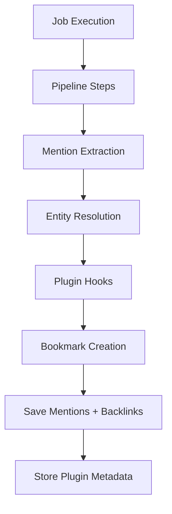

# Storage

The storage layer in ContextHelp gains new responsibilities with the introduction of **Mentions**, the **Entity Graph**, and a growing **Plugin Ecosystem**.
While it continues to store bookmarks, jobs, traces, and tracking fields, it now additionally supports:

- **mention persistence**
- **entity resolution caching** (optional)
- **reverse lookup indexing** for entity → bookmark relationships
- **plugin-scoped metadata storage**, isolated per plugin
- **plugin-defined bookmark types**

These enhancements preserve the system’s core principles of decentralization, determinism, extensibility, and local-first operation.

---

## Local-First Storage Philosophy

ContextHelp treats local storage as the canonical source of truth for:

- bookmarks
- ingestion jobs
- entity-resolution cache (optional)
- backlink index (entity → bookmarks)
- plugin-defined metadata blocks
- plugin-defined bookmark types

Networked registries enrich the system but do not override or replace local data unless explicitly configured.

Key principles:

- **User Ownership** — All knowledge, including mentions and plugin metadata, belongs to the user.
- **Offline First** — Mentions, entities, and plugin logic remain usable without network connectivity.
- **Transparent & Inspectable** — Bookmarks, mentions, and plugin-scoped metadata are visible, exportable, and non-proprietary.
- **Plugin Isolation** — Plugins manage their own metadata without modifying core storage schemas.

---

## Storage Responsibilities

The storage subsystem now handles:

- Persisting **bookmarks**, including:
  - tags
  - hints
  - **mentions**
  - **plugin metadata blocks**
- Maintaining the **entity–bookmark backlink index**
- Maintaining jobs and ingestion traces
- Supporting mention-based filtering and query evaluation
- Supporting plugin-defined bookmark types and metadata
- Ensuring plugin state remains isolated, deterministic, and user-controlled

Storage does **not** handle:

- mention extraction (pipeline responsibility)
- entity resolution (resolver + registry client)
- refresh scheduling (Refresh Plugin)
- price monitoring, feed detection, alert management (plugin responsibilities)
- ranking or reranking
- pipeline execution

These remain outside the storage layer.

---

## Plugin Storage Model

Plugins may maintain **their own storage** independently of core storage, using:

- plugin JSON files (recommended)
- lightweight internal indexing
- ephemeral runtime caches

Core storage does **not** store plugin state unless the plugin explicitly writes metadata inside the bookmark under:

```
bookmark.plugins.<pluginName>
```

This namespace is documented, reserved for plugin use, and fully isolated.

Examples:

```
plugins: {
  "rss_feed": {
    "item_pipeline": "text.long",
    "last_fetch": 1710000000
  },
  "price_monitor": {
    "current_price": 1299.99,
    "threshold_percent": 10
  }
}
```

The storage layer treats these fields as opaque JSON.

---

## Write Path vs Read Path

ContextHelp maintains a strict architectural separation.

### Write Path (Ingestion + Pipelines)

Pipelines write:

- bookmark record
- mentions
- backlink entries
- plugin metadata blocks
- plugin-defined bookmark types

Flow:

```
Raw Input
 → Job Record
 → Pipeline Execution
 → Mention Extraction
 → Entity Resolution
 → Plugin Hooks
 → Bookmark Creation
 → Backlink Index Update
```

Only ingestion workers modify persistent state.

### Read Path (Search + Retrieval)

Query evaluation may include:

- metadata filters
- tag filters
- hint filters
- **mention filters**
- plugin-defined filters (via AST translation rules)
- boolean logic
- text search

Storage returns local results; registry and plugin layers may merge or enhance them.

---

## Data Model Foundations

### Bookmarks

Bookmarks now include:

```
mentions: ["<entity-id>", ...]
```

Additional optional structures:

```
plugins: {
  "<pluginName>": { ... plugin metadata ... }
}
```

and plugin-defined bookmark types:

```
type: "feed"
type: "feed_item"
type: "price_track"
```

Other core fields remain unchanged.

Mentions may reference:

- registry-provided entities
- user-defined local entities
- unresolved entity IDs

### Jobs

Jobs remain unchanged, but job steps may contain plugin diagnostic data or mention-resolution traces.

### Job Steps

Optional but useful for:

- mention extraction logging
- plugin debug output
- feed parsing diagnostics
- price extraction results

---

## Entity–Bookmark Backlink Index

Local storage introduces or extends a lightweight backlink table enabling:

- efficient mention-based queries
- bidirectional graph navigation
- plugin-enhanced semantic graph operations

A minimal model:

- `entity_id`
- `bookmark_id`

Backends may optimize or denormalize this.

---

## Plugin Metadata Storage Expectations

Storage places no constraints on plugin metadata except:

- must not conflict with core fields
- must stay inside `bookmark.plugins.<pluginName>`
- must be valid JSON
- must not alter core table schemas

Plugins may also maintain private persistent files under:

```
~/.contexthelp/plugins/<pluginName>/
```

This supports:

- notifications
- price histories
- feed sync state
- cached query results
- plugin-specific indices

---

## Storage Backends

Backends must support mention persistence, backlinking, and plugin metadata storage.

### JSON Storage

Pros: simple, inspectable
Cons: full scans for mention queries

Expectations:

- store `mentions` and `plugins` JSON fields inside each file
- plugin-specific state remains outside core storage
- optional in-memory backlink index may improve repeated queries

### SQLite (recommended)

Pros: fast, reliable, ideal for mention + entity graph behavior

Recommended tables:

```
bookmarks (JSON columns allowed)
bookmark_mentions (bookmark_id, entity_id)
```

Additional expectations:

- plugin metadata stored inside JSON field `plugins`
- entity backlinks indexed
- plugin-defined bookmark types stored in `type` column

### Postgres

Use JSONB + GIN for:

- mentions
- plugin metadata

Use join table for backlink index when needed.

### Custom Backends

Must support:

- mentions
- backlink lookups
- plugin metadata persistence

Graph DBs may handle backlinks natively.

---

## BookmarkStore Interface

Adds support for:

- plugin metadata read/write
- plugin-defined bookmark types

### Save

Save:

- core bookmark fields
- mentions
- plugin metadata
- backlink entries

### Update

Update must maintain:

- backlink index integrity
- plugin metadata isolation

### List

Query filters may include:

- `mention:<id>`
- `plugin.<pluginName>.<field>` (plugin-defined)
- `type:<pluginType>`

Backends translate AST queries accordingly.

### Delete

Must:

- remove bookmark
- prune backlink entries
- prune plugin metadata

### IncrementView / IncrementMatch

Unchanged.

---

## JobStore Interface

Same responsibilities, but plugins may store arbitrary debug metadata in job steps.

Storage treats plugin data as opaque.

---

## Indexing and Query Optimization

### JSON Backend

Mention filtering requires full scan:

```
if entity_id in bookmark.mentions:
    include
```

Plugin metadata queries also require scanning.

### SQLite / Postgres

Use recommended schema:

```
bookmark_mentions(entity_id, bookmark_id)
```

Plugin-defined bookmark types become simple indexed filters.

Prefix indexing recommended for:

- entity namespaces
- plugin-defined type hierarchies

---

## Plugin-Defined Bookmark Types

Storage must support:

- arbitrary `type` values
- optional `subtype` values
- plugin namespaces (recommended but not required)

Examples:

```
type: "feed"
type: "feed_item"
type: "price_track"
type: "notification_ref"
```

Core storage does not validate or restrict plugin values.

---

## Plugin Metadata Persistence

Bookmark metadata block:

```
plugins: {
  "<pluginName>": {
     "...": "..."
  }
}
```

Rules:

- core must not interpret plugin metadata
- core must preserve plugin metadata through updates
- plugin metadata must be merge-stable

Plugins are responsible for ensuring consistency.

---

## Mermaid Diagram: Plugin-Aware Write Path



---

## Concurrency Model

No changes from traditional context engine requirements.

Rules remain:

- only ingestion workers write
- readers never block writers
- plugin code must not circumvent single-writer guarantees

Plugins may write private JSON files independently.

---

## Tracking Behavior

Same as before.
Plugins may implement their own tracking inside plugin metadata or private files.

---

## Relationship to Registries

Storage does not store registry entity definitions, only IDs.

Rules:

- local entity definitions stored only in entity registry
- mentions store IDs referencing entities
- entity resolution cached optionally in plugin metadata
- registry sync never overwrites bookmarks

---

## Plugin State & Core Storage Separation

Storage ensures:

- plugin metadata stays isolated
- plugins cannot alter core schemas
- plugins may maintain external state freely
- plugins never block or corrupt ingestion

---

## Importing, Exporting, and Syncing

Exports include:

```
mentions: [...]
plugins: {...}
```

Imports must:

- restore mentions
- restore plugin metadata
- rebuild backlink index
- never execute plugin logic automatically

---

## Future Enhancements

- native plugin metadata indexing
- hybrid graph + vector retrieval
- pluggable storage backends with plugin-defined partitions
- encrypted plugin-specific fields

---

## Summary

The Storage layer now provides:

- deterministic ingestion including mention persistence
- entity → bookmark backlink indexing
- full support for plugin metadata inside bookmarks
- stable support for plugin-defined bookmark types
- plugin-isolated persistent storage without core modification
- optimized mention-aware querying
- strict read/write separation
- registry-safe semantics

This enables a powerful plugin ecosystem—including refresh logic, feed consumption, price monitoring, and notifications—**without requiring plugins to modify or extend core storage schemas**.